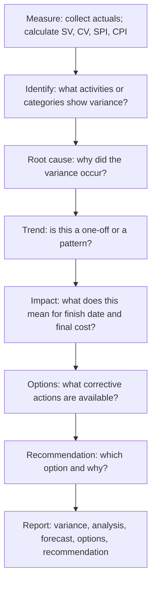

# Variance Analysis and Reporting

> **Core skill:** Analyzing the gap between planned and actual schedule and cost performance — identifying root causes, distinguishing trends from one-off events, and communicating variance to stakeholders with corrective options, not just numbers.

## Why This Matters

Variance is the difference between the plan and reality. It is not a problem — it is information. The project manager who hides variance loses the project; the one who communicates it with analysis and options earns the right to fix it.

The skill is not in calculating variance — that is arithmetic. The skill is in understanding why the variance occurred, whether it is a one-off or a trend, what it means for the project's finish date and final cost, and what the sponsor should do about it. A variance report that says "SPI = 0.92" without explaining which activities caused the slip, whether the critical path is affected, and what recovery options exist is data, not analysis.

Variance reporting is also a credibility exercise. Stakeholders remember the variance you hid, not the variance you explained. Communicating variance early — with root cause, impact, forecast, and options — builds trust. Communicating variance late — after it has compounded into a crisis — destroys it.

## Variance Analysis Process

Every variance report should answer: what happened, why it happened, what it means for the project, and what the sponsor should do about it.

## Variance Types

| Type | Definition | Example | Analysis Lens |
|------|-----------|---------|---------------|
| **Schedule variance** | Activities started or finished later than planned | Integration testing started one week late | Is the critical path affected? What is the new forecast finish date? |
| **Cost variance** | Spending is higher or lower than planned | Contractor costs exceeded budgeted rate | Is the overrun one-time or recurring? What is the EAC? |
| **Effort variance** | More or fewer hours spent than planned | Feature took 120 hours, planned 80 | Was the estimate wrong, or was scope added? |
| **Scope variance** | Work completed differs from work planned | Delivered 8 of 10 planned features | Is scope being deferred, or is it scope creep? |

Schedule variance and cost variance are measured by EVM. Effort variance and scope variance require the project manager's judgment — they are the narrative behind the indices.

## Root Cause Categories

| Category | Common Causes | Questions to Ask |
|----------|--------------|-----------------|
| **Estimation error** | Activity was more complex than estimated; optimism bias | Was the estimate done by the person doing the work? Was a range used? |
| **Scope change** | Uncontrolled addition of work; gold-plating | Was the change approved? Is it in the change log? |
| **Resource** | Resource was less available than planned; skill mismatch; turnover | Was availability verified at planning? Is there a resource constraint? |
| **Dependency** | External dependency slipped; predecessor delayed | Was the dependency on the critical path? Was float considered? |
| **External** | Vendor delay; regulatory change; market event | Was this risk in the register? What was the contingency? |
| **Process** | Approval delays; decision bottlenecks; rework loops | Is the governance process slowing delivery? |

The root cause determines the corrective action. Throwing resources at an estimation problem does not fix the estimates. Re-estimating does not fix a process bottleneck.

## Variance Thresholds and Escalation

| Variance Level | Threshold (Example) | Response |
|----------------|---------------------|----------|
| Within tolerance | SPI and CPI between 0.95 and 1.05 | Monitor; no escalation required |
| Caution | SPI or CPI between 0.90 and 0.95, or trending down | Analyze root cause; prepare corrective options; inform sponsor |
| Action required | SPI or CPI below 0.90, or critical path slip > threshold | Escalate to sponsor with analysis and corrective options |
| Critical | SPI or CPI below 0.80, or project finish date at risk | Immediate escalation; full recovery plan required |

Thresholds are project-specific — a three-month project with a two-day slip is a different conversation than a two-year program with a two-day slip.

## Reporting Structure

A variance report that drives decisions:

| Section | Content | Purpose |
|---------|---------|---------|
| Executive summary | Overall status: on track / at risk / off track; top three variances | One-paragraph summary for busy sponsors |
| Performance summary | CPI, SPI, SV, CV this period and cumulative | Numbers in context |
| Variance detail | Per-variance: what, why, impact, trend | The analysis |
| Forecast | EAC, forecast finish date, confidence range | Where the project is heading |
| Corrective options | Option A, B, C with pros, cons, and recommendation | What the sponsor can do |
| Risks and issues | Risks that may affect the forecast; open issues | Context for the variance |
| Decisions requested | Specific decisions needed from the sponsor or steering committee | Clear asks with deadlines |

## Variance Communication Principles

| Principle | What It Means | What to Avoid |
|-----------|---------------|---------------|
| **Early** | Communicate variance when it is small and options are cheap | Waiting until variance is a crisis |
| **With options** | Every variance report includes at least two corrective options | Reporting variance with no path forward |
| **With root cause** | Explain why, not just what | "We are behind" without the story |
| **Without blame** | Variance analysis names causes, not people | "The team underperformed" — substitute "estimation error" or "resource constraint" |
| **Consistent** | Same format, same metrics, same cycle | Changing the report format to hide variance |

## Practical Applications

**Variance analysis checklist:**

- [ ] Schedule and cost actuals are compared to baseline every status cycle
- [ ] Variances are categorized: schedule, cost, effort, or scope
- [ ] Root cause is identified for every variance above threshold
- [ ] Trend analysis distinguishes one-off events from systematic issues
- [ ] Corrective options are presented with pros, cons, and a recommendation
- [ ] Forecast (EAC, finish date) is updated based on performance trends
- [ ] Variance report includes decisions requested from the sponsor

**Variance review questions:**

- [ ] Is this variance a one-off or part of a trend?
- [ ] Is the variance on or off the critical path?
- [ ] What is the root cause — estimation, scope, resource, dependency, or process?
- [ ] What is the updated EAC and forecast finish date?
- [ ] What corrective options exist, and which is recommended?

## Common Pitfalls

| Pitfall | Why It Is a Problem | Better Approach |
|---------|---------------------|-----------------|
| **Variance denial** | Small variances ignored until they compound into large ones | Report every variance above threshold, even small ones |
| **Data without story** | SPI and CPI reported without root cause or narrative | Pair every metric with analysis: what, why, impact, options |
| **Blame-first analysis** | Root cause defaults to "the team is slow" | Categorize root cause: estimation, scope, resource, dependency, process |
| **Options without recommendation** | Sponsor receives a menu of corrective actions with no guidance | Present options with pros, cons, and the PM's recommendation |
| **Format inconsistency** | Report format changes make trending impossible | Consistent format, metrics, and thresholds across all cycles |

## Success Indicators

- Variance is communicated in the status cycle in which it is detected
- Every variance report includes root cause, impact, forecast, and corrective options
- Trends are identified before they become crises
- Stakeholders trust the variance analysis even when the news is bad
- Corrective actions reference the variance analysis that justified them

## Related Topics

- [[04_Earned_Value_Management]]: EVM produces the variances that drive analysis
- [[05_Schedule_and_Cost_Tracking]]: tracking data is the input to variance analysis
- [[07_Schedule_Compression_and_Recovery]]: variance analysis informs recovery decisions
- [[01_Schedule_Development]]: baseline quality determines variance quality
- [[06_Governance_and_Change_Control/00_overview|Governance and Change Control]]: variance may trigger change requests

## Summary

Variance analysis turns the gap between plan and reality into actionable information. The project manager calculates schedule and cost variance, identifies root cause — estimation error, scope change, resource constraint, dependency slip, or process bottleneck — distinguishes one-off events from trends, forecasts the impact on completion, and presents corrective options with a recommendation. Variance communicated early with analysis builds trust; variance hidden until it becomes a crisis destroys it. The test: when the sponsor reads the variance report, they know what happened, why, what it means, and what to do.