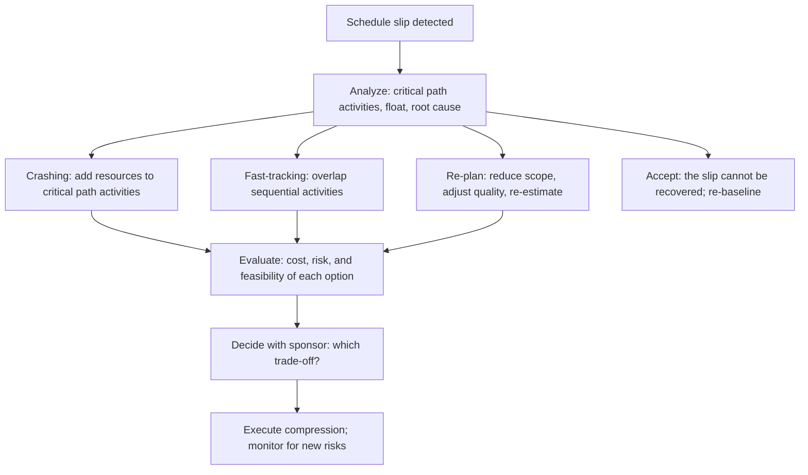

# Schedule Compression and Recovery

> **Core skill:** Compressing the schedule when the project is behind — using crashing, fast-tracking, and re-planning with documented trade-offs — so recovery decisions are deliberate and stakeholders understand what they are trading for time.

## Why This Matters

Every project falls behind at some point. The difference between projects that recover and projects that spiral is whether compression decisions are analyzed or reacted to. The default response — "add more people" — is the most common and least effective: Brooks's Law is real, and adding people to a late software project usually makes it later.

Schedule compression is a trade-off: time for cost (crashing), time for risk (fast-tracking), or time for scope (re-planning). The project manager's job is to analyze which activities can be compressed, what each compression costs, what new risks it introduces, and whether the trade-off is worth it. Compression without analysis is panic; compression with analysis is management.

Recovery is different from compression. Compression is shortening the remaining schedule. Recovery is the broader discipline: root cause analysis of the slip, corrective action to prevent recurrence, stakeholder communication about the new plan, and lessons learned for the next project.

## Compression Techniques



### Crashing

Adding resources to critical path activities to shorten their duration.

| Factor | Assessment |
|--------|------------|
| **When it works** | Activities where adding people reduces duration proportionally; highly partitionable work |
| **When it fails** | Knowledge work with high communication overhead; work with fixed durations; activities near completion |
| **Cost** | Direct: additional resource cost. Indirect: communication overhead, coordination cost |
| **Risk** | New people need ramp-up time; quality may drop; original team may be distracted |

Crashing in software projects rarely produces proportional returns. Doubling the team on a two-week activity rarely makes it one week. The project manager must challenge the assumption that more people equals faster delivery.

### Fast-Tracking

Performing activities in parallel that were originally planned in sequence.

| Factor | Assessment |
|--------|------------|
| **When it works** | Activities with discretionary dependencies; activities with partial overlap possible |
| **When it fails** | Activities with mandatory dependencies; activities where the predecessor's output is the successor's input |
| **Cost** | Low or zero direct cost |
| **Risk** | Rework risk if predecessor output changes; quality risk from incomplete inputs |

Fast-tracking is the cheapest compression technique but the riskiest — the project accepts that rework may be needed and monitors for it.

### Re-Planning

Adjusting scope, quality, or approach to reduce remaining work.

| Factor | Assessment |
|--------|------------|
| **When it works** | Scope is flexible; some features can be deferred; quality thresholds can be adjusted |
| **When it fails** | Scope is fixed by contract or regulation; minimum viable product is already minimal |
| **Cost** | Potentially negative (saves cost) |
| **Risk** | Stakeholder dissatisfaction if scope is cut; technical debt if quality is reduced |

Re-planning is often the most honest approach: the schedule cannot be met at current scope, so scope must change. The project manager presents the options; the sponsor chooses.

## Compression Decision Framework

| Decision | Questions to Answer | Who Decides |
|----------|---------------------|-------------|
| Which activities to compress? | Are they on the critical path? What is the compression potential? | Project manager, with team input |
| Which technique to use? | What is the cost, risk, and feasibility of each technique per activity? | Project manager recommends; sponsor approves if budget or scope affected |
| What is the trade-off? | Time saved vs. cost added vs. risk increased vs. scope reduced | Sponsor |
| Is compression worth it? | Is the compressed schedule achievable? Is the trade-off acceptable? | Sponsor |

The project manager's compression analysis: for each critical path activity, the crash cost per unit of time saved, the fast-track risk, and the re-plan scope impact. The sponsor decides which trade-off to accept.

## The Recovery Plan

Recovery is more than compression — it is the plan to get back on track and stay there:

| Recovery Element | Content | Purpose |
|-----------------|---------|---------|
| Root cause | Why the project slipped | Prevents recurrence |
| Compression actions | Specific crashing, fast-tracking, or re-planning steps | Recovers the schedule |
| Resource plan | Resource changes to support recovery | Ensures capacity for the recovery |
| Risk assessment | New risks introduced by compression | Watches for side effects |
| Milestone re-baseline | Revised milestone dates | Establishes the new target |
| Monitoring cadence | Increased frequency of tracking during recovery | Catches new variance early |
| Lessons learned | What the slip teaches for future planning | Improves estimation and risk management |

## Sponsor Conversation

The compression conversation with the sponsor follows a clear structure:

1. **The situation:** "We are X days/weeks behind. Here is why."
2. **The impact:** "Without action, the project finishes on [date] at [cost]."
3. **The options:**
   - Crash: "We can recover Y days at a cost of $Z with these risks."
   - Fast-track: "We can recover Y days with these risks and no added cost."
   - Re-plan: "We can recover Y days by deferring or cutting these items."
   - Accept: "We cannot recover; the new finish date is [date]."
4. **The recommendation:** "I recommend option [X] because [reason]."
5. **The ask:** "I need your decision by [date] to implement the recovery."

The project manager owns the analysis; the sponsor owns the trade-off.

## Practical Applications

**Compression analysis checklist:**

- [ ] Slip root cause is identified and documented
- [ ] Critical path activities are analyzed for compression potential
- [ ] Crashing options are costed: resource cost per unit of time saved
- [ ] Fast-tracking options are risk-assessed: rework probability and impact
- [ ] Re-planning options are scoped: what is cut, deferred, or reduced
- [ ] Compression trade-offs are documented: time vs. cost vs. risk vs. scope
- [ ] Sponsor decision is documented
- [ ] Recovery plan includes increased monitoring cadence

**Compression decision template:**

```markdown
## Schedule Compression Analysis

**Current slip:** [X days/weeks]
**Root cause:** [Why]
**Current forecast finish:** [Date] at [Cost]

### Option A: Crash
- Activities: [Which activities; how many resources]
- Time recovered: [Days]
- Added cost: [$]
- New risks: [List]

### Option B: Fast-track
- Activities: [Which activities now parallel]
- Time recovered: [Days]
- Added risk: [Rework probability and impact]

### Option C: Re-plan
- Scope changes: [What is cut, deferred, or reduced]
- Time recovered: [Days]
- Stakeholder impact: [Who is affected]

**Recommendation:** [Option X] — [rationale]
**Decision needed by:** [Date]
```

## Common Pitfalls

| Pitfall | Why It Is a Problem | Better Approach |
|---------|---------------------|-----------------|
| **Crash-by-default** | Adding people to knowledge work without analyzing whether it helps | Analyze each activity's crash potential; Brooks's Law is real |
| **Fast-track-without-risk** | Activities run in parallel without acknowledging rework risk | Document rework risk; build rework buffer into remaining schedule |
| **Compression-without-root-cause** | The slip is treated as an event, not a symptom | Identify root cause; fix the process, not just the schedule |
| **Scope-cut-announcement** | Scope is cut without sponsor approval or stakeholder communication | Sponsor decides; stakeholders are informed before, not after |
| **Recovery-without-monitoring** | Compression applied; tracking returns to normal cadence | Increase monitoring frequency during recovery; watch for new risks |

## Success Indicators

- Compression decisions are based on activity-level analysis, not blanket crashing
- Trade-offs — time, cost, risk, scope — are documented and sponsor-approved
- Root cause is addressed, not just the symptom
- Recovery monitoring catches new variance before it compounds
- The same root cause does not cause a second slip

## Related Topics

- [[01_Schedule_Development]]: a realistic schedule reduces the need for compression
- [[02_Critical_Path_Analysis]]: compression acts on the critical path
- [[06_Variance_Analysis_and_Reporting]]: variance analysis triggers compression decisions
- [[04_Earned_Value_Management]]: EVM quantifies the slip
- [[04_Risk_and_Issues/00_overview|Risk and Issues]]: compression introduces new risks

## Summary

Schedule compression is a deliberate trade-off — time for cost (crashing), time for risk (fast-tracking), or time for scope (re-planning) — analyzed activity by activity on the critical path and decided by the sponsor with full visibility into what is being traded. The default response of adding people is the least effective in knowledge work. Recovery goes beyond compression: root cause analysis, increased monitoring, and lessons learned. The project manager owns the analysis; the sponsor owns the trade-off. Compression without analysis is panic; compression with analysis is management.