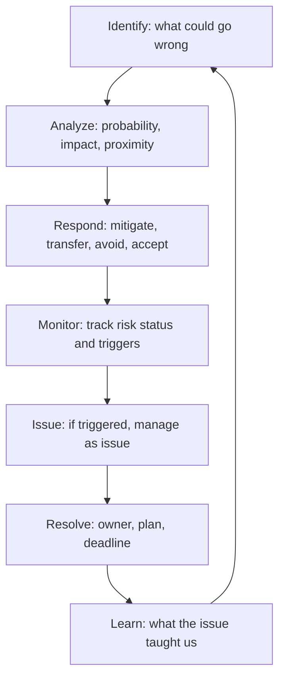

# Risk and Issues

> **Core capability:** The project manager manages uncertainty systematically — identifying risks before they become issues, maintaining a risk register with owners and responses, and resolving issues with documented plans and accountability.

## Why This Matters

Every project has unknowns. The difference between projects that deliver within tolerance and projects that spiral is whether unknowns are named, assessed, owned, and managed — or discovered when they become problems. The risk register is the project manager's primary tool for this: living documentation of what could go wrong, how likely it is, what it would cost, and who is doing something about it.

Issues are risks that materialized. When an issue occurs, the project manager shifts from prevention to resolution: owner, plan, deadline, communication. The speed and clarity of issue resolution is one of the most visible dimensions of project management competence — because issues are what stakeholders see.

## Topics in This Capability Area

| Topic | Core Skill | When It Matters |
|-------|------------|-----------------|
| [[01_Risk_Management_Planning]] | Designing the risk management approach for the project | Planning |
| [[02_Risk_Identification]] | Surfacing risks through workshops, checklists, and analysis | Continuously |
| [[03_Risk_Analysis_and_Prioritization]] | Assessing probability, impact, and proximity; prioritizing | After identification |
| [[04_Risk_Response_Planning]] | Mitigation, transfer, avoidance, acceptance, and contingency | Before risks become issues |
| [[05_Issue_Management]] | Logging, triaging, resolving issues with owners and deadlines | When risks materialize |
| [[06_Risk_Monitoring_and_Control]] | Tracking risk status and response effectiveness | Throughout the project |
| [[07_Contingency_Reserve_Management]] | Managing time and cost reserves against risk exposure | Budget and schedule management |

## The Risk Lifecycle

Risks become issues or retire — the register shows which.

## Practical Applications

### Risk Management Checklist

- [ ] Risk management approach is defined in the project management plan
- [ ] Risk register is maintained with probability, impact, proximity, owner, and response
- [ ] Risk reviews occur in every project status cycle
- [ ] Issues are logged with resolution owners and target dates
- [ ] Contingency reserves are sized against aggregate risk exposure
- [ ] Closed risks and resolved issues inform the project retrospective

## Common Pitfalls

| Pitfall | Why It Is a Problem | Better Approach |
|---------|---------------------|-----------------|
| **Register-as-formality** | Risks logged once, never updated | Living register; reviewed every status cycle |
| **Risk-inflation** | Every uncertainty is a top-priority risk | Prioritize by probability × impact; focus on the critical few |
| **Issue-resolution-drift** | Issues linger without owners or deadlines | Every issue gets an owner and a target resolution date |

## Success Indicators

- Risks get retired with closed responses — not just "monitoring"
- Issues resolve within their target window
- Contingency reserves are drawn upon deliberately, not exhausted by surprise
- The risk register is the first page stakeholders turn to in the status report

## Related Capabilities

- [[01_Initiation_and_Charter/00_overview|Initiation and Charter]]: initial risks identified at initiation
- [[03_Schedule_and_Cost/00_overview|Schedule and Cost]]: contingency reserves managed in schedule and cost baselines
- [[career-path/12_Technical_Program_Manager/04_Risk_and_Issue_Leadership/00_overview|Risk and Issue Leadership (TPM)]]: the program-level counterpart
- [[career-path/11_Engineering_Manager/04_Delivery_Leadership_for_Managers/05_Delivery_Risk_Ownership|Delivery Risk Ownership (EM)]]: the manager's program-risk perspective

## Summary

Risk and issue management is the project manager's uncertainty discipline: a living register of risks with owners and responses, issues resolved with documented plans and deadlines, and contingency reserves sized against reality. The project manager's credibility is measured by what's in the risk register — and what's not.