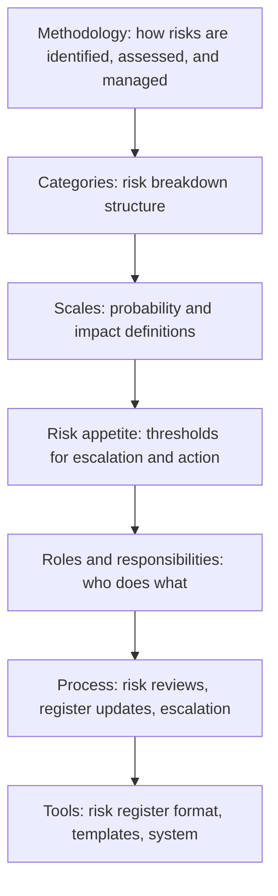

# Risk Management Planning

> **Core skill:** Designing the risk management approach for the project — defining risk categories, probability and impact scales, risk appetite, roles, and the risk management process — so the team knows what to watch, how to assess it, and who acts.

## Why This Matters

Risk management fails most often not because risks are missed but because no one agreed how to manage them. Is "high probability" 70% or 90%? Is "high impact" a two-week slip or a two-month slip? Who owns the risk register? Who decides when a risk becomes an issue? When risk management planning is skipped, every risk conversation restarts from first principles and every risk assessment is a negotiation rather than a measurement.

Risk management planning is the project manager's first risk action: defining the framework that makes all subsequent risk activities consistent, comparable, and actionable. It is a section in the project management plan — not a separate document — because risk management is embedded in how the project is run, not bolted on.

The output is a shared language for uncertainty. When a team member says "this is a medium-probability, high-impact risk," everyone knows what that means, what it triggers, and who is responsible.

## The Risk Management Plan



## Risk Categories (Risk Breakdown Structure)

A risk breakdown structure classifies risks so they can be systematically identified and managed:

| Level 1 | Level 2 (Examples) |
|---------|---------------------|
| **Technical** | Technology maturity, architecture risk, integration complexity, performance, security |
| **External** | Vendor stability, regulatory change, market conditions, weather, supply chain |
| **Organizational** | Resource availability, funding stability, prioritization shifts, stakeholder support |
| **Project management** | Estimation accuracy, planning completeness, dependency management, communication |
| **Quality** | Defect rates, test coverage, acceptance criteria, compliance |

The categories are a checklist during risk identification — have we looked at every category? — and a lens during risk monitoring — are risks clustering in one category?

## Probability and Impact Scales

Vague scales produce vague assessments. Define them numerically where possible:

| Rating | Probability | Schedule Impact | Cost Impact | Scope/Quality Impact |
|--------|------------|-----------------|-------------|---------------------|
| Very high | >70% | >4 weeks or >20% of remaining duration | >$100K or >15% of remaining budget | Key deliverable cannot be completed |
| High | 40–70% | 2–4 weeks or 10–20% of duration | $50K–$100K or 7–15% of budget | Major scope reduction required |
| Medium | 15–40% | 1–2 weeks or 5–10% of duration | $20K–$50K or 3–7% of budget | Minor scope reduction required |
| Low | 5–15% | <1 week or <5% of duration | <$20K or <3% of budget | Scope affected but deliverable intact |
| Very low | <5% | Negligible | Negligible | No material scope impact |

The scales are calibrated to the project. A two-week slip on a six-month project is medium; on a six-week project it is very high.

## Risk Appetite and Thresholds

| Threshold | Definition | Example |
|-----------|------------|---------|
| Risk appetite | The level of risk the organization is willing to accept | "We accept medium risks but require response plans for high and very high" |
| Risk tolerance | The acceptable range of variation around objectives | "Schedule may vary +/−10% without escalation" |
| Risk threshold | The point at which a risk triggers escalation or action | "Any risk with probability × impact score above 12 is escalated to the sponsor" |

Risk appetite is set by the sponsor, not the project manager. The project manager proposes; the sponsor approves.

## Roles and Responsibilities

| Role | Risk Responsibility |
|------|---------------------|
| Sponsor | Sets risk appetite; approves risk responses above threshold; controls management reserve |
| Project manager | Owns the risk management plan and risk register; facilitates risk identification and reviews |
| Risk owner | Monitors a specific risk; executes the risk response; escalates when triggers fire |
| Team members | Identify risks in their work areas; report risk indicators |
| Stakeholders | Identify external risks; participate in risk reviews as needed |

Every risk in the register has one named owner — never "the team." The risk owner is the person who watches and acts.

## Risk Management Process Integration

Risk management is not a separate meeting — it is integrated into the project's regular cadence:

| Cadence | Risk Activity |
|---------|---------------|
| Planning | Identify initial risks; define risk management approach |
| Status cycle | Review risk register: any changes? Any new risks? Any triggers fired? |
| Phase gate | Full risk review: update probability, impact, proximity |
| Change control | Assess risk impact of every change request |
| Retrospective | What risks fired? Were they in the register? What did we learn? |

## Practical Applications

**Risk management planning checklist:**

- [ ] Risk categories are defined (risk breakdown structure)
- [ ] Probability and impact scales are defined with numerical ranges
- [ ] Risk appetite and escalation thresholds are set and sponsor-approved
- [ ] Risk roles are assigned: owner, reviewer, approver
- [ ] Risk management process is integrated into the project cadence
- [ ] Risk register format is defined
- [ ] Risk management section is included in the project management plan

**Risk management plan template sections:**

```markdown
## Risk Management Approach
1. Methodology: [How risks are identified, assessed, responded to, and monitored]
2. Risk categories: [Risk breakdown structure]
3. Scales: [Probability definitions; impact definitions for schedule, cost, scope, quality]
4. Risk appetite: [Organization's willingness to accept risk; sponsor-approved thresholds]
5. Roles: [Sponsor, PM, risk owners, team members, stakeholders]
6. Risk review cadence: [When and how risks are reviewed]
7. Risk register format: [Template and tool]
8. Escalation path: [When and how risks are escalated]
```

## Common Pitfalls

| Pitfall | Why It Is a Problem | Better Approach |
|---------|---------------------|-----------------|
| **Planning-as-formality** | A risk management plan written for the project file, never referenced | Plan is used in every risk review; scales are the shared language |
| **Vague scales** | "High probability" means different things to different people | Numerical ranges with project-calibrated impact definitions |
| **No risk appetite** | Every risk is treated as unacceptable; the project spends on mitigation it does not need | Sponsor sets risk appetite; responses are proportional |
| **Process isolation** | Risk management is a separate activity from project execution | Risk reviews are integrated into status cycles and phase gates |
| **Risk-by-PM-alone** | The project manager identifies all risks without team or stakeholder input | Team identifies risks in their areas; stakeholders identify external risks |

## Success Indicators

- The team uses the probability and impact scales consistently
- Risk appetite guides response decisions — not every risk is mitigated
- Risk management is a standing agenda item, not a special meeting
- The risk register format is stable and understood by all risk owners
- Escalation thresholds are clear and trigger action when crossed

## Related Topics

- [[02_Risk_Identification]]: the plan defines how identification is done
- [[03_Risk_Analysis_and_Prioritization]]: the plan defines scales and thresholds
- [[04_Risk_Response_Planning]]: the plan defines who approves responses
- [[06_Risk_Monitoring_and_Control]]: the plan defines review cadence and escalation
- [[01_Initiation_and_Charter/00_overview|Initiation and Charter]]: initial risks identified at initiation

## Summary

Risk management planning establishes the framework that makes all subsequent risk activities consistent and comparable: risk categories that guide identification, probability and impact scales that make assessment objective, risk appetite that aligns responses with organizational tolerance, and roles that assign ownership. The plan is not a separate document — it is embedded in how the project is run. When planning is done well, risk conversations use a shared language and the escalation path is never a surprise.