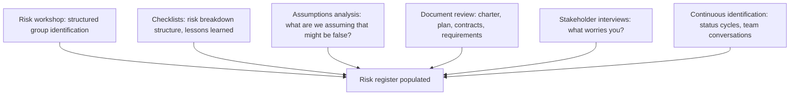

# Risk Identification

> **Core skill:** Surfacing risks systematically — through workshops, checklists, assumptions analysis, and continuous team input — so the risk register reflects what could actually go wrong, not just what is comfortable to name.

## Why This Matters

The risks that kill projects are rarely the ones identified in the first planning session. They are the ones that were visible as weak signals — a key person looking disengaged, a vendor missing a checkpoint, a scope item nobody understood — but never made it into the register because nobody asked in the right way or at the right time.

Risk identification is a continuous activity, not a planning milestone. The initial risk workshop populates the register; status cycle reviews update it; team conversations and stakeholder meetings surface new risks; and assumption analysis catches the ones hiding in plain sight — the things "everyone knows" that turn out not to be true.

The skill is not in listing every possible thing that could go wrong — that is infinite and useless. The skill is in surfacing the risks that are specific, owned, and actionable: risks that name what could happen, why, and what the early signal would be.

## Identification Techniques

## Primary Identification Techniques

| Technique | How It Works | When to Use | Strength |
|-----------|-------------|-------------|----------|
| **Risk workshop** | Facilitated session with team and stakeholders; structured prompts | Planning; at phase gates | Group diversity surfaces more risks |
| **Checklists** | Risk breakdown structure categories; past project lessons learned | Initial identification; planning | Systematic coverage; institutional memory |
| **Assumptions analysis** | Document every assumption; test: what if it is false? | Throughout the project | Surfaces risks hiding in "everyone knows" |
| **Document review** | Review charter, WBS, schedule, contracts, requirements for risk | Planning; after major document changes | Risks embedded in the plan itself |
| **SWOT analysis** | Strengths, weaknesses, opportunities, threats | Strategic or program-level planning | Surfaces external and organizational risks |
| **Expert interviews** | One-on-one conversations with technical leads, stakeholders, SMEs | When specialized knowledge is needed | Depth in specific risk categories |
| **Prompt lists** | Structured lists of risk areas: technical, schedule, cost, quality, etc. | Ongoing; status cycle reviews | Prevents category blind spots |

## The Risk Workshop

A structured risk identification session:

| Phase | Activity | Duration (2-hour workshop) |
|-------|----------|---------------------------|
| Setup | Present scope, objectives, constraints; explain risk categories and scales | 15 minutes |
| Silent generation | Each participant writes risks individually — avoids groupthink | 15 minutes |
| Round-robin | Each person shares one risk; facilitator records without judgment | 30 minutes |
| Clustering | Group related risks; identify themes and categories | 20 minutes |
| Initial assessment | Quick probability/impact for each cluster; flag top risks | 25 minutes |
| Next steps | Assign risk owners for investigation; schedule follow-up | 15 minutes |

The workshop's value is not the complete list — it is the shared understanding of what worries the team and why.

## Assumptions Analysis

Assumptions are the most common source of unidentified risk. Every project makes assumptions; the risk is in not knowing which ones are bets.

| Assumption Example | Risk If False | Early Signal |
|--------------------|---------------|--------------|
| "The API will be stable by Q2" | Integration work delayed; rework | API spec changes in Q1 |
| "We will have three senior engineers" | Schedule extends; quality drops | Hiring pipeline slows |
| "The vendor delivers on time" | Critical path slips | Vendor misses first checkpoint |
| "The compliance review takes two weeks" | Launch blocked; schedule impact | Review scope expands; reviewer asks escalate |
| "The scope is well understood" | Discovery expands scope mid-project | Items-per-epic climbing in first sprints |

Assumptions analysis: list every assumption in the project plan, charter, and schedule; for each, ask: what if this is false? The answer is a risk.

## Continuous Identification

Risk identification does not stop at planning. Sources of ongoing identification:

| Source | Trigger | Action |
|--------|---------|--------|
| Status meetings | "Anything new that worries you?" | Add to register; assign owner |
| Change requests | Every change introduces new assumptions | Risk assessment as part of change control |
| Stakeholder conversations | "What would make this project fail?" | Surface external and organizational risks |
| Team retrospectives | "What nearly went wrong that we caught?" | Add near-misses as potential risks |
| External monitoring | Vendor news, regulatory changes, market shifts | Assess relevance; add to register if applicable |
| Phase gate reviews | Milestone achievement: what risks remain? | Full risk review and re-identification |

## Risk Statement Format

A good risk statement names what could happen, why, and the consequence:

> **"If [event], then [consequence], because [cause]."**

| Poor Risk Statement | Good Risk Statement |
|---------------------|---------------------|
| "Schedule risk" | "If the payment gateway certification extends beyond April, then the Q2 launch slips by at least two weeks because the gateway is on the critical path with zero float." |
| "Resource risk" | "If the senior DBA resigns before data migration completes, then the migration phase extends by four weeks because no backup resource has the required knowledge." |
| "Vendor risk" | "If the hardware vendor misses the Q1 delivery window, then the integration test environment is unavailable until Q2 because the hardware is sole-sourced with a 12-week lead time." |

The format forces specificity: event, consequence, cause. A specific risk has a specific owner, response, and trigger.

## Practical Applications

**Risk identification checklist:**

- [ ] Risk workshop completed with team and key stakeholders
- [ ] Risk breakdown structure categories are all addressed
- [ ] Assumptions are documented and tested for risk
- [ ] Past project lessons learned are reviewed for recurring risks
- [ ] Risk statements use the "if/then/because" format
- [ ] Continuous identification is built into status cycle reviews
- [ ] Stakeholders are regularly asked: "what worries you?"

**Risk identification prompts:**

- What would cause this project to miss its date?
- What would cause this project to exceed its budget?
- What assumptions are we making that, if false, break the plan?
- What dependencies are we relying on that we do not control?
- What happened on the last project that we do not want to repeat?
- What is the one thing nobody wants to say out loud?

## Common Pitfalls

| Pitfall | Why It Is a Problem | Better Approach |
|---------|---------------------|-----------------|
| **One-time identification** | Risks identified at planning, never revisited | Continuous identification: status cycles, changes, phase gates |
| **Groupthink in workshops** | Only the most vocal participants contribute; quiet risks stay hidden | Silent generation before discussion; one-on-one follow-up |
| **Risk inflation** | Every uncertainty is a risk; the register is too long to be useful | Focus on specific, actionable risks with named consequences |
| **Assumption blindness** | Assumptions taken as facts; risks hidden in plain sight | Assumptions analysis at every planning cycle |
| **Vague risk statements** | "Communication risk" or "technical risk" — meaningless | "If/then/because" format: event, consequence, cause |

## Success Indicators

- Risks are identified in every status cycle, not just at planning
- Risk statements are specific: event, consequence, and cause are clear
- The team raises risks unprompted because they trust the process
- Assumptions are documented and reviewed for risk
- The register is lean — every row is specific, owned, and actionable

## Related Topics

- [[01_Risk_Management_Planning]]: the plan defines identification methods and categories
- [[03_Risk_Analysis_and_Prioritization]]: identified risks are assessed and prioritized
- [[05_Issue_Management]]: risks that materialize become issues
- [[02_Scope_and_Planning/00_overview|Scope and Planning]]: scope assumptions are a primary risk source
- [[career-path/12_Technical_Program_Manager/04_Risk_and_Issue_Leadership/00_overview|Risk and Issue Leadership (TPM)]]: the program-level risk identification approach

## Summary

Risk identification is the continuous discipline of surfacing what could go wrong — through workshops, checklists, assumptions analysis, and ongoing team and stakeholder input. The goal is not an exhaustive list of every possible risk but a register of specific, owned, and actionable risks — each naming what could happen, why, and the consequence. The risks that kill projects are rarely the ones identified in the first session; they are the ones visible as weak signals that never made it into the register because no one asked in the right way. Identification stops when the project stops.