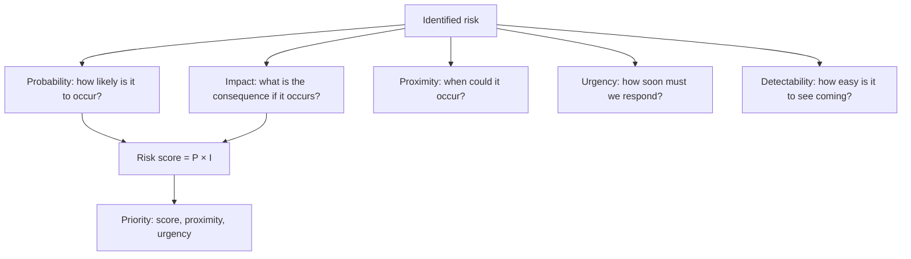

# Risk Analysis and Prioritization

> **Core skill:** Assessing each identified risk for probability, impact, proximity, and urgency — using qualitative and, where justified, quantitative methods — so the project focuses its limited response resources on the risks that matter most.

## Why This Matters

A risk register with fifty un-prioritized risks is a list of anxieties, not a management tool. The project manager cannot respond to every risk with equal intensity — and should not. The purpose of analysis and prioritization is to separate the critical few from the manageable many, so response resources are allocated where they make the most difference.

Qualitative analysis — rating probability and impact on defined scales — is sufficient for most risks in most projects. It is fast, it uses the shared language defined in the risk management plan, and it surfaces the risks that need attention. Quantitative analysis — Monte Carlo simulation, decision trees, expected monetary value — is used when the investment decision is large enough to justify the analysis cost, or when the risk profile is too complex for qualitative ratings alone.

The output is a prioritized risk register: risks ordered by risk score (probability × impact), with proximity noted — because a high-impact risk two years away is less urgent than a medium-impact risk arriving next month.

## Analysis Dimensions

## Qualitative Analysis

The standard approach for most projects: rate each risk on probability and impact using the scales defined in the risk management plan.

| Risk | Probability | Schedule Impact | Cost Impact | Risk Score (P × I) | Priority |
|------|------------|-----------------|-------------|---------------------|----------|
| Vendor API delay | High (60%) | High (3 weeks) | Medium ($40K) | 0.6 × 0.8 = 0.48 | Critical |
| Senior engineer departure | Medium (25%) | Very high (5 weeks) | High ($80K) | 0.25 × 0.9 = 0.225 | High |
| Scope creep on reporting module | High (50%) | Medium (2 weeks) | Low ($15K) | 0.5 × 0.4 = 0.20 | High |
| Regulatory change | Low (10%) | Very high (6 weeks) | High ($100K) | 0.1 × 0.9 = 0.09 | Medium |

The risk score is a ranking tool, not a precise measurement. It surfaces the relative priority of risks so response resources can be allocated proportionally.

### The Probability-Impact Matrix

|  | Very Low | Low | Medium | High | Very High |
|--|----------|-----|--------|------|-----------|
| **Very High** | Medium | High | High | Critical | Critical |
| **High** | Medium | Medium | High | High | Critical |
| **Medium** | Low | Medium | Medium | High | High |
| **Low** | Low | Low | Medium | Medium | Medium |
| **Very Low** | Low | Low | Low | Low | Medium |

The matrix maps probability (rows) against impact (columns). Critical risks demand immediate response; high risks require planned responses; medium risks are monitored; low risks are accepted or watched.

## Proximity and Urgency

Two risks with the same score may have different priority because of when they could occur:

| Risk | Score | Proximity | Urgency | Priority Adjustment |
|------|-------|-----------|---------|---------------------|
| Vendor API delay | 0.48 | Next month | Response needed now | Confirmed critical |
| Key person departure | 0.48 | Six months | Response can wait, but succession planning starts now | High, not critical |
| Regulatory change | 0.09 | Unknown, possibly Q4 | Monitor for developments | Keep on watch list |

Proximity: when could the risk occur? Urgency: how soon must the response be in place? A risk with high proximity and high urgency jumps the queue even if its score is moderate.

## Quantitative Analysis

Used when the stakes justify the analysis cost:

| Technique | How It Works | When to Use |
|-----------|-------------|-------------|
| **Expected monetary value (EMV)** | Probability × cost impact for each risk; sum for total risk exposure | Sizing contingency reserve; comparing response costs to risk costs |
| **Decision tree** | Branched decision paths with probabilities and payoffs at each node | Complex decisions with multiple uncertainties and sequential choices |
| **Monte Carlo simulation** | Runs thousands of schedule or cost simulations with probability distributions | Schedule risk analysis; cost risk analysis; confidence intervals for finish dates |
| **Sensitivity analysis** | Identifies which variables have the most impact on the outcome | Understanding which risks drive the most schedule or cost uncertainty |

Quantitative analysis is standard for large programs and projects with significant financial exposure but overkill for small projects. The project manager's judgment: is the cost of the analysis less than the value of the insight it provides?

## Risk Prioritization Outputs

| Output | Content | Use |
|--------|---------|-----|
| Prioritized risk register | Risks ranked by score, with proximity and urgency noted | Guides response resource allocation |
| Top risks list | The 5–10 highest-priority risks | Stakeholder reporting; sponsor review |
| Risk heat map | Visual probability-impact matrix with risks plotted | One-page view for steering committee |
| Risk exposure summary | Aggregate risk exposure (sum of EMV or qualitative scores) | Contingency sizing; trend analysis |

## Risk Reassessment

Risk analysis is not static. Risks are reassessed when:

| Trigger | Reassessment Action |
|---------|---------------------|
| Status cycle review | Review probability and impact for active risks; update scores |
| Phase gate | Full reassessment of all risks for the next phase |
| Risk event occurs | If a risk fires, assess remaining related risks |
| Change request | Assess new risks introduced by the change; reassess affected existing risks |
| External event | Market change, vendor event, regulatory action |
| Response implementation | After a response is executed, reassess residual risk |

## Practical Applications

**Risk analysis checklist:**

- [ ] Every identified risk is assessed for probability and impact using defined scales
- [ ] Risk scores are calculated and risks are prioritized
- [ ] Proximity and urgency are noted for each risk
- [ ] High and critical risks are flagged for response planning
- [ ] Risk heat map is prepared for stakeholder reporting
- [ ] Quantitative analysis is applied where justified by project stakes
- [ ] Risk reassessment triggers are defined

**Risk prioritization review questions:**

- [ ] Which risks have the highest scores, and are they getting the most attention?
- [ ] Are any high-proximity risks about to become issues?
- [ ] Has any risk's probability or impact changed since the last review?
- [ ] Are risks clustering in any category or work package?
- [ ] Is the aggregate risk exposure trending up or down?

## Common Pitfalls

| Pitfall | Why It Is a Problem | Better Approach |
|---------|---------------------|-----------------|
| **Score-only prioritization** | Two risks with the same score but different proximity get equal attention | Add proximity and urgency to the prioritization equation |
| **False precision** | "Probability = 67.3%" — spurious precision in qualitative analysis | Use the defined scales; coarse categories are fine for most risks |
| **Analysis paralysis** | Quantitative analysis applied to risks that do not justify it | Qualitative for most; quantitative only when stakes justify the cost |
| **One-time assessment** | Risks assessed at identification, never reassessed | Reassess at every status cycle and after any trigger event |
| **Impact-by-category-only** | Only one impact dimension assessed (usually schedule) | Assess impact on schedule, cost, scope, and quality |

## Success Indicators

- Every risk in the register has a current probability and impact assessment
- Critical and high risks receive proportionally more response attention
- Proximity is factored into prioritization — near-term risks are actioned first
- Quantitative analysis is used where it adds value, not as default
- Risk reassessment is triggered by defined events, not forgotten

## Related Topics

- [[01_Risk_Management_Planning]]: the plan defines the scales used in analysis
- [[02_Risk_Identification]]: identification produces the risks that analysis prioritizes
- [[04_Risk_Response_Planning]]: response planning focuses on the highest-priority risks
- [[07_Contingency_Reserve_Management]]: risk analysis feeds contingency sizing
- [[career-path/12_Technical_Program_Manager/04_Risk_and_Issue_Leadership/00_overview|Risk and Issue Leadership (TPM)]]: program-level risk aggregation and prioritization

## Summary

Risk analysis and prioritization separate the critical few risks from the manageable many by assessing probability, impact, proximity, and urgency on defined scales. Qualitative analysis — probability × impact with a heat map — is sufficient for most projects. Quantitative analysis — EMV, decision trees, Monte Carlo — is reserved for decisions where the cost of analysis is less than the value of the insight. The output is a prioritized register that guides response resource allocation: critical risks get immediate attention, high risks get planned responses, and low risks are monitored or accepted. Reassessment is continuous — risk scores change as the project progresses and the environment shifts.