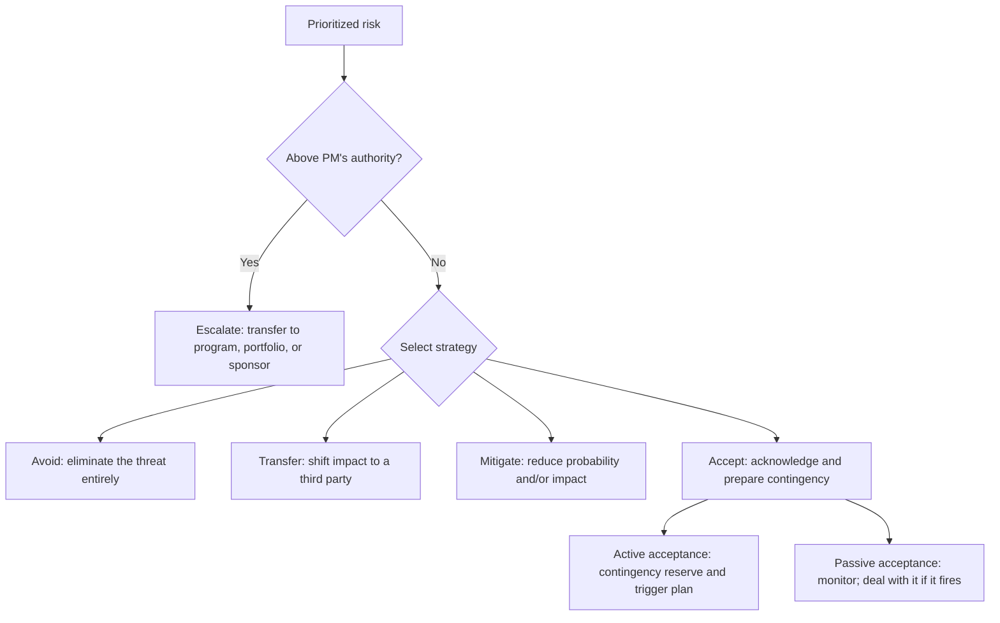

# Risk Response Planning

> **Core skill:** Designing and documenting responses for prioritized risks — mitigation, transfer, avoidance, acceptance, and escalation — with owners, actions, triggers, and residual risk assessments so the project acts on risks before they become issues.

## Why This Matters

A risk identified and analyzed but not responded to is a risk that will fire on schedule. The response is where risk management becomes action: someone is assigned to do something that reduces the probability, reduces the impact, transfers the risk to a party better able to manage it, or prepares a contingency plan for when the risk fires.

Response planning is also where risk management becomes honest about trade-offs. Mitigation costs money and time. Transfer costs money. Avoidance may cost scope. Acceptance costs nothing now but reserves budget and schedule for the impact if the risk fires. The project manager presents these trade-offs; the sponsor or risk owner decides.

Every response leaves a residual risk — the risk that remains after the response is applied. If the residual risk is still above the risk appetite, secondary responses are needed. The process iterates until the residual risk is acceptable or the response cost exceeds the risk exposure.

## Response Strategies



### Response Strategies for Threats

| Strategy | What It Means | Example | Cost |
|----------|--------------|---------|------|
| **Avoid** | Eliminate the threat by changing the plan | Remove a risky technology choice; change scope to exclude the risky component | May cost scope or time |
| **Transfer** | Shift the impact to a third party | Insurance, warranties, performance bonds, fixed-price contract | Financial cost; does not eliminate the risk |
| **Mitigate** | Reduce probability or impact to an acceptable level | Add redundancy; run a prototype early; cross-train a backup | Time, money, or resources |
| **Escalate** | The risk is outside the PM's authority or scope | A program-level risk that affects multiple projects; a strategic risk | No direct cost; response moves to higher level |
| **Accept** | Acknowledge the risk; prepare contingency or monitor | Risks with low probability or low impact; risks where response cost exceeds exposure | Contingency reserve if active; none if passive |

### Response Strategies for Opportunities

Risk management also addresses positive risks (opportunities):

| Strategy | What It Means | Example |
|----------|--------------|---------|
| **Exploit** | Ensure the opportunity is realized | Assign your best resources to a high-value optional feature |
| **Enhance** | Increase probability or impact | Invest in early delivery to capture market window |
| **Share** | Partner with another party to capture the opportunity | Joint venture; shared investment |
| **Accept** | Take advantage if it occurs, but do not pursue | A vendor discount that may materialize |

## Response Selection Criteria

| Criterion | Question |
|-----------|----------|
| **Effectiveness** | Does the response reduce the risk below the risk appetite? |
| **Cost** | Is the response cost less than the expected risk exposure (probability × impact)? |
| **Feasibility** | Can the response be implemented with available resources and time? |
| **Timeliness** | Can the response be in place before the risk could occur? |
| **Side effects** | Does the response introduce new risks? |
| **Residual risk** | What risk remains after the response is applied? Is it acceptable? |

The general rule: the response cost should not exceed the expected risk exposure unless the impact is catastrophic (in which case mitigation is justified regardless of probability).

## Contingency vs. Fallback Plans

| Plan | What It Is | When It Activates | Example |
|------|-----------|-------------------|---------|
| **Contingency plan** | Predefined actions if the risk fires | When a defined trigger event occurs | "If the vendor misses the February delivery, we lease equipment from an alternative supplier" |
| **Fallback plan** | Actions if the contingency plan fails | When the contingency plan does not achieve the desired result | "If the alternative supplier cannot deliver, we defer the affected scope to the next phase" |

Contingency plans are funded from the contingency reserve. Fallback plans may require management reserve if not previously budgeted.

## Documenting Risk Responses

Each risk response entry in the register:

```markdown
## Risk Response: [Risk ID]

**Risk:** [One-sentence risk statement]
**Strategy:** [Avoid / Transfer / Mitigate / Accept / Escalate]
**Response owner:** [One name]
**Response actions:**
1. [Action] — [owner] — [target date]
2. [Action] — [owner] — [target date]
**Trigger:** [The condition or event that activates the contingency plan]
**Contingency plan:** [What happens if the risk fires]
**Residual risk:** [Risk remaining after response — probability × impact]
**Cost:** [Response cost, including contingency reserve allocation]
**Review date:** [Date the response is next evaluated]
```

## Response Monitoring

A response that is planned but not executed is a risk still active. Response monitoring:

| Check | Frequency | Action If Not on Track |
|-------|-----------|------------------------|
| Response actions on schedule? | Every status cycle | Escalate to response owner; adjust plan |
| Response cost within estimate? | Every status cycle | Review against contingency allocation |
| Risk probability or impact changed? | Every status cycle | Reassess; adjust response if needed |
| New risks introduced by the response? | Every status cycle | Identify and register secondary risks |
| Residual risk within appetite? | At phase gates | Adjust or add secondary response |

## Practical Applications

**Response planning checklist:**

- [ ] Every prioritized risk has a selected response strategy
- [ ] Mitigation actions are specific, dated, and owned by one person
- [ ] Contingency plans are defined with trigger events
- [ ] Response cost is compared to expected risk exposure
- [ ] Residual risk is assessed and is within risk appetite
- [ ] Secondary risks introduced by the response are identified
- [ ] Contingency reserve allocation is documented
- [ ] Response status is reviewed in every status cycle

**Response decision template:**

| Risk | P × I Score | Strategy | Response Actions | Cost | Residual Risk | Acceptable? |
|------|-------------|----------|-----------------|------|---------------|-------------|
| Vendor delay | 0.48 | Mitigate + contingency | 1. Identify backup vendor (Feb). 2. Pre-negotiate contract terms | $15K | 0.15 | Yes |
| Key departure | 0.225 | Mitigate | 1. Cross-train backup (Jan–Mar). 2. Document critical knowledge | 60 person-hours | 0.10 | Yes |
| Regulatory change | 0.09 | Accept (active) | Monitor; allocate $40K contingency | $0 (contingency only) | 0.09 | Monitored |

## Common Pitfalls

| Pitfall | Why It Is a Problem | Better Approach |
|---------|---------------------|-----------------|
| **"Monitor" as mitigation** | Watching a risk is not reducing it; the risk fires on schedule | Every risk has a dated action or an explicit acceptance with contingency |
| **Response-without-cost** | Mitigation actions are planned without costing them | Cost every response; compare cost to expected risk exposure |
| **Contingency-without-trigger** | "We'll deal with it" — no trigger, no owner, no plan | Define trigger events and named contingency owners |
| **Residual risk ignored** | The response is applied but the remaining risk is not assessed | Assess residual risk; add secondary responses if above appetite |
| **Over-mitigation** | Every risk is mitigated regardless of cost or probability | Compare response cost to expected exposure; accept low-exposure risks |

## Success Indicators

- Every high and critical risk has a documented response with owner and target date
- Response costs are compared to expected risk exposure — and the comparison makes sense
- Contingency plans have defined triggers — the team knows when to act
- Residual risks are assessed and within risk appetite
- Response status is reviewed in every status cycle

## Related Topics

- [[03_Risk_Analysis_and_Prioritization]]: prioritized risks drive response planning
- [[02_Risk_Identification]]: identified risks become response candidates
- [[06_Risk_Monitoring_and_Control]]: responses are monitored for effectiveness
- [[07_Contingency_Reserve_Management]]: contingency reserves fund response plans
- [[05_Issue_Management]]: when risks fire despite responses, they become issues
- [[career-path/11_Engineering_Manager/04_Delivery_Leadership_for_Managers/05_Delivery_Risk_Ownership|Delivery Risk Ownership (EM)]]: manager-level risk response patterns

## Summary

Risk response planning turns prioritized risks into action: selecting a strategy (avoid, transfer, mitigate, accept, escalate), designing specific dated actions with named owners, costing the response, defining contingency triggers, and assessing residual risk. The key discipline is proportionality — response cost should not exceed expected risk exposure unless the impact is catastrophic. A risk with no response beyond "monitor" is not managed; it is documented. The response plan is living — reviewed every status cycle, adjusted when the risk profile changes, and closed when the risk retires or fires.