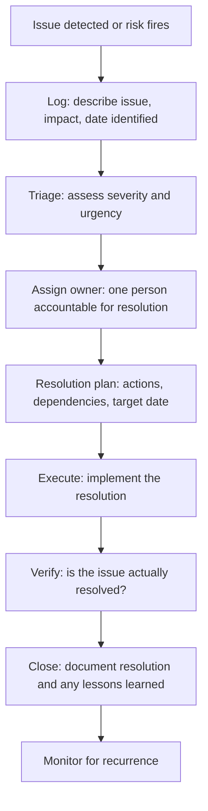

# Issue Management

> **Core skill:** Logging, triaging, and resolving issues — risks that have materialized — with assigned owners, resolution plans, target dates, and documented outcomes so issues are closed, not deferred indefinitely.

## Why This Matters

An issue is a risk that fired. Something is wrong now — not might go wrong later. The project manager's response shifts from prevention to resolution: who owns this, what is the plan, when will it be resolved, and what is the impact in the meantime?

Issue management is one of the most visible dimensions of project management competence because issues are what stakeholders see. A risk register is internal preparation; an issues log is the public record of problems the project is handling. The speed, clarity, and completeness of issue resolution shapes stakeholder confidence more than any status report.

The discipline is simple but demanding: every issue gets an owner, a resolution plan, and a target date within one status cycle of being logged. Issues that linger without owners or deadlines erode credibility and compound — an unresolved issue is a block on dependent work.

## Issue vs. Risk

| Dimension | Risk | Issue |
|-----------|------|-------|
| Timing | Future: could happen | Present: has happened |
| Action | Prevention, mitigation, contingency | Resolution, containment, recovery |
| Register | Risk register | Issue log |
| Urgency | Depends on proximity | Immediate — it is already affecting the project |
| Owner | Risk owner monitors and responds | Issue owner resolves |

A risk becomes an issue when its trigger condition is met or when it materializes regardless of response. The entry moves from the risk register to the issue log.

## The Issue Lifecycle



## Issue Triage

| Severity | Definition | Response Time | Escalation |
|----------|-----------|---------------|------------|
| Critical | Blocks critical path; threatens project objectives | Immediate; same-day response plan | Sponsor and steering committee |
| High | Delays a milestone or work package; significant impact | Response plan within 2 business days | Sponsor informed |
| Medium | Affects non-critical work; manageable impact | Response plan within one status cycle | PM manages; sponsor aware |
| Low | Minor inconvenience; workaround exists | Logged; resolved when convenient | No escalation needed |

## Resolution Planning

An issue resolution plan answers:

| Question | Content |
|----------|---------|
| What exactly is the problem? | Specific, factual description of the issue |
| What is the impact? | Affected work, schedule, cost, quality, stakeholders |
| What caused it? | Root cause (if known) or investigation plan |
| What are the resolution options? | At least two with pros, cons, and feasibility |
| What is the chosen resolution? | Specific actions, owner for each action, dependencies |
| When will it be resolved? | Target resolution date |
| What is the workaround? | Interim measure to keep work moving |
| What are the risks? | Risks introduced by the resolution itself |

## The Issue Log

| Field | Content | Standard |
|-------|---------|----------|
| Issue ID | Unique identifier | Sequential or category-prefixed |
| Date identified | When the issue was first detected | The detection date, not the log date |
| Description | What happened, specifically | Not "slow progress" — "API endpoint returns 500 errors on 15% of requests" |
| Severity | Critical / High / Medium / Low | From triage |
| Impact | Affected deliverables, schedule, cost | Quantified where possible |
| Owner | One named person | The person accountable for resolution |
| Resolution plan | Actions with owners and dates | Linked to the issue |
| Target resolution date | When the issue should be resolved | Realistic, not aspirational |
| Status | Open / In progress / Resolved / Closed | Updated every status cycle |
| Resolution | What was done; date resolved | One-paragraph closure note |

## Issue Escalation

| Escalate When | Do Not Escalate When |
|---------------|----------------------|
| Resolution requires authority above the PM | Resolution is within the PM's authority and underway |
| The issue affects the project's objectives or business case | The issue is severe but the resolution plan is credible |
| Stakeholder conflict requires sponsor intervention | Stakeholders agree on the resolution approach |
| Resolution will exceed the contingency reserve | Resolution is funded within contingency |
| The issue has program-level impact | The issue is contained within the project |

Escalate with: situation, impact, resolution options, recommendation, and decision needed by a specific date.

## Issue Trends and Analysis

Issue data is project intelligence:

| Analysis | What It Reveals | Action |
|----------|----------------|--------|
| Issue count trending | Is the project accumulating or resolving issues? | If accumulating, investigate root cause |
| Resolution time | How long do issues stay open? | If growing, improve resolution process |
| Category clustering | Are issues concentrated in one area? | Targeted intervention in that area |
| Risk-to-issue ratio | How many risks became issues? | Calibrate risk identification and response |
| Recurrence | Are the same issues occurring again? | Root cause analysis; process change |

## Practical Applications

**Issue management checklist:**

- [ ] Every issue is logged within one business day of detection
- [ ] Severity is assessed and escalation path is followed
- [ ] An owner is assigned — one person, never "the team"
- [ ] A resolution plan exists with target date within one status cycle of logging
- [ ] Workaround is documented if resolution is not immediate
- [ ] Issue status is updated in every status cycle
- [ ] Issue closure includes a resolution note
- [ ] Issue trends are analyzed periodically

**Issue log entry template:**

```markdown
## Issue: [ISSUE-ID] — [One-line description]

**Date identified:** [Date]
**Severity:** [Critical / High / Medium / Low]
**Impact:** [Affected deliverables, schedule, cost]
**Root cause:** [What caused this, or investigation plan if unknown]

**Owner:** [One name]
**Resolution plan:**
1. [Action] — [owner] — [target date]
2. [Action] — [owner] — [target date]

**Target resolution date:** [Date]
**Workaround:** [Interim measure to keep work moving]
**Status:** [Open / In progress / Resolved / Closed]
**Resolution:** [What was done; date; lessons learned]
```

## Common Pitfalls

| Pitfall | Why It Is a Problem | Better Approach |
|---------|---------------------|-----------------|
| **Issue drift** | Issues logged and forgotten; no owner, no target date | Every issue has an owner and a target date within one status cycle |
| **Risk-issue confusion** | Risks are managed as issues (panic) or issues are managed as risks (delay) | Clear distinction: risk = might happen; issue = has happened |
| **Resolution-without-verification** | Issue declared resolved without testing | Verify resolution; confirm with affected stakeholders |
| **No workaround** | Work stops while the issue is being resolved | Interim workaround documented and communicated |
| **Issue hoarding** | The PM tries to resolve everything without escalation | Escalate when resolution exceeds authority or requires sponsor weight |

## Success Indicators

- Issues are logged within one business day of detection
- Every issue has an owner and a target resolution date
- Resolution time is stable or decreasing
- Issues are verified resolved before closure
- Issue recurrence is rare — root cause is addressed

## Related Topics

- [[02_Risk_Identification]]: risks that are missed become issues without warning
- [[04_Risk_Response_Planning]]: contingency plans are executed when risks become issues
- [[06_Risk_Monitoring_and_Control]]: risk monitoring detects when risks become issues
- [[01_Initiation_and_Charter/00_overview|Initiation and Charter]]: issue escalation path established at initiation
- [[career-path/12_Technical_Program_Manager/04_Risk_and_Issue_Leadership/00_overview|Risk and Issue Leadership (TPM)]]: program-level issue management

## Summary

Issue management is the project manager's response when a risk fires: log, triage, assign an owner, build a resolution plan with a target date, execute, verify, and close — with documented resolution notes. Every issue gets an owner and a target date within one status cycle. Issues that linger without owners erode credibility and compound into larger problems. The issue log is the public record of how the project handles problems; its quality — speed, clarity, completeness — shapes stakeholder confidence more than any status report.