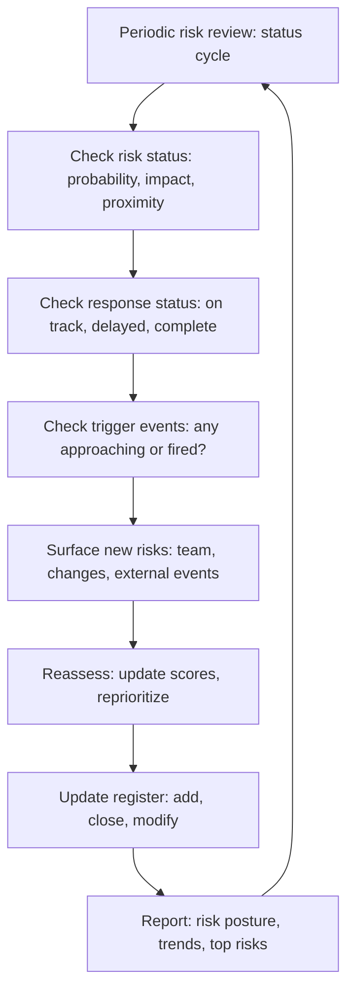

# Risk Monitoring and Control

> **Core skill:** Tracking risk status, response effectiveness, and emerging risks continuously — so the risk register is a living document that reflects the project's current risk posture, not a planning artifact.

## Why This Matters

A risk register that is updated at planning and never touched again is not a risk register — it is a risk archive. Risks change: their probability rises as triggers approach, their impact shifts as scope changes, and new risks emerge as the project progresses. Risk monitoring and control is the discipline of keeping the register alive.

Monitoring means watching: are risk probabilities and impacts changing? Are response actions on track? Are contingency triggers approaching? Are new risks surfacing that belong in the register?

Control means acting: if a response is not working, adjust it. If a risk's probability spikes, escalate it. If a risk fires, move it to the issue log. If new risks outpace closed risks, investigate whether the project's risk identification is adequate.

The output is a risk register that a stakeholder can read at any status review and trust that it reflects the project's current reality — not the project's state at initiation.

## The Monitoring Cycle

## What to Monitor

| Monitoring Element | Frequency | Key Questions |
|--------------------|-----------|---------------|
| Risk probability | Every status cycle | Has the likelihood changed? Are triggers approaching? |
| Risk impact | Every status cycle | Has the potential consequence grown or shrunk? |
| Proximity | Every status cycle | Is the risk close to its expected occurrence window? |
| Response actions | Every status cycle | Are mitigation actions on schedule? Is the response effective? |
| Trigger events | Continuous | Has any contingency trigger fired? |
| Residual risk | Every status cycle | Is residual risk still within appetite? |
| New risks | Every status cycle | What has changed that introduces new risk? |
| Closed risks | Every status cycle | Which risks have been retired? What is the resolution note? |
| Emerging risks | Continuous | Weak signals that have not yet formed into named risks |

## Risk Status Categories

| Status | Meaning | Action |
|--------|---------|--------|
| Active | Risk is still possible; monitoring continues | Regular review; response actions ongoing |
| Triggered | Risk has fired; move to issue log | Execute contingency plan; log as issue |
| Retired | Risk is no longer possible | Close with resolution note |
| Expired | Risk window has passed without firing | Close with note; document if any response was wasted |
| Escalated | Risk moved to program, portfolio, or sponsor level | Monitor for status updates from the escalated owner |

Every risk in the register has exactly one status. No risk stays "active" indefinitely without justification.

## Risk Trend Analysis

| Trend | What It Indicates | Response |
|-------|-------------------|----------|
| Risk count rising | The project is discovering new risks faster than closing them | Review identification effectiveness; is the project riskier than expected? |
| Risk scores rising | Existing risks are becoming more likely or more impactful | Reassess responses; consider additional mitigation |
| Response completion lagging | Response actions are behind schedule | Escalate to response owners; reallocate resources |
| Clustering in one category | A systemic issue in one area (e.g., all technical risks rising) | Root cause analysis in that area |
| Risk-to-issue conversion high | Risks are firing despite responses | Response effectiveness review; improve identification |
| No new risks | Complacency or identification failure — projects always have new risks | Stimulate identification: prompts, workshops, assumption review |

## Risk Audit

A periodic risk audit assesses the risk management process itself:

| Audit Question | What It Checks |
|----------------|----------------|
| Is the risk register complete and current? | All known risks are in the register; status is up to date |
| Are risk responses being executed? | Response actions are on track; owners are engaged |
| Are risk assessments consistent? | Different risks with similar profiles have similar scores |
| Is the risk management plan being followed? | Process adherence: reviews, escalation, documentation |
| Are risk reports reaching the right audience? | Stakeholders receive risk information at the right level of detail |
| Is contingency reserve tracking with risk exposure? | Reserve allocation matches aggregate risk exposure |

## Risk Reporting

Stakeholders receive risk information at different levels:

| Audience | What They Need | Format |
|----------|---------------|--------|
| Project team | Their risks: what to watch, what to do | Risk register filtered by owner; action items |
| Project manager | Full register; trends; response status | Risk register; trend analysis; audit results |
| Sponsor | Top 5–10 risks; risk posture summary; decisions needed | Risk heat map; top risks with response status; escalation requests |
| Steering committee | Risk posture; aggregate exposure; trends | One-page dashboard: heat map, trend arrows, top risks |
| Program manager | Cross-project risk aggregation; shared risks | Program risk register; dependency risk map |

## Practical Applications

**Risk monitoring checklist:**

- [ ] Risk register is reviewed in every status cycle
- [ ] Probability, impact, and proximity are reassessed for each active risk
- [ ] Response actions are tracked: on schedule, delayed, or complete
- [ ] Trigger events are monitored; any approaching triggers are flagged
- [ ] New risks are identified from team input, changes, and external monitoring
- [ ] Closed risks have resolution notes
- [ ] Risk trends are analyzed: count, scores, clustering, conversion rate
- [ ] Risk audit is conducted at phase gates

**Risk review agenda (15 minutes, weekly):**

1. New risks identified this week (2 min)
2. Risks with status changes (3 min)
3. Response actions behind schedule (3 min)
4. Trigger events approaching or fired (2 min)
5. Top risks for sponsor report (3 min)
6. Any risks to close or escalate (2 min)

## Common Pitfalls

| Pitfall | Why It Is a Problem | Better Approach |
|---------|---------------------|-----------------|
| **Register-as-archive** | Risks logged once, never updated | Living register; every status cycle reviews every active risk |
| **Response-without-tracking** | Mitigation actions planned but never checked for completion | Response actions tracked alongside schedule activities |
| **Trend blindness** | Individual risks monitored but aggregate trends missed | Track risk count, scores, and clustering trends |
| **Audit-avoidance** | The risk process is assumed to work because it exists | Periodic risk audits assess process effectiveness |
| **Stakeholder-risk-gap** | The PM knows the risks; stakeholders do not | Risk reporting calibrated to audience; top risks in every status report |

## Success Indicators

- The risk register is updated in every status cycle
- No risk stays "active" indefinitely without reassessment
- Risk trends are analyzed and drive process improvement
- Response actions complete within their target dates
- Stakeholders can name the project's top risks without reference

## Related Topics

- [[01_Risk_Management_Planning]]: the plan defines the monitoring cadence
- [[03_Risk_Analysis_and_Prioritization]]: reassessment updates scores and priorities
- [[04_Risk_Response_Planning]]: response actions are tracked for completion
- [[05_Issue_Management]]: triggered risks move to the issue log
- [[03_Schedule_and_Cost/00_overview|Schedule and Cost]]: risk monitoring feeds schedule and cost forecasts
- [[career-path/11_Engineering_Manager/04_Delivery_Leadership_for_Managers/05_Delivery_Risk_Ownership|Delivery Risk Ownership (EM)]]: leading indicator monitoring at the team level

## Summary

Risk monitoring and control keeps the risk register alive: reassessing probability, impact, and proximity every status cycle; tracking response action completion; watching for trigger events; surfacing new risks; and analyzing trends across the register. The discipline is the difference between a risk register that reflects the project's current posture and one that memorializes the planning phase. Risk audit periodically assesses the process itself — not just the risks. The test: can a stakeholder read the register at any status review and trust that it is current?