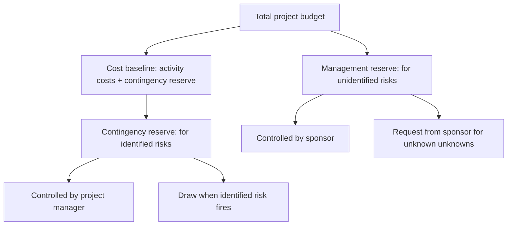

# Contingency Reserve Management

> **Core skill:** Sizing, allocating, drawing upon, and replenishing time and cost reserves — so contingency is a managed buffer against identified risks, not a slush fund or an afterthought.

## Why This Matters

Every project budget has two reserves: contingency (for identified risks) and management reserve (for unidentified risks). The project manager controls contingency; the sponsor controls management reserve. When this distinction blurs, contingency becomes padding and management reserve becomes a political negotiation.

Contingency is not a round number added at the end of estimation. It is sized from the risk register: probability × impact for each risk, aggregated, and adjusted for risk correlation and organizational risk appetite. As the risk register changes — risks close, new risks emerge, probabilities shift — the contingency drawdown and remaining reserve should track.

The discipline is drawdown justification: every dollar or day drawn from contingency must trace to a specific risk in the register. When contingency is drawn for unidentified events, it signals that risk identification is incomplete and management reserve should have been used instead.

## Reserve Types



### Contingency vs. Management Reserve

| Dimension | Contingency Reserve | Management Reserve |
|-----------|---------------------|---------------------|
| Covers | Identified risks (known unknowns) | Unidentified risks (unknown unknowns) |
| Sizing basis | Risk register: probability × impact | Percentage of budget; organizational policy; historical overrun data |
| Control | Project manager | Sponsor |
| Draw authorization | PM approves; documented against risk | Sponsor approves; formal request |
| Included in cost baseline | Yes | No (outside the baseline) |
| Included in budget | Yes | Yes |
| EVM treatment | Part of BAC (budget at completion) | Added to BAC only when drawn |

## Sizing Contingency Reserve

### Method 1: Expected Monetary Value (EMV)

Sum of probability × cost impact for each risk:

| Risk | Probability | Cost Impact | EMV |
|------|------------|-------------|-----|
| Vendor API delay | 60% | $40,000 | $24,000 |
| Senior engineer departure | 25% | $80,000 | $20,000 |
| Scope creep on reporting | 50% | $15,000 | $7,500 |
| Regulatory change | 10% | $100,000 | $10,000 |
| **Total EMV** | | | **$61,500** |

The EMV sum is the starting point for contingency sizing. It is then adjusted for risk correlation (are multiple risks likely to fire together?) and organizational risk appetite.

### Method 2: Percentage of Budget

A percentage of the total estimated cost, based on:

| Factor | Higher Percentage | Lower Percentage |
|--------|------------------|-----------------|
| Project novelty | First-of-kind; no historical analogues | Repeatable project with strong historical data |
| Technology maturity | New or unproven technology | Established, well-understood technology |
| Requirements stability | Requirements expected to change | Fixed, well-defined requirements |
| Organizational experience | Team new to this type of work | Experienced team and organization |
| Project complexity | Many dependencies, interfaces, stakeholders | Simple, contained scope |

Typical range: 5%–15% for well-understood projects; 15%–30% for novel or complex projects.

### Method 3: Schedule Contingency

Schedule contingency is sized in days, not dollars — but converts to cost if resources are kept on:

| Approach | How It Works | When to Use |
|----------|-------------|-------------|
| Critical path buffer | Add buffer to the end of the critical path | Single critical path; low dependency complexity |
| Feeding buffers | Add buffers where non-critical paths feed the critical path | Multiple paths; protect critical path from feeder delays |
| Risk-driven buffer | For each risk, estimate schedule impact × probability | Detailed risk register with schedule impact estimates |

## Drawing on Contingency

| Step | Action | Documentation |
|------|--------|---------------|
| 1. Trigger | A risk fires; the contingency plan activates | Risk ID and trigger event documented |
| 2. Estimate | Cost or schedule impact of the draw | Quantified impact; draw amount |
| 3. Authorize | PM approves the draw if within contingency | Approval record |
| 4. Record | Draw amount subtracted from remaining contingency | Contingency register updated |
| 5. Report | Draw reported in status: risk, amount, remaining contingency | Status report |
| 6. Re-assess | After resolution, reassess related risks and remaining contingency needs | Risk register update |

A draw is always traceable to a risk in the register. If the event is not in the register, it should be a management reserve draw — and the PM should ask why the risk was not identified.

## Contingency Monitoring

| Monitoring Element | Frequency | Action |
|--------------------|-----------|--------|
| Remaining contingency vs. aggregate risk exposure | Every status cycle | If remaining < exposure, flag as under-reserved |
| Draw rate | Every status cycle | Is contingency being drawn faster than expected? |
| Draw justification | Every draw | Does every draw trace to an identified risk? |
| Contingency burn-down | Monthly or at phase gates | Is the burn-down curve matching the risk profile? |
| Top risks vs. contingency allocation | Monthly | Are the largest risks adequately reserved? |

## Contingency Replenishment

Contingency can increase or decrease as the risk profile changes:

| Scenario | Action |
|----------|--------|
| New high-impact risks identified | Increase contingency to cover new EMV |
| Risks close without firing | Contingency released back to the project or organization |
| Risk probabilities drop | Reduce contingency proportionally |
| Project phase change | Recalculate contingency for the next phase's risk profile |

Replenishment or release requires sponsor approval if it changes the cost baseline.

## Practical Applications

**Contingency management checklist:**

- [ ] Contingency reserve is sized from the risk register using EMV
- [ ] Schedule contingency is allocated on the critical path and feeding paths
- [ ] Every draw traces to an identified risk in the register
- [ ] Remaining contingency is reported in every status cycle
- [ ] Contingency burn-down is tracked against the risk profile
- [ ] Management reserve is separately identified and sponsor-controlled
- [ ] Contingency is reassessed when the risk register changes materially

**Contingency report template:**

```markdown
## Contingency Reserve Status

**Total contingency:** [$Amount / Days]
**Drawn to date:** [$Amount / Days] — [% of total]
**Remaining:** [$Amount / Days]

**Draws this period:**
| Risk ID | Risk | Amount | Justification |
|---------|------|--------|---------------|
| R-014 | Vendor API delay | $15,000 | Contingency plan activated; backup vendor engaged |

**Aggregate risk exposure (EMV):** [$Amount]
**Coverage ratio:** Remaining contingency / EMV = [ratio]
**Status:** [Green: >1.5× EMV / Yellow: 1–1.5× / Red: <1×]
```

## Common Pitfalls

| Pitfall | Why It Is a Problem | Better Approach |
|---------|---------------------|-----------------|
| **Contingency as round number** | "Add 10%" — no traceability to risks | Size from risk register using EMV; justify the percentage |
| **Draw-without-trace** | Contingency drawn for events not in the risk register | Every draw references a risk ID; unidentified events use management reserve |
| **Contingency hoarding** | Contingency never drawn even when risks fire | Draw when identified risks fire; that is what contingency is for |
| **Management reserve confusion** | PM draws from management reserve without sponsor approval | Management reserve is sponsor-controlled; formal request required |
| **Burn-down neglect** | Contingency is not tracked over time; remaining reserve is unknown | Track contingency drawdown every status cycle; report remaining |

## Success Indicators

- Contingency reserve is sized from the risk register and the sizing rationale is documented
- Every draw traces to an identified risk — no "miscellaneous" draws
- Remaining contingency is reported in every status cycle
- Contingency burn-down rate matches the project's risk profile
- Coverage ratio (remaining contingency / EMV) stays above 1.0

## Related Topics

- [[03_Risk_Analysis_and_Prioritization]]: risk analysis feeds EMV for contingency sizing
- [[04_Risk_Response_Planning]]: contingency plans draw on contingency reserve
- [[06_Risk_Monitoring_and_Control]]: monitoring tracks contingency drawdown
- [[03_Schedule_and_Cost/00_overview|Schedule and Cost]]: contingency is part of the cost baseline
- [[career-path/12_Technical_Program_Manager/04_Risk_and_Issue_Leadership/00_overview|Risk and Issue Leadership (TPM)]]: program-level reserve management

## Summary

Contingency reserve management is the discipline of sizing, allocating, drawing upon, and monitoring reserves against identified risks. Contingency is sized from the risk register using expected monetary value — not a round percentage added by habit. Every draw traces to a risk ID; unidentified events draw from management reserve, which is sponsor-controlled. Remaining contingency is reported in every status cycle, and the coverage ratio (remaining / EMV) tells the project manager whether the reserve is sufficient. Contingency is not padding — it is a managed buffer that shrinks as risks fire and grows as new risks emerge.