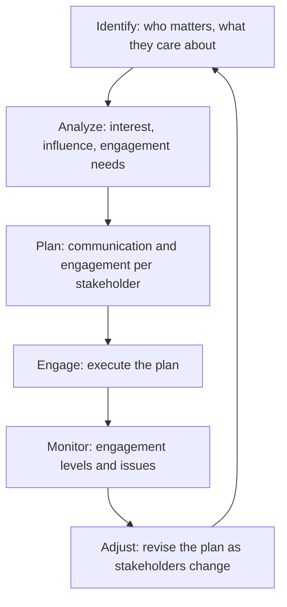

# Stakeholder Engagement

> **Core capability:** The project manager plans and executes stakeholder engagement — identifying who matters, understanding their interests and influence, communicating appropriately, and keeping them involved at the right level throughout the project.

## Why This Matters

Projects fail on stakeholder relationships more often than on technical execution. The sponsor who disengages after charter approval, the user group that was never consulted, the executive who hears about a delay from a rumor — each is a stakeholder engagement failure that cascades into a project failure.

The project manager's stakeholder work is deliberate, not reactive: a stakeholder register that maps interest, influence, and communication needs; a communication plan that delivers the right information at the right cadence; and engagement that keeps stakeholders as partners, not obstacles.

## Topics in This Capability Area

| Topic | Core Skill | When It Matters |
|-------|------------|-----------------|
| [[01_Stakeholder_Identification_and_Analysis]] | Mapping who matters and their interest/influence profile | Project initiation |
| [[02_Stakeholder_Engagement_Planning]] | Planning how and when to engage each stakeholder group | Throughout the project |
| [[03_Project_Communication_Management]] | Designing and executing the project communication plan | Every status cycle |
| [[04_Managing_Stakeholder_Expectations]] | Aligning expectations with project reality | Continuously |
| [[05_Stakeholder_Conflict_Resolution]] | Resolving disagreements between stakeholder groups | When interests conflict |
| [[06_Stakeholder_Engagement_Monitoring]] | Tracking engagement levels and adjusting | Throughout the project |
| [[07_Sponsor_Relationship_Management]] | Managing the project sponsor as the key stakeholder | Continuously |

## The Stakeholder Engagement Cycle

Engagement is a cycle — not a step at project start.

## Practical Applications

### Stakeholder Engagement Checklist

- [ ] Stakeholder register is maintained with interest, influence, and engagement strategy
- [ ] Communication plan covers all stakeholder groups with appropriate cadence and channels
- [ ] Sponsor is engaged and informed at the right level — never surprised
- [ ] Stakeholder conflicts are surfaced and resolved early
- [ ] Engagement is monitored and adjusted as stakeholders change

## Common Pitfalls

| Pitfall | Why It Is a Problem | Better Approach |
|---------|---------------------|-----------------|
| **Sponsor abandonment** | Sponsor signs the charter and disappears | Regular sponsor updates; engage on key decisions |
| **One-channel communication** | Status reports for everyone; nobody reads them | Tailored communication per stakeholder group |
| **Stakeholder-as-obstacle** | Treating stakeholders as interference to manage around | Stakeholders as partners; engage their interests |

## Success Indicators

- Sponsor is informed, engaged, and advocates for the project
- Stakeholders receive communication they actually read and act on
- Stakeholder conflicts are resolved without escalation to crisis
- The stakeholder register is reviewed and updated each phase

## Related Capabilities

- [[01_Initiation_and_Charter/00_overview|Initiation and Charter]]: stakeholders identified at initiation
- [[06_Governance_and_Change_Control/00_overview|Governance and Change Control]]: governance is the stakeholder decision forum
- [[career-path/12_Technical_Program_Manager/05_Stakeholder_Alignment/00_overview|Stakeholder Alignment (TPM)]]: the program-level counterpart

## Summary

Stakeholder engagement is the project manager's relationship discipline: identifying who matters, understanding what they care about, communicating appropriately, and engaging them as partners throughout the project. Projects that lose their stakeholders lose their support — and the project manager who maintains engagement maintains the project's organizational legitimacy.