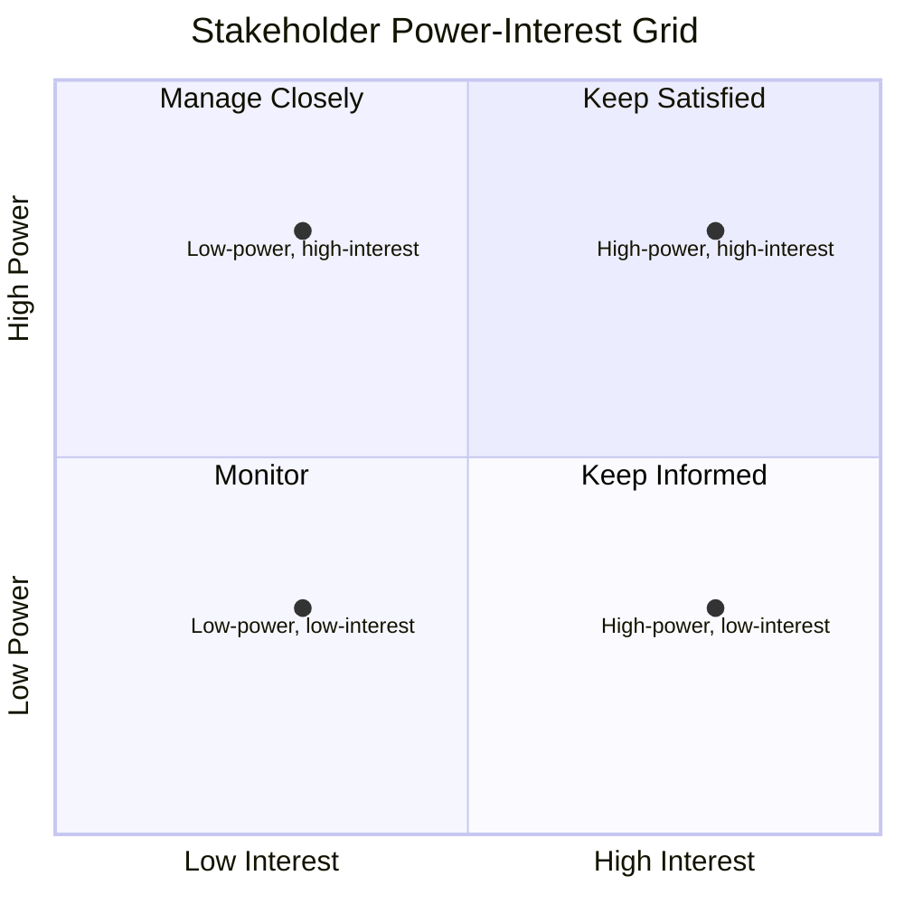

# Stakeholder Identification and Analysis

> **Core skill:** Systematically identifying every person, group, and organization that can affect or be affected by the project — then analyzing their interest, influence, expectations, and engagement needs so the project manager knows who matters, why, and how much.

## Why This Matters

A stakeholder omitted at initiation becomes a veto at delivery. The stakeholder the project manager never identified is the one who blocks the release, withdraws the funding, or refuses the handover — and does so with the righteous indignation of someone who was never consulted.

Identification is not brainstorming names in a meeting. It is a structured sweep of the project's organizational, operational, contractual, and regulatory landscape — followed by analysis that answers the only questions that matter for engagement: what do they care about, how much power do they have, and how much attention do they need from us.

## The Identification Sweep

### Where Stakeholders Hide

| Category | Examples | Discovery Method |
|----------|----------|------------------|
| **Internal sponsors** | Executive sponsor, steering committee | Charter, org chart, sponsor interview |
| **Internal users** | Teams that will use the deliverable | Requirements sessions, user interviews |
| **Internal enablers** | Legal, procurement, security, facilities | Project delivery plan dependencies |
| **External customers** | Paying users, client organizations | Contract, sales, customer success |
| **External regulators** | Government agencies, standards bodies | Regulatory scan, legal counsel |
| **External partners** | Vendors, subcontractors, integrators | Contract, procurement, supply chain |
| **Indirect stakeholders** | Teams displaced by the change, adjacent projects | Impact analysis, dependency mapping |
| **Opinion leaders** | Respected voices without formal authority | Org network analysis, sponsor guidance |

The sweep is complete when you can name stakeholders in every category — not when the room runs out of names.

### The Identification Process

1. **Charter review**: extract named stakeholders from the project charter and business case
2. **Org chart mapping**: trace the project through the organization — who owns the budget, the team, the decision
3. **Dependency tracing**: for every deliverable, identify who receives it, who depends on it, who blocks it
4. **Impact analysis**: who wins, who loses, who must change their behavior
5. **Regulatory and contractual scan**: compliance obligations and contractual parties
6. **Stakeholder snowball**: ask each identified stakeholder: "Who else cares about this?"

## Analysis Dimensions

Every identified stakeholder is analyzed on dimensions that determine engagement strategy:

| Dimension | Question | Scale |
|-----------|----------|-------|
| **Interest** | How much does this stakeholder care about the project outcome? | Low / Medium / High |
| **Influence** | How much power does this stakeholder have over the project? | Low / Medium / High |
| **Attitude** | Is this stakeholder supportive, neutral, or resistant? | Resistant / Neutral / Supportive |
| **Impact** | How much does the project affect this stakeholder? | Low / Medium / High |
| **Engagement need** | What level of involvement does this stakeholder require? | Monitor / Keep Informed / Consult / Partner |

### The Power-Interest Grid

- **High power, high interest**: manage closely — these are your key players
- **High power, low interest**: keep satisfied — they can hurt you but may not care enough to engage
- **Low power, high interest**: keep informed — they care deeply; their support is valuable
- **Low power, low interest**: monitor — they rarely need active engagement but can shift

## The Stakeholder Register

The stakeholder register is the living document that records identification and analysis:

| Field | Content |
|-------|---------|
| Name and role | Who they are, organizationally |
| Category | Internal/external; sponsor/user/regulator |
| Interest | What they care about in the project |
| Influence | High/Medium/Low with justification |
| Attitude | Supportive/Neutral/Resistant |
| Engagement strategy | How we will engage them |
| Communication needs | What, how often, through what channel |
| Key concerns | What worries them about the project |
| Expected contribution | What we need from them |
| Last reviewed | Date of last analysis update |

## Stakeholder Analysis in Programs

Program managers face an additional layer: stakeholders at the program level interact with stakeholders at the project level, and conflicts between project stakeholders become program-level conflicts. The program manager's register tracks:

- **Cross-project stakeholders**: those whose interests span multiple projects
- **Aggregate impact**: stakeholders affected by the combined effect of multiple projects
- **Cascading influence**: stakeholders whose influence over one project extends to others

## Practical Applications

### Identification and Analysis Checklist

- [ ] Stakeholder categories are all swept: sponsors, users, enablers, customers, regulators, partners
- [ ] Every stakeholder has an interest, influence, attitude, and impact assessment
- [ ] The power-interest grid is populated and reviewed with the sponsor
- [ ] The stakeholder register is a living document — reviewed at each phase gate
- [ ] "Who else?" was asked of every identified stakeholder
- [ ] Program-level cross-project stakeholders are identified

## Common Pitfalls

| Pitfall | Why It Is a Problem | Better Approach |
|---------|---------------------|-----------------|
| **Sponsor-only sweep** | Only the obvious names are captured; the silent vetoes are missed | Structured sweep across all categories |
| **Static register** | Analysis from initiation is stale by execution | Review and update at every phase gate |
| **One-dimensional analysis** | Only power is assessed; interest and attitude are ignored | Multi-dimensional: interest, influence, attitude, impact |
| **Forgotten losers** | Stakeholders who lose from the project are ignored | Impact analysis includes negative impacts |
| **Register-as-document** | The register exists but nobody uses it | Register drives the engagement plan and communication plan |

## Success Indicators

- No stakeholder with veto power is discovered after the project is underway
- The power-interest grid accurately predicts who engages and who blocks
- The stakeholder register is referenced in status meetings and phase gate reviews
- New stakeholders are added to the register within one week of identification

## Related Topics

- [[02_Stakeholder_Engagement_Planning]]: the register drives the engagement plan
- [[03_Project_Communication_Management]]: analysis determines communication needs
- [[06_Stakeholder_Engagement_Monitoring]]: the register is the monitoring baseline
- [[career-path/12_Technical_Program_Manager/05_Stakeholder_Alignment/00_overview|Stakeholder Alignment (TPM)]]: the program-level identification discipline

## Summary

Stakeholder identification and analysis is the project's organizational reconnaissance: a structured sweep of every person, group, and organization that can affect or be affected by the project, followed by multi-dimensional analysis that answers who matters, why, and how much. The output is a living stakeholder register that drives the engagement plan, the communication plan, and every decision about who to involve and when. A stakeholder missed at identification is a veto waiting to happen — and the project manager who finds them after the fact pays in rework, delay, and credibility.