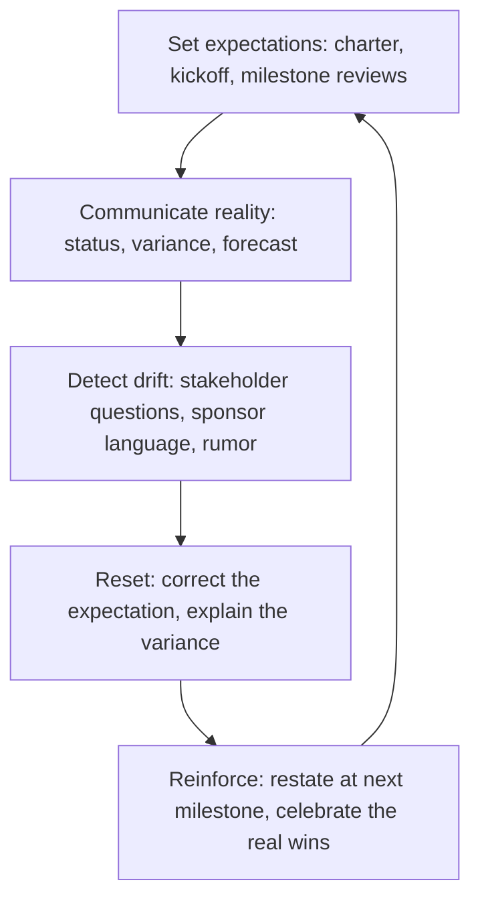

# Managing Stakeholder Expectations

> **Core skill:** Aligning what stakeholders expect from the project with what the project can actually deliver — through honest forecasting, early surface of bad news, deliberate expectation setting at every milestone, and the discipline of under-promising and meeting the promise.

## Why This Matters

The gap between what stakeholders expect and what the project delivers is the gap where trust dies. A project that delivers exactly what was promised but disappoints expectations did not fail on delivery — it failed on expectation management. The stakeholder who expected a feature in March and got it in June, who expected a budget of $500K and got a request for $750K, who expected a strategic transformation and got a tool upgrade — that stakeholder is not wrong about the project. The project manager is wrong about the expectation.

Expectation management is continuous, not contractual. The charter sets the baseline, but expectations drift with every rumor, every demo, every offhand comment from a sponsor. The project manager's job is to reset expectations to reality, earlier than comfortable and more often than convenient, so that the project's actual delivery is never a surprise.

## Sources of Expectation Drift

| Drift Source | Mechanism | Countermeasure |
|--------------|-----------|----------------|
| **Optimism bias** | Stakeholders hear the best case as the plan | Communicate the range, not the point estimate |
| **Scope creep** | Small additions accumulate into a different project | Every addition framed as a trade-off against the baseline |
| **Demo effect** | A polished demo implies completion; stakeholders reset their clock | Demo with disclaimers: what is done, what is placeholder |
| **Sponsor enthusiasm** | The sponsor describes the project more ambitiously than the charter | Rehearse sponsor messaging; keep the sponsor anchored |
| **Adjacent project promises** | Another project promises integration on a timeline you cannot meet | Coordinate dependency communication; correct externally |
| **Silence fills with hope** | When the project goes quiet, stakeholders assume the best | Communicate through quiet periods; silence is not status |

## The Expectation Management Cycle

## Setting Expectations at Initiation

| Element | How to Set It | The Honest Version |
|---------|---------------|-------------------|
| Scope | "We will deliver X by Y" | "We will deliver X by Y, with confidence Z%, and these are the conditions that could change it" |
| Schedule | "Q3 delivery" | "Q3 delivery, with a 2-week buffer for integration risks — so plan for late Q3, not early Q3" |
| Budget | "$1M" | "$1M baseline with a 15% contingency for scope changes driven by regulatory requirements" |
| Quality | "Production-ready" | "Production-ready as defined by these acceptance criteria; items outside this list are post-launch" |
| Benefits | "$2M annual savings" | "$2M projected savings with these assumptions; first measurement at 6 months post-launch" |

The honest version is not pessimistic — it is precise. It replaces adjectives with numbers and confidence levels. A stakeholder who hears a range with a confidence level can plan against it; a stakeholder who hears a single date plans against a fiction.

## Resetting Expectations

When reality diverges from the expectation, the reset follows a structure:

### The Expectation Reset Conversation

| Step | Content |
|------|---------|
| **1. State the change** | One sentence: what is different from what was expected |
| **2. Explain the cause** | Why — without defensiveness, without blame |
| **3. Provide the new expectation** | The new date, scope, cost, or outcome — with confidence level |
| **4. Describe the impact** | What this means for the stakeholder's plans |
| **5. Offer the mitigation** | What we are doing to minimize the gap |
| **6. Ask for their concern** | "What does this change for you?" |

The reset is a conversation, not a memo. The stakeholder needs to process the change, voice the impact, and be heard — before they can accept the new expectation.

### Timing the Reset

| Signal | Action |
|--------|--------|
| Risk probability increases | Reset before the risk fires — "If this risk materializes, the date moves" |
| Variance trend is negative | Reset when the trend is visible, not when the milestone is missed |
| Stakeholder language drifts | Reset when a stakeholder describes the project differently from the charter |
| External dependency slips | Reset your stakeholders before the dependency announces its slip to them |

The rule: reset sooner than comfortable. The reset that arrives early is a professional update; the reset that arrives at the deadline is a failure.

## Under-Promise and Meet the Promise

The discipline is not sandbagging — it is forecasting honestly and committing to what you can control:

- **Forecast a range**: "Q2 with 80% confidence, Q3 with 95% confidence"
- **Commit to a point**: "We commit to Q3 delivery"
- **Deliver against the commitment**: if you deliver in Q2, you beat expectations; if you deliver in Q3, you met them
- **Never commit to the best case**: the best case is a possibility, not a promise

The project manager who always delivers what they committed to — and occasionally beats it — builds an expectation asset. The one who commits to the best case and occasionally misses builds an expectation liability.

## Expectations in Programs

Program managers manage expectations at two levels:

- **Program expectations**: the aggregate benefit, timeline, and cost — communicated to executive stakeholders
- **Project expectations**: managed by project managers; the program manager ensures consistency
- **Cross-project expectation conflicts**: when Project A's delay affects Project B's stakeholder expectations, the program manager owns the integrated reset
- **Benefit expectations**: the hardest to manage — benefits are projected, not guaranteed; the program manager communicates the assumptions, not just the projections

## Practical Applications

### Expectation Management Checklist

- [ ] Charter commitments are stated with ranges and confidence levels, not single points
- [ ] Every demo includes a disclaimer: what is done, what is placeholder, what is planned
- [ ] Variance from baseline is communicated at the first status report where it appears
- [ ] Expectation resets follow the structured conversation: change, cause, new expectation, impact, mitigation, concern
- [ ] Sponsor messaging is reviewed for drift — the sponsor reinforces, not inflates
- [ ] The team knows: under-promise and meet the promise

## Common Pitfalls

| Pitfall | Why It Is a Problem | Better Approach |
|---------|---------------------|-----------------|
| **Best-case commitments** | The best case becomes the baseline; every deviation is a failure | Commit to what you can control; forecast the range |
| **Late resets** | The reset arrives at the deadline — trust is already spent | Reset when the trend is visible, not when the milestone is missed |
| **Reset-by-memo** | A written reset without conversation feels like an announcement, not an engagement | Structured conversation: state, explain, impact, listen |
| **Scope-creep silence** | Small additions accepted without resetting timeline expectations | Every scope change is a trade-off conversation |
| **Sponsor inflation** | The sponsor sells the project more ambitiously than the charter | Sponsor messaging rehearsed and anchored to the charter |

## Success Indicators

- Stakeholders describe the project accurately — not more ambitiously, not more pessimistically
- Variance from baseline is communicated before it becomes a missed milestone
- Expectation resets are accepted professionally, not escalated in anger
- The project delivers what it committed to — and occasionally more
- The sponsor's public description of the project matches the project manager's internal description

## Related Topics

- [[03_Project_Communication_Management]]: communication is the vehicle for expectation setting
- [[05_Stakeholder_Conflict_Resolution]]: unmet expectations are the source of most conflicts
- [[02_Scope_and_Planning/00_overview|Scope and Planning]]: the scope baseline is the expectation anchor
- [[06_Governance_and_Change_Control/00_overview|Governance and Change Control]]: change control resets expectations formally

## Summary

Managing stakeholder expectations is the continuous discipline of closing the gap between what stakeholders expect and what the project can deliver. It begins with honest forecasting at initiation — ranges, not points; confidence levels, not adjectives — and continues through every status report, every demo, every variance communication, and every structured reset conversation. The project manager who resets expectations early, in person, and with the stakeholder's impact in mind builds trust even through bad news. The one who lets expectations drift until the deadline builds a reputation that survives the project. The rule is simple: under-promise and meet the promise — and when the promise must change, be the one who says so first.