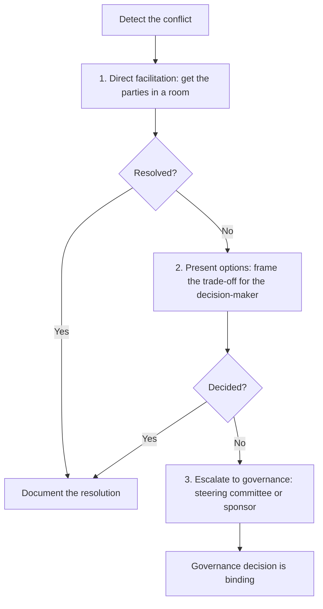

# Stakeholder Conflict Resolution

> **Core skill:** Identifying, surfacing, and resolving conflicts between stakeholder groups — when interests diverge, priorities compete, or expectations collide — through structured facilitation that seeks resolution at the lowest level and escalates only when the conflict cannot be resolved there.

## Why This Matters

Stakeholders disagree. The marketing team wants features that sales promised; engineering wants technical debt reduction; the sponsor wants the original date; the users want changes that break the date. These conflicts are not project failures — they are the normal condition of a project with real stakeholders who have real interests. The failure is not the conflict; it is the project manager who lets it fester.

Conflict left unresolved does not disappear — it escalates. What begins as a disagreement in a requirements meeting becomes a complaint to the sponsor, then a veto at the steering committee, then an organizational crisis that consumes the project. The project manager who surfaces conflict early, facilitates resolution at the lowest level, and escalates with options rather than problems turns stakeholder tension from a project threat into a decision opportunity.

## Types of Stakeholder Conflict

| Conflict Type | Example | Root Cause |
|---------------|---------|------------|
| **Priority conflict** | Two stakeholder groups want their features first | Competing interests; finite resources |
| **Resource conflict** | Two projects need the same scarce team | Shared resource pool; no prioritization framework |
| **Expectation conflict** | Sponsor expects Q1; team forecasts Q2 | Misaligned expectations; optimism bias |
| **Value conflict** | Operations wants stability; business wants speed | Different success criteria |
| **Process conflict** | Stakeholder wants to bypass change control | Governance vs. agility tension |
| **Information conflict** | Stakeholders have different information and draw different conclusions | Asymmetric information; rumor |
| **Personal conflict** | Individuals clash on style, approach, or history | Interpersonal dynamics |

Identifying the type matters because the resolution strategy differs: a priority conflict is resolved by a decision framework; an information conflict is resolved by sharing facts; a personal conflict is resolved by facilitation.

## The Conflict Resolution Ladder

The ladder principle: resolve at the lowest level possible. Every escalation adds time, formality, and organizational cost. The project manager's skill is keeping the conflict at the first rung — direct facilitation — for as long as resolution is possible.

## The Facilitation Conversation

When bringing conflicting stakeholders together:

| Phase | Action | Project Manager's Role |
|-------|--------|----------------------|
| **Prepare** | Understand each position separately before the joint conversation | Listen to each side; identify common ground |
| **Frame** | State the shared objective that both parties agree on | "We both want this project to succeed — we disagree on how" |
| **Surface** | Each party states their position and interest without interruption | Enforce turn-taking; restate to confirm understanding |
| **Explore** | Identify what is negotiable and what is fixed for each party | Ask: "What would make this work for you?" |
| **Generate** | Propose options that address both parties' core interests | Offer 2-3 resolution paths, not one |
| **Agree** | Capture the resolution: what was decided, who does what, by when | Write it down; both parties confirm |

The project manager is not the judge — the project manager is the facilitator. The resolution comes from the parties, not from the project manager's authority.

## Resolution Strategies by Conflict Type

| Conflict Type | Resolution Strategy |
|---------------|---------------------|
| **Priority conflict** | Trade-off framework: cost of delay, strategic alignment, dependency chain — decide on criteria, not on advocacy |
| **Resource conflict** | Capacity data and prioritization criteria; escalate to the resource owner if criteria are absent |
| **Expectation conflict** | Reset conversation: facts, forecast, confidence level, impact — not persuasion |
| **Value conflict** | Acknowledge the value difference; find a decision that satisfies the minimum of both |
| **Process conflict** | Clarify the purpose of the process; adapt the process to the concern if possible |
| **Information conflict** | Share data; agree on facts before discussing conclusions |
| **Personal conflict** | Separate the people from the problem; focus on the project decision, not the personal history |

## When to Escalate

Escalation is not failure — it is recognition that the conflict exceeds the project manager's facilitation authority:

| Escalation Signal | Action |
|-------------------|--------|
| The conflict affects scope, schedule, or cost beyond the project manager's change authority | Escalate with options and impact assessment |
| One party refuses to participate in resolution | Escalate to that party's manager with a clear account of the impasse |
| The conflict has persisted through two facilitation attempts | Escalate; continued facilitation without resolution erodes credibility |
| The conflict involves stakeholders above the project manager's level | Escalate to the sponsor; the sponsor resolves peer conflicts |

Escalation always carries options, not just the problem: "Here is the conflict, here are the resolution options, here is the impact of each, and here is my recommendation."

## Conflict in Programs

Program managers face multi-level conflicts:

- **Project-to-project**: two project managers disagree on shared resource allocation or dependency timing
- **Project-to-program**: a project's direction conflicts with the program's benefit objectives
- **Stakeholder-to-program**: a stakeholder's interest in one project conflicts with the program's integrated plan

The program manager's conflict resolution adds a dimension: the program benefit. When two projects conflict, the resolution criterion is not "who advocated better" — it is "which resolution maximizes program benefits."

## Practical Applications

### Conflict Resolution Checklist

- [ ] The conflict type is identified — priority, resource, expectation, value, process, information, or personal
- [ ] Each party's position and interest are understood separately before joint facilitation
- [ ] The facilitation conversation followed the structure: frame, surface, explore, generate, agree
- [ ] Resolution options address core interests, not just stated positions
- [ ] The resolution is documented: what was decided, who does what, by when
- [ ] Escalation, when necessary, carries options and a recommendation — not just the problem

## Common Pitfalls

| Pitfall | Why It Is a Problem | Better Approach |
|---------|---------------------|-----------------|
| **Conflict avoidance** | The conflict festers; stakeholders escalate around the project manager | Surface conflict early; facilitate before it escalates |
| **Judging, not facilitating** | The project manager picks a side; the other side disengages | Facilitate the resolution; let the parties decide |
| **Escalating too early** | Every disagreement goes to the sponsor; the sponsor becomes the bottleneck | Resolve at the lowest level; escalate only when facilitation fails |
| **Escalating too late** | The conflict has already poisoned relationships and delayed decisions | Escalate when two facilitation attempts fail |
| **Resolution without documentation** | The agreement is verbal; parties remember it differently later | Write it down; both parties confirm |

## Success Indicators

- Stakeholder conflicts are surfaced in project status — not discovered in steering committee meetings
- Most conflicts are resolved at the facilitation level without escalation
- Escalations carry options and recommendations; governance makes decisions, not investigations
- Conflict resolutions are documented and honored
- Stakeholders trust the project manager to facilitate fairly, not to advocate for one side

## Related Topics

- [[04_Managing_Stakeholder_Expectations]]: unmet expectations are the most common conflict source
- [[06_Stakeholder_Engagement_Monitoring]]: monitoring detects brewing conflicts before they escalate
- [[07_Sponsor_Relationship_Management]]: the sponsor is the escalation destination for unresolved conflicts
- [[06_Governance_and_Change_Control/00_overview|Governance and Change Control]]: governance resolves conflicts that exceed the project manager's authority

## Summary

Stakeholder conflict resolution is the project manager's facilitation discipline: detect conflict early, identify its type, resolve it at the lowest level through structured facilitation that surfaces interests and generates options, and escalate — with options, not just problems — only when resolution exceeds the project manager's authority. The project manager is not the judge of stakeholder disputes; the project manager is the facilitator who keeps conflict productive, resolution documented, and escalation deliberate. Conflict is normal; festering conflict is failure.