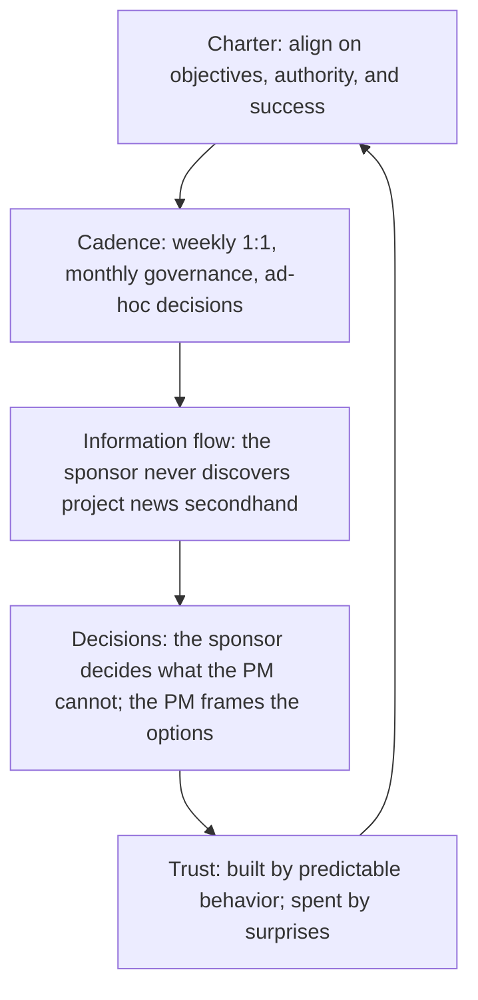

# Sponsor Relationship Management

> **Core skill:** Managing the project sponsor as the project's most critical stakeholder — keeping the sponsor informed, engaged, and decisive; never surprising the sponsor; and maintaining a relationship where the sponsor is the project's advocate, not its auditor.

## Why This Matters

The sponsor is the project's organizational owner: the person who authorized the charter, controls the budget, chairs the governance board, and carries the accountability for project success or failure. The sponsor is also the project manager's most powerful ally — and, if the relationship fails, the most dangerous adversary.

A sponsor who trusts the project manager delegates decisions, advocates upward, protects the project from organizational turbulence, and provides air cover when things go wrong. A sponsor who does not trust the project manager micromanages, second-guesses, demands redundant reporting, and withdraws support at the first sign of trouble. The difference is almost never the project's performance — it is the quality of the sponsor relationship.

## The Sponsor's Role

| Responsibility | What It Means in Practice |
|----------------|---------------------------|
| **Authority** | Approves the charter, budget, and major changes; chairs governance |
| **Advocacy** | Represents the project to executive leadership; secures resources and organizational support |
| **Accountability** | Owns the project's business case and benefit realization |
| **Decision-making** | Resolves issues that exceed the project manager's authority |
| **Air cover** | Protects the project from organizational politics and competing priorities |

The sponsor does not manage the project — that is the project manager's role. The sponsor enables the project manager to manage it. Confusion about this boundary is the most common source of sponsor-relationship failure.

## The Sponsor Relationship Operating Model



## The Weekly Sponsor 1:1

The sponsor 1:1 is the project manager's most important recurring meeting. It is not a status report — it is a strategic conversation:

| Segment | Content | Duration |
|---------|---------|----------|
| **Headlines** | Overall health: on track / at risk / off track — one sentence and why | 2 minutes |
| **Decisions needed** | What the sponsor must decide this week — with options and recommendation | 10 minutes |
| **Risks and concerns** | Top 3 risks with mitigation status; emerging concerns | 5 minutes |
| **Organizational context** | What the sponsor is hearing, what is changing in the organization | 5 minutes |
| **Ask of the sponsor** | Specific asks: advocacy, escalation, resource, air cover | 3 minutes |
| **Look ahead** | What is coming in the next 2-4 weeks that the sponsor should anticipate | 5 minutes |

The sponsor 1:1 is the project manager's protected time — never cancelled for status reports that can be emailed, never reduced to a "quick call" that skips the strategic segments.

## The No-Surprises Discipline

| Rule | Practice |
|------|----------|
| **Bad news travels up first** | The sponsor hears about a problem from the project manager — never from a third party, never in a public forum |
| **Early, not comfortable** | The project manager communicates problems when they are forming, not when they have landed |
| **With options, not just alarms** | Every problem presented carries at least two response options and a recommendation |
| **In the 1:1, not the steering committee** | Difficult news lands in private first; the steering committee sees the managed version |
| **Written follow-up** | After a difficult 1:1, a brief written summary confirms what was discussed and agreed |

The no-surprises reputation is the sponsor relationship's compounding asset. It is built one early, honest conversation at a time — and spent entirely by a single secondhand discovery.

## When the Sponsor Disengages

Sponsor disengagement is the project's silent emergency:

| Signal | What It Means | Response |
|--------|---------------|----------|
| Cancelled 1:1s | The sponsor is deprioritizing the project | Ask directly: "Is this project still your priority? What has changed?" |
| Delegate escalation | The sponsor sends a delegate to governance meetings | The delegate lacks authority; decisions stall |
| Silence on decisions | Decisions needed are deferred or ignored | Escalate the decision impact: "Without this decision by [date], the milestone moves" |
| No advocacy | The project is absent from the sponsor's executive communications | Ask: "How are you positioning the project with leadership? How can I support?" |

The response to sponsor disengagement is direct conversation — not passive acceptance. A project without an engaged sponsor is a project without an organizational owner, and it will drift until it is cancelled or absorbed.

## Re-engaging the Sponsor

| Step | Action |
|------|--------|
| **1. Diagnose** | Understand why the sponsor disengaged: competing priorities, loss of confidence, organizational change, personal bandwidth |
| **2. Reframe** | Reconnect the project to the sponsor's current priorities: "Here is how this project supports what you care about now" |
| **3. Reduce the burden** | Minimize the sponsor's time commitment: shorter 1:1s, pre-digested decisions, one-page briefs |
| **4. Deliver a win** | Find a near-term deliverable that matters to the sponsor and deliver it visibly |
| **5. Escalate if needed** | If the sponsor cannot re-engage, escalate to the sponsor's manager or the governance board: the project needs an engaged owner |

## The Sponsor in Programs

Program managers manage sponsor relationships at two levels:

- **Program sponsor**: the executive who owns the program's business case and benefit realization — typically more senior than project sponsors
- **Project sponsors**: managed by project managers; the program manager ensures consistency and resolves sponsor conflicts across projects
- **Sponsor escalation**: when a project sponsor disengages, the program manager escalates to the program sponsor, who has the authority to replace or reinforce

## Practical Applications

### Sponsor Relationship Checklist

- [ ] Weekly sponsor 1:1 is scheduled, protected, and follows the strategic format
- [ ] The sponsor has never discovered project news secondhand
- [ ] Every problem presented to the sponsor carries options and a recommendation
- [ ] Decisions needed from the sponsor have clear deadlines and impact statements
- [ ] The sponsor's advocacy is visible — the project appears in executive communications
- [ ] Sponsor disengagement signals trigger a direct conversation within one week

### Sponsor 1:1 Brief Template

```markdown
## Sponsor Brief — [Date]
### Headlines
- Overall: [On track / At risk / Off track] — [one-sentence reason]

### Decisions Needed This Week
- [Decision] — options: [A/B] — recommendation: [A] — deadline: [date] — impact of no decision: [X]

### Top Risks
- [Risk 1] — probability: [%] — mitigation: [X] — status: [on track / at risk]
- [Risk 2] — probability: [%] — mitigation: [X] — status: [on track / at risk]
- [Risk 3] — probability: [%] — mitigation: [X] — status: [on track / at risk]

### Ask of the Sponsor
- [Ask 1] — purpose: [X] — deadline: [date]
- [Ask 2] — purpose: [X] — deadline: [date]

### Look Ahead (Next 4 Weeks)
- [Milestone/decision/risk] — [date]
```

## Common Pitfalls

| Pitfall | Why It Is a Problem | Better Approach |
|---------|---------------------|-----------------|
| **Sponsor-as-auditor** | The sponsor only hears from the project when something is wrong | Proactive, strategic 1:1; the sponsor is a partner, not an inspector |
| **Status-report 1:1** | The 1:1 reviews status that could be emailed; strategic time is wasted | Status by email; 1:1 for decisions, risks, and context |
| **Secondhand discovery** | The sponsor hears about a problem from someone else | No-surprises discipline: bad news travels up first, from the PM |
| **Problems without options** | Every problem is an alarm with no response path | Every problem carries options and a recommendation |
| **Disengagement ignored** | The sponsor cancels 1:1s and the PM accepts it | Direct conversation; escalate if re-engagement fails |

## Success Indicators

- The sponsor describes the project accurately and advocates for it in executive forums
- The sponsor makes timely decisions — never the bottleneck
- The project manager and sponsor trust each other: candor flows both ways
- The sponsor has never discovered project news secondhand
- The sponsor's calendar reflects the project's priority — 1:1s are kept, not cancelled

## Related Topics

- [[01_Stakeholder_Identification_and_Analysis]]: the sponsor is the first stakeholder identified and analyzed
- [[02_Stakeholder_Engagement_Planning]]: the sponsor is always Partner-level engagement
- [[05_Stakeholder_Conflict_Resolution]]: the sponsor is the final escalation destination
- [[01_Initiation_and_Charter/00_overview|Initiation and Charter]]: the sponsor owns the charter and authorizes the project
- [[06_Governance_and_Change_Control/00_overview|Governance and Change Control]]: the sponsor chairs governance

## Summary

Sponsor relationship management is the project manager's most leveraged relationship discipline: a weekly strategic 1:1 that surfaces decisions and context, a no-surprises discipline that keeps the sponsor informed before anyone else, and a partnership where the sponsor advocates, decides, and protects while the project manager manages. The sponsor relationship is built on trust, maintained by predictable behavior, and spent by surprises. A project with an engaged sponsor has an organizational owner; a project without one has only a project manager — and that is not enough. The project manager who manages the sponsor relationship as deliberately as the schedule or budget multiplies the project's chances of success; the one who treats it as a reporting obligation gets the sponsor they deserve.