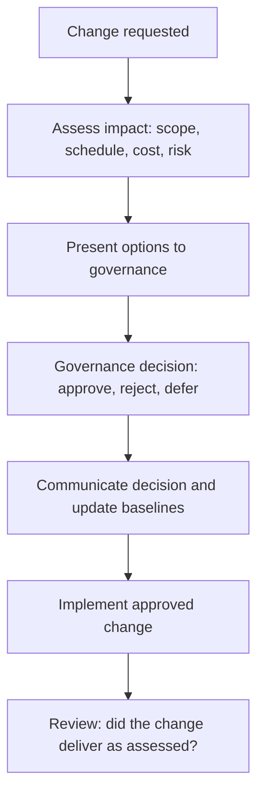

# Governance and Change Control

> **Core capability:** The project manager establishes the decision framework that governs the project — defining who decides what, managing change through a controlled process, and ensuring governance supports delivery rather than creating ceremonial bureaucracy.

## Why This Matters

Without governance, decisions are remade in every meeting and nobody knows who owns the tough calls. Without change control, scope, schedule, and cost drift silently until the project is unrecognizable from its charter. The project manager designs governance that is light enough to not bottleneck the project and strong enough to handle the decisions that matter.

Governance is also the project's integrity system: every change to scope, schedule, or cost flows through a defined process that assesses impact, assigns ownership, and communicates the decision. The project manager does not approve changes — governance does. The project manager runs the process that makes the decision visible and accountable.

## Topics in This Capability Area

| Topic | Core Skill | When It Matters |
|-------|------------|-----------------|
| [[01_Project_Governance_Design]] | Designing decision rights, boards, and escalation paths | Project initiation |
| [[02_Change_Control_Process]] | Running the change control process: request, assess, decide, communicate | Whenever scope, schedule, or cost changes |
| [[03_Decision_Recording_and_Communication]] | Documenting decisions and communicating them to affected parties | Every decision |
| [[04_Configuration_Management]] | Managing project artifacts, versions, and baselines | Throughout the project |
| [[05_Quality_Assurance_in_Governance]] | Ensuring project processes and deliverables meet quality standards | Phase reviews; audits |
| [[06_Phase_Gate_Reviews]] | Running structured reviews at project phase transitions | End of each phase |
| [[07_Project_Audit_and_Compliance]] | Preparing for and responding to project audits | When required; proactively |

## Change Control in Practice

The process is simple; the discipline is applying it to every change, not just the comfortable ones.

## Practical Applications

### Governance Checklist

- [ ] Governance structure is defined: steering committee, decision rights, escalation paths
- [ ] Change control process is documented and communicated to all stakeholders
- [ ] Change log records every request with assessment, decision, and impact
- [ ] Configuration management tracks baselines and versions of key artifacts
- [ ] Phase gate reviews assess readiness before transitioning to the next phase
- [ ] Governance decisions are recorded and accessible

## Common Pitfalls

| Pitfall | Why It Is a Problem | Better Approach |
|---------|---------------------|-----------------|
| **Governance-as-ceremony** | Meetings that review status but make no decisions | Governance with decision agendas and recorded outputs |
| **Change-by-nod** | Changes accepted informally without impact assessment | Every change assessed for triple-constraint impact |
| **Configuration drift** | Baselines outdated; no single source of truth | Configuration management discipline |
| **Phase-gate theater** | Gates passed because of schedule pressure, not readiness | Honest gate criteria; sponsor accountable for gate decisions |

## Success Indicators

- Governance meetings produce decisions, not just status updates
- Every scope, schedule, or cost change is traceable through the change log
- Baselines are current and referenced in project status
- Phase gate reviews result in genuine go/no-go decisions

## Related Capabilities

- [[01_Initiation_and_Charter/00_overview|Initiation and Charter]]: governance established at initiation
- [[02_Scope_and_Planning/00_overview|Scope and Planning]]: scope baseline governed through change control
- [[career-path/04_Principal_and_Distinguished_Engineer/03_Decision_Governance_and_Principles/00_overview|Decision Governance and Principles (Principal)]]: the enterprise governance perspective

## Summary

Governance and change control are the project's integrity system: defined decision rights, a change process that assesses impact before approval, configuration management that maintains the single source of truth, and phase gates that gate on readiness. The project manager designs governance that supports delivery — not ceremony that impersonates it.