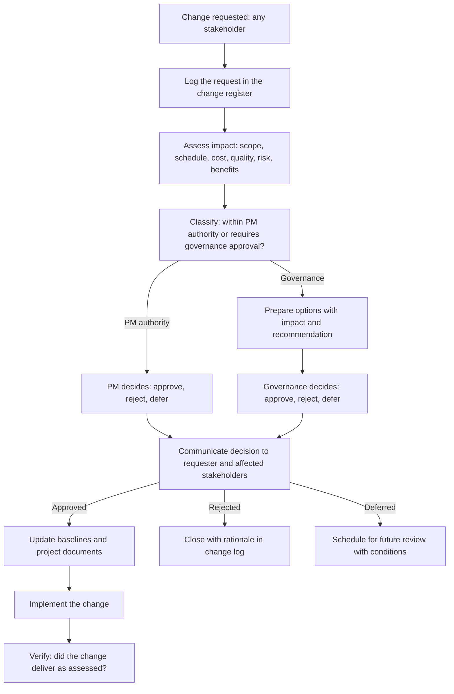

# Change Control Process

> **Core skill:** Running the change control process — request, assess, decide, communicate, implement — so that every change to scope, schedule, or cost is visible, assessed for impact, decided by the right authority, and traceable through the change log.

## Why This Matters

Projects change. Requirements evolve, risks materialize, stakeholders discover what they actually need, and the environment shifts. Change is not failure — unmanaged change is. When changes are accepted informally — a nod in a meeting, an email that "we'll figure it out," a scope addition that nobody costed — the project silently drifts from its baseline until it is unrecognizable.

The change control process is the project's immune system: it detects changes, assesses their impact on the triple constraint, presents options to the decision-maker, and records the outcome. The process is not a bureaucracy to slow the project down — it is a discipline to keep the project honest about what it is delivering against what it was chartered to deliver. Every change that bypasses the process is a withdrawal from the project's integrity account.

## The Change Control Sequence

## The Change Request

Every change begins with a request that captures:

| Field | Content |
|-------|---------|
| **Request ID** | Unique identifier, sequential |
| **Requestor** | Who is requesting the change |
| **Date requested** | When the request was submitted |
| **Description** | What is being changed — specific, not aspirational |
| **Rationale** | Why the change is needed — the value or the necessity |
| **Priority** | Critical / High / Medium / Low — with justification |
| **Impact if not approved** | What happens if the change is rejected |

## Impact Assessment

Before any decision, the change is assessed for its effect on:

| Dimension | Assessment |
|-----------|------------|
| **Scope** | What deliverables, requirements, or acceptance criteria change? |
| **Schedule** | What is the impact on milestones, critical path, and end date? |
| **Cost** | What is the cost of the change — resources, procurement, contingency consumption? |
| **Quality** | Does the change affect quality standards, testing scope, or acceptance criteria? |
| **Risk** | What new risks does the change introduce? What risks does it mitigate? |
| **Benefits** | Does the change affect the project's benefit projections? |
| **Dependencies** | What other projects, teams, or systems are affected? |
| **Stakeholders** | Which stakeholders are affected and must be informed? |

The assessment is factual, not advocacy. The project manager assesses impact; governance decides whether the impact is acceptable.

## Decision Authority Thresholds

| Change Magnitude | Decision Authority |
|------------------|-------------------|
| No impact on baselines | Project manager — log and implement |
| Schedule impact < 1 week; cost impact < 5% | Project manager — log and implement |
| Schedule impact 1-4 weeks; cost impact 5-10% | Steering committee — with PM recommendation |
| Schedule impact > 4 weeks; cost impact > 10% | Sponsor — with steering committee recommendation |
| Scope change (any magnitude) | Steering committee or sponsor per decision rights matrix |
| Benefit projection change | Sponsor — always |

Thresholds are defined in the governance design and confirmed at the first steering committee. They are numeric, not subjective — "significant schedule impact" is ambiguous; "schedule impact greater than two weeks" is clear.

## The Change Log

The change log is the project's audit trail for every change:

| Field | Content |
|-------|---------|
| Change ID | Unique identifier |
| Date requested | When the request was received |
| Requestor | Who requested |
| Description | What changed |
| Impact assessment | Scope, schedule, cost, quality, risk |
| Decision | Approved / rejected / deferred |
| Decision date | When decided |
| Decision authority | Who decided |
| Rationale | Why the decision was made |
| Implementation status | Pending / in progress / complete / verified |
| Baseline update | Which documents were updated |

The change log is the single source of truth for "what changed and why." It is referenced in every status report and every phase gate review.

## Emergency Changes

Some changes cannot wait for the next governance meeting:

| Condition | Process |
|-----------|---------|
| The change is urgent — waiting causes material harm | PM assesses impact; sponsor approves by exception (email or call) |
| The sponsor is unavailable | Steering committee chair or designated alternate approves |
| The change is reversible | PM may implement and notify governance at the next meeting |
| The change is irreversible | Must have sponsor approval before implementation |

Emergency changes are still logged, assessed, and communicated — they bypass the meeting, not the process.

## Change Control in Programs

Program change control adds a dimension:

- **Project-level changes**: managed by project change control; escalated to program when they affect other projects or program benefits
- **Program-level changes**: scope, schedule, cost, or benefit changes that affect multiple projects — governed by the program steering committee
- **Cross-project impact**: when Project A's change affects Project B's baseline, the program change control assesses the integrated impact before either project decides
- **Benefit impact**: any change that reduces projected program benefits escalates to the program sponsor

## Practical Applications

### Change Control Checklist

- [ ] Every change is logged in the change register — no informal changes
- [ ] Impact assessment covers scope, schedule, cost, quality, risk, and benefits
- [ ] Decision authority thresholds are numeric and agreed by governance
- [ ] Every change decision is recorded with rationale
- [ ] Approved changes update baselines within one week
- [ ] The change log is reviewed at every steering committee meeting
- [ ] Emergency changes follow the exception process, not no process

## Common Pitfalls

| Pitfall | Why It Is a Problem | Better Approach |
|---------|---------------------|-----------------|
| **Change-by-nod** | Changes accepted in meetings without impact assessment | Every change request assessed before decision |
| **Threshold ambiguity** | "Significant" means different things to different people | Numeric thresholds: dollars, days, percentage |
| **Assessment-as-advocacy** | The PM assesses impact to support a preferred outcome | Factual assessment; governance decides |
| **Log neglect** | The change log is incomplete; the audit trail is broken | Every change logged; log reviewed at steering committee |
| **Emergency bypass** | Urgent changes skip process entirely | Emergency process: sponsor approval, log, communicate — skip the meeting, not the discipline |

## Success Indicators

- Every scope, schedule, or cost change is traceable through the change log
- Impact assessments are factual and consistent
- Governance decisions on changes are timely — not the project's bottleneck
- The change log is current and referenced in status and phase gate reviews
- No stakeholder can point to a change that "just happened" without assessment

## Related Topics

- [[01_Project_Governance_Design]]: the decision rights and thresholds that change control operates within
- [[03_Decision_Recording_and_Communication]]: how change decisions are documented and communicated
- [[04_Configuration_Management]]: baselines that change control updates
- [[02_Scope_and_Planning/00_overview|Scope and Planning]]: the scope baseline that change control protects
- [[03_Schedule_and_Cost/00_overview|Schedule and Cost]]: the schedule and cost baselines that change control governs

## Summary

The change control process is the project's immune system: every change to scope, schedule, or cost is requested, logged, assessed for impact on all dimensions, classified by decision authority, decided by the right body, communicated to affected stakeholders, and implemented with baseline updates. The change log is the audit trail that answers "what changed and why" for every stakeholder and every audit. The process is not bureaucracy — it is the discipline that keeps the project honest about what it is delivering against what it was chartered to deliver. A project without change control drifts; a project with change control adapts deliberately. The difference is not whether change happens — it is whether change is visible, assessed, and accountable.