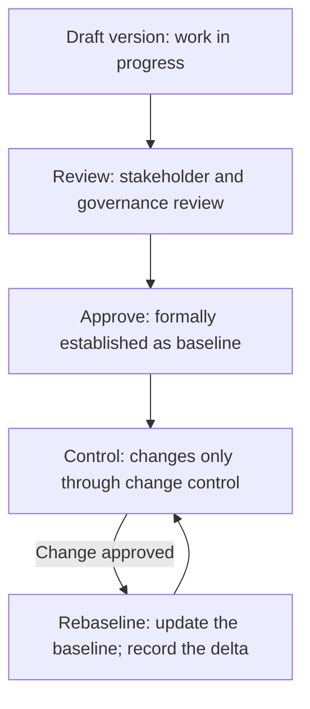

# Configuration Management

> **Core skill:** Managing project artifacts, versions, and baselines — so there is a single source of truth for every project document, every baseline is current and controlled, and no decision is made against outdated information.

## Why This Matters

A project that operates without configuration management has multiple versions of the truth. The schedule in the status report disagrees with the schedule in the steering committee deck. The scope statement referenced in the change request was superseded three weeks ago. The risk register the sponsor reviewed is not the risk register the team is working from. Every discrepancy is a decision made on fiction — and every such decision compounds into a project that is managed against a phantom.

Configuration management is the discipline of the single source of truth: every project artifact has a known version, baselines are formally established and updated through change control, and the project team and stakeholders reference the same information. It is not glamorous work — it is file naming, version control, and baseline discipline. But it is the foundation on which every status report, every change assessment, and every governance decision rests.

## What Configuration Management Controls

| Artifact Category | Examples | Control |
|-------------------|----------|---------|
| **Baselines** | Scope baseline, schedule baseline, cost baseline, benefits baseline | Formally established; changed only through change control |
| **Plans** | Project management plan, communication plan, risk management plan | Version-controlled; reviewed at phase gates |
| **Requirements** | Requirements document, user stories, acceptance criteria | Version-controlled; traceable to scope baseline |
| **Design documents** | Architecture, technical specifications, integration designs | Version-controlled; reviewed at design reviews |
| **Registers** | Risk register, issue register, stakeholder register, change log, decision log | Continuously updated; versioned at reporting cadence |
| **Reports** | Status reports, phase gate reports, audit reports | Archived with version; retained for project history |
| **Contracts and agreements** | Vendor contracts, SOWs, MOUs | Formally controlled; changes through contract change process |

## Baselines

A baseline is a formally approved version of a project artifact that serves as the reference for measurement and change control.

### Baseline Types

| Baseline | Content | Established | Changed Via |
|----------|---------|-------------|-------------|
| **Scope baseline** | Scope statement, WBS, WBS dictionary | After planning approval | Change control |
| **Schedule baseline** | Approved project schedule with milestones | After planning approval | Change control |
| **Cost baseline** | Approved budget with contingency | After planning approval | Change control |
| **Benefits baseline** | Projected benefits with assumptions | After charter approval | Change control (sponsor) |
| **Performance baseline** | Integrated scope, schedule, cost baseline | After planning approval | Change control |

### The Baseline Lifecycle

The baseline is the project's contract with itself — and the reference point for every variance analysis.

## Version Control Discipline

| Practice | Description |
|----------|-------------|
| **Document naming** | Consistent convention: [Artifact]_[Version]_[Date].[ext] — e.g., Scope-Baseline_v2.3_2026-03-15.docx |
| **Version numbering** | Major.Minor: major changes (baseline updates) increment major; minor edits increment minor |
| **Change history** | Every document includes a change history table: version, date, author, change description |
| **Single repository** | All controlled artifacts in one accessible location — not scattered across email, shared drives, and local folders |
| **Access control** | Baselines are read-only for most; write access restricted to the PM and designated editors |
| **Retention** | All versions retained; superseded versions are archived, not deleted |

## Configuration Items and the CI Register

A configuration item (CI) is any artifact under configuration control. The CI register tracks:

| Field | Content |
|-------|---------|
| CI ID | Unique identifier |
| Name | Artifact name |
| Type | Baseline / Plan / Requirement / Design / Register / Report / Contract |
| Current version | Version number and date |
| Status | Draft / Under review / Approved (baseline) / Superseded |
| Location | Where the current version is stored |
| Owner | Who is responsible for the artifact |
| Last updated | Date of last change |
| Change history | Reference to change log entries affecting this CI |

## Configuration Management and Change Control

Configuration management and change control are a closed loop:

1. Configuration management establishes and maintains baselines
2. Change control proposes, assesses, and decides on changes to baselines
3. Configuration management updates baselines when changes are approved
4. Configuration management provides the current baseline for the next change assessment

When one breaks, the other is undermined: change control without configuration management assesses impact against unknown baselines; configuration management without change control preserves baselines that nobody uses.

## Configuration Management in Programs

Program configuration management adds integration:

- **Program baselines**: integrated scope, schedule, cost, and benefits across all projects
- **Project baselines**: maintained by project managers; consolidated into program baselines
- **Cross-project consistency**: the program manager ensures consistent version control, naming, and baseline discipline across projects
- **Program CI register**: aggregates project CIs plus program-level artifacts

## Practical Applications

### Configuration Management Checklist

- [ ] All baselines are formally established and documented
- [ ] Version control conventions are defined and followed for all controlled artifacts
- [ ] The CI register is current and accessible
- [ ] Baselines are updated within one week of an approved change
- [ ] Superseded versions are archived, not deleted
- [ ] The project team and stakeholders access artifacts from a single repository
- [ ] Configuration management status is reviewed at each phase gate

## Common Pitfalls

| Pitfall | Why It Is a Problem | Better Approach |
|---------|---------------------|-----------------|
| **Baseline neglect** | Baselines are established then never updated; they become fiction | Baseline update within one week of approved change |
| **Multiple truths** | Schedule in three places with three different dates | Single repository; controlled access; one version of each artifact |
| **Version chaos** | Documents named "Final," "Final v2," "Final Final" | Consistent naming convention with version numbers and dates |
| **Configuration drift** | The actual project diverges from the documented baselines | Regular baseline reviews; update or formally acknowledge drift |
| **Archive-as-delete** | Superseded versions are deleted; project history is lost | Archive; retain all versions for audit and lessons learned |

## Success Indicators

- Every status report references the current baseline — and the baseline is correct
- Change requests are assessed against accurate, current baselines
- The project team and stakeholders access artifacts from one place, one version
- Baselines are updated within one week of approved changes
- An auditor can reconstruct the project's configuration history from the CI register and change log

## Related Topics

- [[02_Change_Control_Process]]: the process that changes baselines
- [[03_Decision_Recording_and_Communication]]: decisions that often cause baseline updates
- [[02_Scope_and_Planning/00_overview|Scope and Planning]]: the scope baseline is a primary CI
- [[03_Schedule_and_Cost/00_overview|Schedule and Cost]]: schedule and cost baselines are primary CIs

## Summary

Configuration management is the discipline of the single source of truth: every project artifact has a known version, baselines are formally established and updated only through change control, version control conventions are followed consistently, and the project team and stakeholders reference the same information. It is the foundation on which every status report, change assessment, and governance decision rests. Without it, the project manages against phantoms — schedules that have drifted, scopes that have shifted, and risks that have changed without anyone recording it. The project manager who maintains configuration discipline gives the project an honest reference point; the one who neglects it gives the project plausible deniability about its own state.