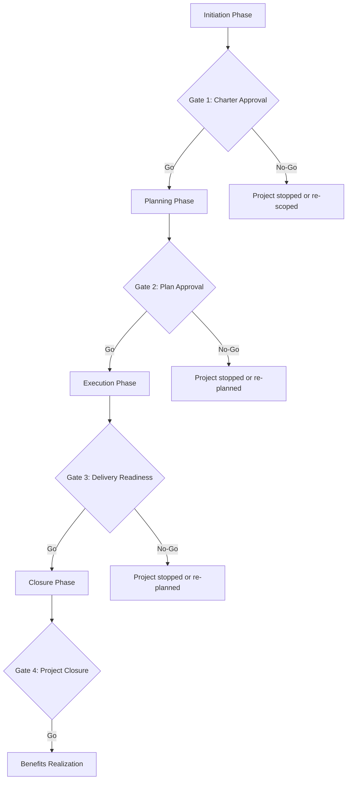

# Phase Gate Reviews

> **Core skill:** Running structured reviews at project phase transitions — assessing readiness, quality, and business case validity — so the project only proceeds to the next phase when it is genuinely ready, not when the calendar says it is time.

## Why This Matters

Phase gate reviews are the project's formal checkpoints: structured assessments at the transition between phases where governance decides whether the project should continue to the next phase, continue with changes, or stop. A phase gate that is passed because the date arrived — despite incomplete deliverables, unresolved risks, or a business case that no longer holds — is governance theater. The project proceeds into the next phase with known problems that will compound, and governance has surrendered its most important lever: the power to say "not yet."

The project manager's role in phase gate reviews is to present the evidence honestly, recommend candidly, and accept the governance decision — including the decision to stop. A project manager who spins the evidence to get through the gate is managing the project's reputation at the cost of its reality, and the bill always arrives in a later phase.

## The Phase Gate Structure

## Gate Criteria by Phase

### Gate 1: Charter Approval (Initiation → Planning)

| Criterion | Evidence |
|-----------|----------|
| Business case is valid and approved | Business case document; sponsor approval |
| Project charter is signed | Signed charter |
| Project manager is assigned | Assignment record |
| Key stakeholders are identified | Initial stakeholder register |
| High-level scope and objectives are defined | Charter scope statement |
| Initial funding is approved | Budget authorization |

### Gate 2: Plan Approval (Planning → Execution)

| Criterion | Evidence |
|-----------|----------|
| Scope baseline is approved | Scope statement, WBS |
| Schedule baseline is approved | Project schedule with milestones |
| Cost baseline is approved | Budget with contingency |
| Risk register is populated with response plans | Risk register |
| Stakeholder engagement plan is approved | Engagement plan; communication plan |
| Governance structure is established | Decision rights matrix; steering committee confirmed |
| Quality plan is defined | Quality metrics, acceptance criteria |
| Resource plan is approved | Team assignments, procurement plan |

### Gate 3: Delivery Readiness (Execution → Closure)

| Criterion | Evidence |
|-----------|----------|
| Deliverables meet acceptance criteria | Test results; UAT sign-off |
| Operational readiness is confirmed | Transition plan; operations team acceptance |
| Benefits tracking baseline is established | Benefits measurement plan |
| Outstanding issues are documented with owners | Issue register with resolution plans |
| Lessons learned are captured from execution | Initial lessons learned log |
| Closure plan is drafted | Closure checklist and schedule |

### Gate 4: Project Closure (Closure → Benefits Realization)

| Criterion | Evidence |
|-----------|----------|
| All deliverables are accepted | Formal acceptance from sponsor/customer |
| Transition to operations is complete | Signed handover document |
| Benefits realization plan is in place | Benefits management plan with measurement schedule |
| Lessons learned are documented and shared | Final lessons learned report |
| Project resources are released | Resource release confirmations |
| Contracts are closed | Contract closure notices |
| Project archives are complete | Archive index; configuration management final state |
| Financial closure is complete | Final cost report; budget reconciliation |

## The Phase Gate Review Meeting

### Pre-Read (Distributed 1 Week Before)

- Gate checklist with evidence summary
- Deliverable acceptance records
- Quality metrics for the phase
- Risk and issue status
- Updated business case (if changed)
- PM recommendation: go / conditional go / no-go

### Meeting Agenda

| Segment | Content | Duration |
|---------|---------|----------|
| PM recommendation | Go / conditional go / no-go — with rationale | 5 minutes |
| Evidence review | Gate criteria walkthrough; questions on evidence | 20 minutes |
| Risk and issue discussion | Unresolved risks; issues being carried forward | 10 minutes |
| Business case review | Is the business case still valid? | 10 minutes |
| Deliberation | Governance discusses; PM answers questions | 10 minutes |
| Decision | Go / conditional go / no-go — with conditions and rationale | 5 minutes |

### Gate Decisions

| Decision | Meaning | Consequence |
|----------|---------|-------------|
| **Go** | The project is ready to proceed to the next phase | Next phase activities begin; resources are authorized |
| **Conditional go** | The project may proceed but must address specific conditions by a defined date | Conditions with owners and deadlines; if conditions not met, project returns to gate |
| **No-go: re-plan** | The project is not ready; return to current phase and re-plan | Current phase continues with revised plan; new gate date set |
| **No-go: stop** | The project is terminated | Closure activities initiated; resources released; lessons captured |

## The PM's Role: Honest Recommendation

The project manager's phase gate recommendation is the moment of professional integrity:

- **Recommend go** when the evidence supports it — the criteria are met, the risks are acceptable, and the business case holds
- **Recommend conditional go** when there are gaps that can be closed quickly — be specific about the conditions and the deadline
- **Recommend no-go** when the project is not ready, the risks are unacceptable, or the business case no longer holds — even if the date has arrived, even if the sponsor wants to proceed

A project manager who recommends go when the evidence says no-go has traded short-term relief for long-term credibility. The governance body may override the recommendation — but the recommendation is on the record, and the project manager's integrity is intact.

## Phase Gates in Programs

Program phase gates coordinate across projects:

- **Program gate**: assesses the program's readiness to move to the next program phase — based on aggregate project readiness
- **Project gates**: each project passes its own gate; the program gate is not passed until all critical-path projects pass theirs
- **Cross-project readiness**: the program gate assesses integration readiness — not just individual project readiness
- **Benefit gate**: at key program gates, the program's benefit projections are revalidated against project progress

## Practical Applications

### Phase Gate Checklist

- [ ] Gate criteria are defined and agreed at project initiation
- [ ] Evidence for each criterion is collected and summarized in the pre-read
- [ ] The PM recommendation is honest — go, conditional go, or no-go with rationale
- [ ] The pre-read is distributed one week before the gate meeting
- [ ] The meeting agenda is decision-focused — not a status review
- [ ] The gate decision is recorded with conditions, owners, and deadlines
- [ ] Conditional go items are tracked and closed by the deadline

## Common Pitfalls

| Pitfall | Why It Is a Problem | Better Approach |
|---------|---------------------|-----------------|
| **Gate-by-calendar** | The gate is held because the date arrived, not because the project is ready | Gate criteria drive the date; the date does not drive the gate |
| **Evidence theater** | Evidence is assembled to justify go, not to assess readiness honestly | PM presents evidence honestly; governance decides |
| **Conditional-go-as-go** | Conditions are set but never tracked; the project proceeds as if it were a clean go | Conditions with owners, deadlines, and escalation if not met |
| **No-go avoidance** | Governance never says no-go; every gate is a go | Governance is accountable for no-go decisions; the PM's job is to recommend honestly |
| **Gate as status review** | The gate meeting reviews progress instead of assessing readiness | Gate criteria are readiness criteria, not progress metrics |

## Success Indicators

- Phase gates result in genuine go/no-go decisions — not automatic passes
- PM recommendations are honest and aligned with the evidence
- Conditional go items are tracked and closed by the deadline
- The business case is revalidated at every gate — not just at initiation
- Gates that reveal readiness gaps result in re-plans, not schedule pressure to proceed anyway

## Related Topics

- [[01_Project_Governance_Design]]: governance design establishes the gate structure
- [[05_Quality_Assurance_in_Governance]]: quality evidence is the core of gate assessment
- [[03_Decision_Recording_and_Communication]]: gate decisions are recorded and communicated
- [[02_Scope_and_Planning/00_overview|Scope and Planning]]: planning phase ends at Gate 2
- [[07_Benefits_and_Closure/00_overview|Benefits and Closure]]: closure at Gate 4

## Summary

Phase gate reviews are the project's formal checkpoints: structured assessments at phase transitions where governance decides go, conditional go, or no-go based on evidence against defined criteria. The project manager presents evidence honestly, recommends candidly, and accepts the governance decision. A gate passed because the date arrived rather than because the project is ready is governance theater — and the problems it papers over compound in the next phase. A gate where governance says no-go when the evidence demands it is governance working. The phase gate is the project's most powerful quality and integrity mechanism — and it works only when the project manager tells the truth and governance has the courage to act on it.