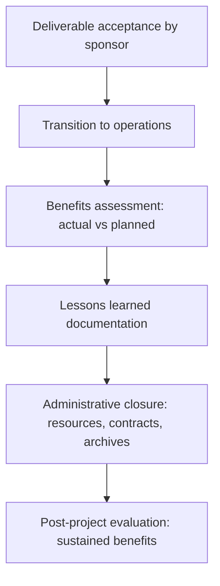

# Benefits and Closure

> **Core capability:** The project manager connects deliverables to value — tracking benefit realization, closing the project with an honest assessment of what was achieved, and ensuring lessons are captured for future projects.

## Why This Matters

Projects that deliver on time and budget but produce no value are not successes — they are efficiently built failures. The project manager's final responsibility is the honest assessment: did the project achieve its objectives? Were benefits realized? What did we learn? This assessment is uncomfortable when the answers are "partially," "not yet," and "don't do that again" — which makes it the most important assessment the project manager writes.

Closure is also the transition: handing deliverables to operations, releasing resources, archiving knowledge, and formally ending the project's organizational existence. A project that never closes drifts forever, consuming resources without accountability. The project manager who closes well leaves a clean slate; the one who avoids closure leaves a ghost.

## Topics in This Capability Area

| Topic | Core Skill | When It Matters |
|-------|------------|-----------------|
| [[01_Benefits_Identification_and_Planning]] | Defining benefits and tracing them to deliverables | Project initiation; benefits management plan |
| [[02_Benefits_Tracking_During_Delivery]] | Monitoring leading indicators of benefit realization | Throughout the project |
| [[03_Benefits_Realization_at_Closure]] | Assessing actual vs planned benefits honestly | Project closure |
| [[04_Project_Closure_Process]] | Formal closure: acceptance, handover, administrative close | Project end |
| [[05_Transition_to_Operations]] | Handing deliverables to the operational owner | Before project closure |
| [[06_Lessons_Learned_and_Retrospectives]] | Capturing what worked and what didn't for future projects | Throughout; formal at closure |
| [[07_Post_Project_Evaluation]] | Evaluating project success against objectives after transition | 3-12 months after closure |

## The Closure Sequence

Closure begins at acceptance and ends only when benefits are measured.

## Practical Applications

### Closure Checklist

- [ ] All deliverables are accepted by the sponsor or customer
- [ ] Operational transition is complete with documented handover
- [ ] Benefits realized are assessed against the benefits management plan
- [ ] Lessons learned are documented and shared with the organization
- [ ] Project resources are released and contracts closed
- [ ] Project archives are complete and accessible
- [ ] Post-project evaluation is scheduled if benefits require time to materialize

## Common Pitfalls

| Pitfall | Why It Is a Problem | Better Approach |
|---------|---------------------|-----------------|
| **Closure avoidance** | Project drifts; nobody declares it done | Closure criteria in the charter; formal closure triggered |
| **Benefits-by-claim** | Benefits declared but never measured | Honest assessment against baseline; measured, not asserted |
| **Lessons-lost** | Retrospective done, never read again | Lessons integrated into organizational process assets |
| **Transition-as-handoff** | Operations team receives deliverables they cannot operate | Transition planned from initiation; operations involved early |

## Success Indicators

- Project closure is a deliberate event, not a fading away
- Benefits assessment is honest and used in the next project's business case
- Lessons learned are referenced in subsequent project charters
- Operational owners can sustain the deliverables without the project team

## Related Capabilities

- [[01_Initiation_and_Charter/00_overview|Initiation and Charter]]: benefits and closure criteria defined at initiation
- [[04_Risk_and_Issues/00_overview|Risk and Issues]]: benefit risk is part of the risk register
- [[career-path/12_Technical_Program_Manager/07_Benefits_and_Outcome_Measurement/00_overview|Benefits and Outcome Measurement (TPM)]]: the program-level counterpart

## Summary

Benefits and closure complete the project lifecycle: delivering value, not just deliverables. The project manager tracks benefits during delivery, assesses realization honestly at closure, transitions deliverables so they survive the handoff, captures lessons that improve the next project, and formally closes the project so it doesn't drift forever. The final status report is the project's epitaph — write one you'd want read at your next project's initiation.