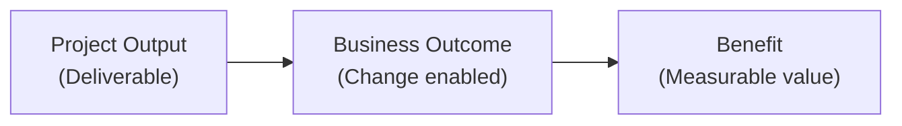

# Benefits Identification and Planning

> **Core skill:** Defining the benefits the project is expected to produce — tangible and intangible, quantified and qualified — and planning how each benefit will be measured, who owns its realization, and when it will be assessed, so the project is managed for outcomes, not just outputs.

## Why This Matters

The project charter states the objective; the benefits management plan states the value. A project that delivers every deliverable on time and on budget but produces no measurable benefit has not succeeded — it has efficiently produced a result nobody needed. The benefits management plan connects the project's outputs to the organization's outcomes: "When we deliver X, it will enable Y, which we will measure through Z."

Benefits identification and planning is also the project's defense against scope creep: every proposed addition is tested against the benefits it contributes to. A feature that adds schedule and cost but contributes to no identified benefit is a feature that should be challenged. The benefits plan is the project's value anchor — and the project manager who neglects it manages outputs while the organization funds outcomes.

## Types of Benefits

| Benefit Type | Examples | Measurement |
|--------------|----------|-------------|
| **Financial — revenue** | Increased sales, new market entry, higher pricing | Revenue reports, market share data |
| **Financial — cost** | Reduced operational cost, headcount reduction, automation savings | Cost reports, efficiency metrics |
| **Financial — avoidance** | Regulatory penalty avoided, risk mitigation savings | Risk register, compliance reports |
| **Operational** | Faster process, reduced errors, increased capacity | Process metrics, throughput, error rates |
| **Customer** | Improved satisfaction, retention, NPS | Surveys, churn data, NPS scores |
| **Strategic** | Market position, competitive advantage, capability building | Strategic reviews, capability assessments |
| **Compliance** | Regulatory compliance, certification achieved, audit passed | Compliance reports, certifications |
| **Intangible** | Brand reputation, employee morale, organizational learning | Surveys, sentiment analysis, qualitative assessment |

Every benefit is either measurable or it is an aspiration — and benefits that cannot be measured cannot be managed.

## The Benefits Management Plan

### Plan Structure

| Section | Content |
|---------|---------|
| **Benefit inventory** | Each identified benefit with description, type, and owner |
| **Benefit-to-output mapping** | Which project deliverables or outputs enable which benefits |
| **Measurement method** | How each benefit will be measured: metric, data source, baseline |
| **Target** | The expected value of the benefit: quantitative or qualitative |
| **Measurement timeline** | When the benefit will be measured: during project, at closure, post-closure |
| **Benefit owner** | Who is accountable for realizing each benefit (not the PM — the business owner) |
| **Assumptions** | What conditions must hold for the benefit to be realized |
| **Risks to benefits** | What could prevent or reduce the benefit |
| **Interdependencies** | Benefits that depend on other projects, systems, or organizational changes |

### Benefit Mapping

| Output | Outcome | Benefit | Metric | Target |
|--------|---------|---------|--------|--------|
| Automated invoice processing system | Invoices processed without manual intervention | Reduced processing cost | Cost per invoice | $12 → $3 |
| Customer self-service portal | Customers resolve issues without calling support | Reduced support volume | Support tickets per month | 5,000 → 2,000 |
| Regulatory reporting module | Reports generated in required format | Compliance achieved | Audit findings | Zero findings |

The discipline: never claim a benefit without tracing it to a specific output and a specific measurement.

## Quantifying Benefits

### The Honest Range

Benefits are forecast, not guaranteed. The benefits plan communicates the range:

| Element | Description |
|---------|-------------|
| **Best case** | The benefit if all assumptions hold |
| **Expected case** | The most likely benefit given realistic assumptions |
| **Worst case** | The minimum benefit if key assumptions fail |
| **Confidence level** | The project manager's confidence in the expected case — High/Medium/Low |

A benefit stated as a single number is a hope; a benefit stated as a range with confidence is a forecast.

### Intangible Benefits

Some benefits resist quantification but still matter:

| Intangible | How to Make It Tangible |
|------------|------------------------|
| Improved brand reputation | Brand sentiment surveys; social media sentiment analysis |
| Employee morale | Engagement survey scores; attrition rates |
| Organizational learning | Skills inventory before and after; capability assessments |
| Strategic positioning | Executive assessment; market analyst reports |

The rule: every benefit is either quantified or qualified with observable evidence. "Improved morale" without a measurement is a slogan.

## Benefit Ownership

The project manager does not own benefits — the business owner does:

| Role | Responsibility |
|------|----------------|
| **Benefit owner** (business stakeholder) | Accountable for realizing the benefit after the project delivers the output |
| **Project manager** | Accountable for delivering the outputs that enable the benefit — and for tracking leading indicators during the project |
| **Sponsor** | Accountable for the overall benefits case and for ensuring benefit owners are engaged |

Benefit ownership is assigned at benefits planning, not at project closure. A benefit without an owner at initiation will be an orphan at realization.

## Benefits in Programs

Program benefits are the raison d'être of program management:

- **Program benefits**: realized through the coordination of multiple projects — benefits that no single project can deliver alone
- **Benefit mapping**: program outputs → project outputs → outcomes → benefits — a multi-level map
- **Benefit interdependencies**: benefits that depend on multiple projects' outputs; the program manager monitors the integrated path
- **Benefit optimization**: the program manager may adjust project scope, sequence, or resourcing to maximize aggregate benefits, even if it sub-optimizes individual project benefits

## Practical Applications

### Benefits Planning Checklist

- [ ] Every benefit is traced to a specific project output and business outcome
- [ ] Every benefit has a measurement method, data source, and baseline
- [ ] Benefits are forecast as ranges with confidence levels
- [ ] Every benefit has an assigned benefit owner (business stakeholder)
- [ ] Assumptions and risks to benefits are documented
- [ ] The benefits plan is approved by the sponsor as part of the charter or project plan
- [ ] Benefit interdependencies with other projects are identified

## Common Pitfalls

| Pitfall | Why It Is a Problem | Better Approach |
|---------|---------------------|-----------------|
| **Benefits-by-assertion** | Benefits claimed but never quantified or measured | Every benefit measurable; measurement method defined at planning |
| **PM-as-benefit-owner** | The PM is held accountable for benefits they cannot control | Benefit owner is the business stakeholder who controls the outcome |
| **Output-as-benefit** | "Delivered the system" is reported as a benefit | Output is what was built; benefit is what changed |
| **Single-number forecast** | A single benefit number implies certainty where none exists | Range with confidence level |
| **Orphan benefits** | Benefits identified at initiation but no owner assigned | Benefit owner assigned at planning; confirmed by sponsor |

## Success Indicators

- Every benefit has a measurement method, baseline, target, and owner
- The benefits plan is referenced in scope decisions — "does this change contribute to a benefit?"
- Benefit owners are engaged during the project, not just at closure
- Leading indicators of benefit realization are tracked during the project
- The benefits plan is reviewed at each phase gate

## Related Topics

- [[02_Benefits_Tracking_During_Delivery]]: tracking leading indicators during the project
- [[03_Benefits_Realization_at_Closure]]: assessing actual vs. planned benefits at closure
- [[01_Initiation_and_Charter/00_overview|Initiation and Charter]]: benefits identified in the business case and charter
- [[career-path/12_Technical_Program_Manager/07_Benefits_and_Outcome_Measurement/00_overview|Benefits and Outcome Measurement (TPM)]]: the program-level benefits discipline

## Summary

Benefits identification and planning connects the project's outputs to the organization's value: every benefit is identified, traced to a specific deliverable and outcome, quantified with a range and confidence level, assigned a measurement method and a business owner, and documented with its assumptions and risks. The benefits plan is the project's value anchor — it answers "why are we doing this?" in measurable terms, and it defends against scope that adds cost without adding benefit. A project managed without a benefits plan is managed for outputs; a project managed with one is managed for outcomes. The difference is whether the project's final report measures what was delivered or what changed.