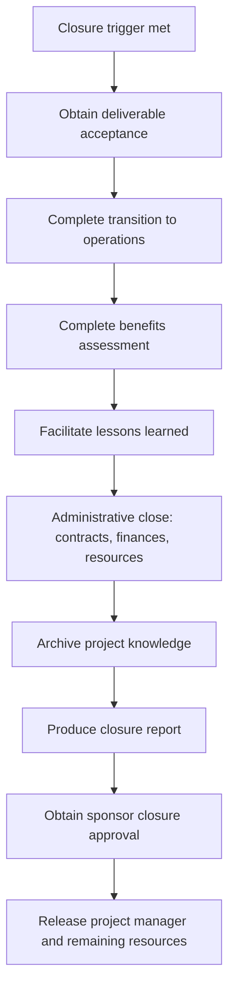

# Project Closure Process

> **Core skill:** Formally closing the project — obtaining deliverable acceptance, completing administrative close, releasing resources, archiving knowledge, and producing the closure report — so the project ends as a deliberate event, not a drift into silence.

## Why This Matters

Projects that are not formally closed do not end — they drift. Resources are half-released, contracts linger, stakeholders assume the project is still active, and the organization carries the project on its books without accountability. A project that never closes becomes organizational debt: consuming attention, confusing priorities, and providing cover for work that should have been stopped or transitioned.

Formal closure is the project manager's final deliverable: obtaining sponsor acceptance that the project's objectives have been met (or that the project is being terminated), completing the administrative and contractual close, releasing resources with clarity, archiving project knowledge so it is accessible to future projects, and producing the closure report that tells the project's story honestly. The project manager who closes well leaves a clean slate; the one who avoids closure leaves a ghost.

## Closure Triggers

| Trigger | Description |
|---------|-------------|
| **Normal completion** | All deliverables accepted; project objectives met |
| **Early termination** | Project stopped by governance — business case invalidated, funding withdrawn, priority superseded |
| **Integration** | Project absorbed into a larger program or operational function |
| **Contractual end** | Fixed-term or fixed-scope contract completed |

Closure is triggered by the condition, not the calendar. The project manager initiates closure when the trigger condition is met — or recommends closure when it should be met but governance is avoiding the decision.

## The Closure Sequence

## Deliverable Acceptance

The first closure step is formal acceptance that the project has delivered what it committed to:

| Acceptance Element | Evidence |
|--------------------|----------|
| **Scope completion** | All scope items are delivered per the scope baseline or formally descoped through change control |
| **Quality acceptance** | Deliverables meet acceptance criteria; test results and acceptance sign-offs are complete |
| **Customer/sponsor sign-off** | Formal written acceptance from the sponsor or customer that deliverables are accepted |
| **Outstanding items** | Any incomplete or deferred items are documented with owners, rationale, and plan |

Acceptance is not "everyone is happy" — it is "the deliverables match the agreed scope and quality criteria." Items outside the scope baseline are not blockers to acceptance; they are candidates for a future phase or project.

## Administrative Close

### Financial Close

| Action | Description |
|--------|-------------|
| Final cost reconciliation | All costs captured; final cost vs. budget reported |
| Outstanding payments | All invoices processed; vendor payments finalized |
| Budget closure | Remaining budget returned or reallocated per organizational process |
| Financial report | Final cost report with variance analysis |

### Contractual Close

| Action | Description |
|--------|-------------|
| Contract completion verification | All contractual deliverables accepted |
| Vendor performance assessment | Formal assessment of vendor performance for organizational records |
| Contract closure notices | Formal closure notices issued to all vendors |
| Warranties and support | Warranty periods documented; support contacts transitioned to operations |

### Resource Release

| Action | Description |
|--------|-------------|
| Team member release | Each team member formally released with transition plan |
| Knowledge transfer | Critical knowledge documented and transferred |
| Equipment and access | Project equipment returned; system access revoked |
| Performance feedback | Feedback provided to team members' managers where appropriate |

## Project Knowledge Archiving

The project's knowledge assets must survive its closure:

| Asset | Archiving Action |
|-------|-----------------|
| Project management artifacts | Charter, plans, baselines, registers, logs — archived in organizational repository |
| Technical documentation | Architecture, design, specifications — handed to operations or archived |
| Lessons learned | Final lessons learned report — distributed and archived |
| Decision and change history | Decision log, change log — archived for audit and future reference |
| Contracts and legal | Archived per organizational retention policy |
| Communications | Key stakeholder communications archived per policy |

The archive is not a folder on the PM's laptop — it is the organizational repository where the next project manager can find the lessons from this project.

## The Project Closure Report

The closure report is the project's definitive summary:

| Section | Content |
|---------|---------|
| **Project summary** | Project name, dates, sponsor, PM, objectives |
| **Scope delivery** | What was delivered vs. planned; scope changes and rationale |
| **Schedule performance** | Planned vs. actual milestones; variance explanation |
| **Cost performance** | Budget vs. actual; variance explanation |
| **Quality performance** | Quality metrics; acceptance status |
| **Benefits realization** | Benefits assessment: achieved, partial, not achieved, scheduled |
| **Risk and issue summary** | Major risks and issues; how they were resolved |
| **Stakeholder summary** | Key stakeholder engagement and feedback |
| **Lessons learned** | Summary of key lessons; reference to full lessons learned report |
| **Outstanding items** | Incomplete work, open issues, deferred items — with owners |
| **Post-closure plan** | Benefits measurement schedule; support arrangements; warranty periods |
| **Appendices** | Key artifacts referenced in the report |

The closure report is the project's epitaph — and it should be honest enough that the next project manager who reads it understands both what was achieved and what was learned.

## Closing an Early-Terminated Project

Early termination is closure, not failure:

| Element | Approach |
|---------|----------|
| **Honesty** | State the reason for termination without blame: "Business case invalidated by market change" not "Sponsor lost confidence" |
| **Deliverable disposition** | What happens to completed and in-progress deliverables |
| **Knowledge preservation** | Lessons learned are especially valuable from terminated projects |
| **Team transition** | Special attention to team members' next assignments |
| **Stakeholder communication** | Clear, consistent message about why the project is ending |

A well-closed terminated project preserves the organization's learning and the team's dignity; a poorly closed one leaves questions, rumors, and half-finished work that nobody owns.

## Practical Applications

### Closure Checklist

- [ ] Deliverable acceptance is obtained in writing from the sponsor or customer
- [ ] Financial close is complete: all costs captured, invoices paid, budget reconciled
- [ ] Contractual close is complete: all vendors notified, performance assessed
- [ ] Resources are formally released with knowledge transfer complete
- [ ] Project knowledge is archived in the organizational repository
- [ ] Lessons learned are documented and distributed
- [ ] Benefits assessment is complete with transition to benefit owners
- [ ] Closure report is produced and approved by the sponsor
- [ ] Post-closure measurement schedule is agreed with benefit owners

## Common Pitfalls

| Pitfall | Why It Is a Problem | Better Approach |
|---------|---------------------|-----------------|
| **Closure avoidance** | Project drifts; resources half-committed; accountability evaporates | Closure criteria in the charter; formal closure triggered by condition, not calendar |
| **Scope-creep closure** | "Just one more thing" delays closure indefinitely | Acceptance against agreed scope; new requests are a new project |
| **Archive-on-laptop** | Project knowledge lives on the PM's machine; disappears when the PM moves on | Organizational repository; knowledge archived before resources are released |
| **Closure without sponsor** | PM closes the project without sponsor approval | Sponsor signs the closure report; closure is a governance decision |
| **Termination-as-shame** | Terminated projects are closed quietly with no lessons | Every terminated project has lessons; the organization pays twice if they are lost |

## Success Indicators

- Project closure is a deliberate event — scheduled, communicated, and completed
- The closure report is honest, complete, and approved by the sponsor
- Project knowledge is archived and accessible to future projects
- Resources are released with clarity — no ambiguity about "are we still on the project?"
- Post-closure benefits measurement is scheduled and owned by benefit owners

## Related Topics

- [[03_Benefits_Realization_at_Closure]]: the benefits assessment that feeds the closure report
- [[05_Transition_to_Operations]]: the operational handover that precedes administrative close
- [[06_Lessons_Learned_and_Retrospectives]]: lessons that must be captured before the team disperses
- [[07_Post_Project_Evaluation]]: the evaluation that follows closure
- [[01_Initiation_and_Charter/00_overview|Initiation and Charter]]: closure criteria defined at initiation

## Summary

The project closure process is the deliberate end of the project's organizational existence: obtaining sponsor acceptance that deliverables meet the agreed scope, completing financial and contractual close, releasing resources with clarity, archiving knowledge so it survives the project, and producing a closure report that tells the project's story honestly — achievements, shortfalls, benefits, and lessons. A project that is formally closed leaves a clean slate for the organization and a knowledge base for the next project; a project that is never closed drifts forever, consuming attention and avoiding accountability. The project manager who closes well completes the project; the one who avoids closure abandons it. The closure report is the project's epitaph — write one the next project manager will thank you for.