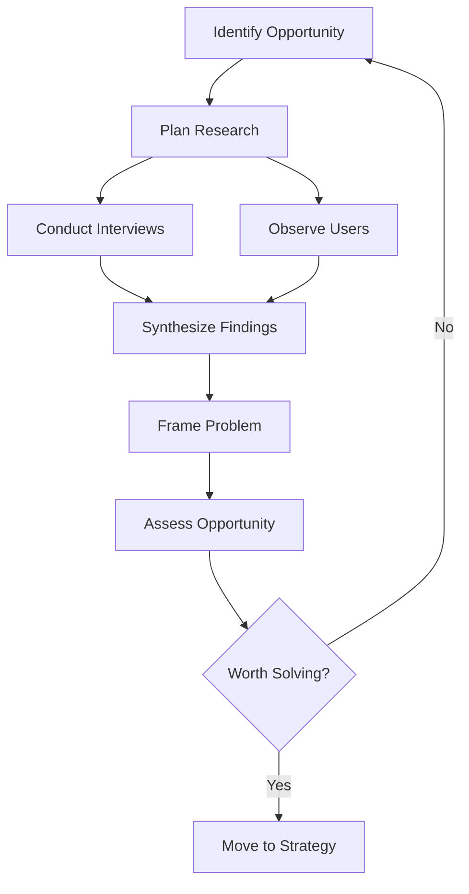

# Problem Discovery

> A senior product manager starts with the problem, not the solution. Discovery is the discipline of understanding customer needs, behaviors, constraints, and opportunities before deciding what to build.

## Why Problem Discovery Matters

Products fail when teams solve the wrong problem. Discovery reduces this risk by:
- Separating symptoms from root causes
- Distinguishing stated wants from actual needs
- Identifying constraints before committing resources
- Validating that the problem is worth solving

## Subtopics

| # | Topic | Summary |
|---|-------|---------|
| 01 | [[01_Customer_Interviews]] | Structured conversations to understand needs and context |
| 02 | [[02_Observation_and_Context]] | Learning from behavior, not just words |
| 03 | [[03_Problem_Framing]] | Defining the problem before jumping to solutions |
| 04 | [[04_Opportunity_Assessment]] | Deciding if a problem is worth solving |
| 05 | [[05_User_Research_Methods]] | Choosing the right research approach |
| 06 | [[06_Synthesis_and_Insights]] | Turning data into actionable understanding |

## Discovery Process

## Core Principles

1. **Problems before solutions** - Resist the urge to jump to features
2. **Behavior over opinions** - What people do matters more than what they say
3. **Context matters** - Understand the situation, not just the request
4. **Multiple perspectives** - Talk to different stakeholders and users
5. **Evidence-based** - Ground insights in data, not assumptions

## Senior-Level Behaviors

A senior product manager demonstrates problem discovery by:
- Leading discovery initiatives, not just participating
- Challenging assumptions and reframing problems
- Synthesizing insights across multiple sources
- Communicating findings that drive decisions
- Building organizational capability for discovery

## Connections

- [[body-of-knowledge/BABOK/02_Elicitation_and_Collaboration]] - Elicitation techniques
- [[body-of-knowledge/BABOK/03_Requirements_Life_Cycle_Management]] - Managing requirements
- [[career-path/02_Senior_Software_Engineer/02_Problem_Framing_and_Requirements]] - Technical problem framing

## Evidence for Promotion

To demonstrate senior-level problem discovery:
- Led discovery for a major product initiative
- Reframed a problem that changed product direction
- Built reusable discovery processes or templates
- Mentored others in discovery techniques
- Showed measurable impact of discovery on product outcomes
