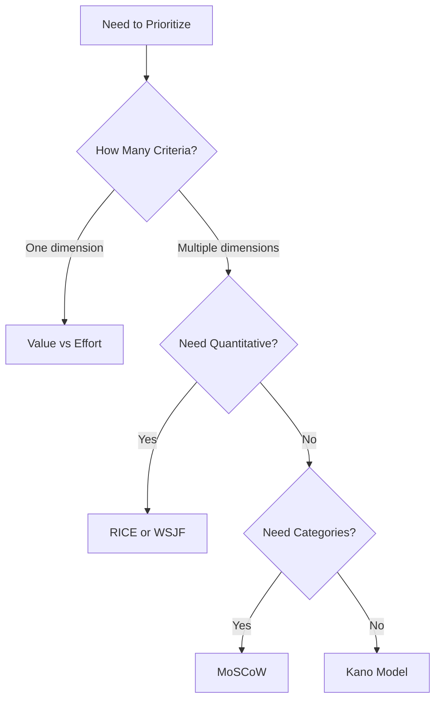

# Prioritization Frameworks

> Prioritization frameworks provide structured, repeatable approaches to comparing opportunities. They reduce bias, increase transparency, and enable consistent decision-making.

## Why Frameworks Matter

**Without frameworks:**
- Ad hoc decisions
- Bias and politics dominate
- Difficulty explaining decisions
- Inconsistent prioritization

**With frameworks:**
- Structured comparison
- Transparent decisions
- Consistent application
- Defensible priorities

## Framework Selection

### When to Use Each Framework

| Framework | Best For | Complexity | Time |
|-----------|----------|------------|------|
| RICE | General prioritization | Medium | Medium |
| MoSCoW | Requirements, releases | Low | Low |
| Value/Effort | Quick decisions | Low | Low |
| Kano | Feature prioritization | Medium | Medium |
| WSJF | Agile, flow-based | High | High |
| Cost of Delay | Strategic decisions | High | High |

### Decision Flowchart



## RICE Framework

### Components

**Reach:** How many users will this affect?
- Score: Number of users per time period
- Example: 1,000 users per quarter

**Impact:** How much will it affect each user?
- 3 = Massive impact
- 2 = High impact
- 1 = Medium impact
- 0.5 = Low impact
- 0.25 = Minimal impact

**Confidence:** How confident are we in our estimates?
- 100% = High confidence
- 80% = Medium confidence
- 50% = Low confidence

**Effort:** How much work is required?
- Score: Person-months
- Example: 2 person-months

### Calculation

```
RICE Score = (Reach × Impact × Confidence) / Effort
```

### Example

```
Opportunity A: Unified customer view
- Reach: 500 users per quarter
- Impact: 2 (High)
- Confidence: 80%
- Effort: 4 person-months

RICE Score = (500 × 2 × 0.8) / 4 = 200

Opportunity B: Mobile app
- Reach: 200 users per quarter
- Impact: 1 (Medium)
- Confidence: 50%
- Effort: 6 person-months

RICE Score = (200 × 1 × 0.5) / 6 = 16.7

Priority: A (higher RICE score)
```

### RICE Template

```
Opportunity: [Name]

Reach: [X users per quarter]
Rationale: [How estimated]

Impact: [3/2/1/0.5/0.25]
Rationale: [Why this impact level]

Confidence: [100%/80%/50%]
Rationale: [Why this confidence level]

Effort: [X person-months]
Rationale: [How estimated]

RICE Score: [Calculated score]

Decision: [Prioritize/Defer/Reject]
```

## MoSCoW Framework

### Categories

**Must Have:**
- Critical for success
- Cannot launch without
- Non-negotiable
- Example: Basic authentication, core workflows

**Should Have:**
- Important but not critical
- Significant value
- Can launch without (painfully)
- Example: Advanced search, integrations

**Could Have:**
- Nice to have
- Small value
- Only if time permits
- Example: Customizable dashboards, themes

**Won't Have (this time):**
- Explicitly excluded
- May consider later
- Not in current scope
- Example: Mobile app, API marketplace

### Process

1. List all opportunities
2. Categorize each as M, S, C, or W
3. Negotiate within categories
4. Commit to Must and Should
5. Consider Could if capacity allows

### Example

```
Release 1.0:

Must Have:
- Customer profile page
- Order history view
- Basic search
- CRM integration

Should Have:
- Advanced filters
- Saved searches
- Export functionality
- Email notifications

Could Have:
- Customizable layout
- Dark mode
- Keyboard shortcuts
- Mobile responsive

Won't Have (this time):
- Native mobile app
- AI recommendations
- API access
- Multi-language support
```

### MoSCoW Guidelines

**Must Have should be:**
- Truly critical (can't launch without)
- Limited (not everything is Must)
- Agreed by all stakeholders

**If everything is Must Have:**
- You're not prioritizing
- Re-evaluate what "critical" means
- Ask: "Can we launch without this?"

## Value/Effort Matrix

### 2x2 Matrix

```
          Low Effort    High Effort
High      Quick Wins    Big Bets
Value     (Do first)    (Plan carefully)

Low       Fill-ins      Money Pit
Value     (If time)     (Avoid)
```

### Process

1. Assess value (High/Low)
2. Assess effort (High/Low)
3. Plot on matrix
4. Prioritize by quadrant

### Example

```
Quick Wins (High Value, Low Effort):
- Saved searches
- Export functionality
- Email notifications

Big Bets (High Value, High Effort):
- Unified customer view
- AI recommendations
- Mobile app

Fill-ins (Low Value, Low Effort):
- Dark mode
- Keyboard shortcuts

Money Pit (Low Value, High Effort):
- Custom reporting engine
- Legacy system migration
```

### Value/Effort Scoring

**More granular than 2x2:**

| Opportunity | Value (1-10) | Effort (1-10) | V/E Ratio |
|-------------|--------------|---------------|-----------|
| A | 8 | 3 | 2.67 |
| B | 9 | 8 | 1.13 |
| C | 4 | 2 | 2.00 |
| D | 3 | 7 | 0.43 |

**Priority order:** A, C, B, D

## Kano Model

### Feature Categories

**Must-be (Basic):**
- Expected features
- Absence causes dissatisfaction
- Presence doesn't increase satisfaction
- Example: System uptime, data security

**Performance (Linear):**
- More is better
- Satisfaction proportional to quality
- Example: Faster performance, more storage

**Delight (Excitement):**
- Unexpected features
- Absence doesn't cause dissatisfaction
- Presence creates high satisfaction
- Example: Smart recommendations, predictive search

**Indifferent:**
- Users don't care
- Neither presence nor absence affects satisfaction
- Example: Backend technology choices

**Reverse:**
- Users don't want it
- Presence causes dissatisfaction
- Example: Intrusive ads, forced features

### Kano Survey

**For each feature, ask:**
1. How would you feel if you had it? (Like it, Expect it, Neutral, Can tolerate it, Dislike it)
2. How would you feel if you didn't have it? (Same options)

**Categorize based on responses**

### Prioritization Order

1. Must-be (table stakes)
2. Performance (competitive necessity)
3. Delight (differentiation)
4. Indifferent (don't build)
5. Reverse (don't build)

## WSJF (Weighted Shortest Job First)

### Components

**Cost of Delay:**
- User-business value (How valuable?)
- Time criticality (How urgent?)
- Risk reduction/opportunity enablement (How strategic?)

**Job Size:**
- Effort estimate
- Complexity

### Calculation

```
WSJF = Cost of Delay / Job Size
```

### Example

```
Opportunity A:
- User-business value: 8
- Time criticality: 5
- Risk reduction: 6
- Cost of Delay: 19
- Job Size: 5
- WSJF: 19 / 5 = 3.8

Opportunity B:
- User-business value: 9
- Time criticality: 3
- Risk reduction: 4
- Cost of Delay: 16
- Job Size: 8
- WSJF: 16 / 8 = 2.0

Priority: A (higher WSJF)
```

## Cost of Delay

### Why Cost of Delay Matters

**Delay has cost:**
- Revenue not captured
- Costs not reduced
- Opportunities missed
- Competitive disadvantage

### Calculating Cost of Delay

**Per week/month:**

```
Opportunity: Unified customer view
Value: $500,000 per year
Cost of delay: $500,000 / 52 weeks = $9,615 per week

If delayed 3 months:
Cost = 13 weeks × $9,615 = $125,000
```

### Cost of Delay Profiles

**Expedite (urgent):**
- High and immediate cost of delay
- Do immediately
- Example: Critical bug, compliance deadline

**Fixed date:**
- Cost of delay spikes at specific date
- Schedule to meet date
- Example: Product launch, event

**Standard:**
- Linear cost of delay
- Prioritize by WSJF
- Example: Most features

**Intangible:**
- Low immediate cost of delay
- High long-term value
- Example: Technical debt, infrastructure

## Framework Application

### Combining Frameworks

**Use multiple frameworks for different decisions:**

```
Strategic prioritization:
- Value/Effort for initial screening
- RICE for detailed comparison
- Cost of Delay for timing decisions

Release planning:
- MoSCoW for release scope
- RICE for feature ordering
- Kano for feature mix

Sprint planning:
- WSJF for sprint backlog
- Story points for capacity
```

### Framework Adaptation

**Adapt frameworks to context:**

- Simplify for small decisions
- Add rigor for large decisions
- Combine for complex decisions
- Evolve as you learn

## Common Framework Mistakes

### 1. Framework as Crutch

**Mistake:** Blindly following framework output
**Fix:** Use framework as input, apply judgment

### 2. Garbage In, Garbage Out

**Mistake:** Poor inputs, precise outputs
**Fix:** Focus on input quality, not calculation precision

### 3. One Framework for Everything

**Mistake:** Using RICE for all decisions
**Fix:** Match framework to decision type

### 4. Ignoring Context

**Mistake:** Framework ignores strategic context
**Fix:** Include strategic alignment in assessment

### 5. Not Revisiting

**Mistake:** Prioritize once, never revisit
**Fix:** Re-prioritize as context changes

## Senior-Level Framework Use

1. **Select appropriate frameworks**
   - Match framework to decision
   - Adapt to context
   - Combine when needed

2. **Build prioritization capability**
   - Train teams in frameworks
   - Create prioritization processes
   - Establish decision governance

3. **Make frameworks work**
   - Ensure quality inputs
   - Apply judgment to outputs
   - Learn and improve

4. **Connect frameworks to outcomes**
   - Track prioritization effectiveness
   - Measure framework accuracy
   - Improve over time

## Metrics

- Framework usage (% of decisions using frameworks)
- Prioritization accuracy (predicted vs. actual value)
- Decision speed (time to prioritize)
- Stakeholder satisfaction with prioritization
- Framework adaptation rate

## Resources

- [[body-of-knowledge/BABOK/05_Requirements_Analysis_and_Design]] - Requirements prioritization
- Inspired by Marty Cagan
- The Lean Product Playbook by Dan Olsen
- The Principles of Product Development Flow by Don Reinertsen

## Checklist

Before prioritizing:
- [ ] Appropriate framework selected
- [ ] Framework adapted to context
- [ ] Quality inputs gathered
- [ ] Framework applied consistently
- [ ] Outputs reviewed with judgment
- [ ] Decisions documented
- [ ] Rationale communicated
- [ ] Priorities aligned with strategy
- [ ] Stakeholders aligned
- [ ] Re-prioritization scheduled
