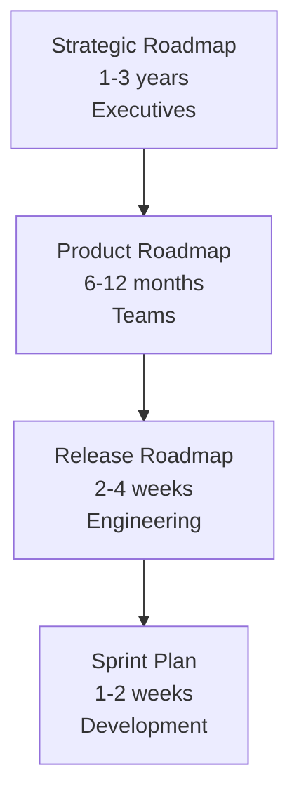

# Roadmap Types

> Different audiences need different roadmaps. Executives need strategic direction, teams need tactical plans, customers need to know what's coming. One roadmap doesn't fit all.

## Why Multiple Roadmaps

**Single roadmap problems:**
- Too detailed for executives
- Too vague for engineering
- Confusing for customers
- Doesn't serve any audience well

**Multiple roadmap benefits:**
- Right detail for each audience
- Clear communication
- Aligned expectations
- Effective planning at each level

### Roadmap Hierarchy



## Roadmap Hierarchy

### 1. Strategy Roadmap

**Audience:** Executives, board, investors
**Timeframe:** 1-3 years
**Focus:** Strategic initiatives, market moves, business outcomes
**Detail:** High-level themes and major milestones

**Content:**
- Strategic goals and initiatives
- Market expansion plans
- Major product launches
- Business outcome targets

**Example:**
```
2026 Strategy Roadmap:

Q1-Q2: Mid-market platform launch
- Unified customer view
- 100 beta customers
- $2M ARR target

Q3-Q4: European expansion
- Localization
- GDPR compliance
- 50 European customers

2027: AI-powered insights
- Predictive analytics
- Automated recommendations
- Market leadership position
```

**Communication:**
- Quarterly board presentations
- Annual strategic planning
- Investor updates

### 2. Product Roadmap

**Audience:** Product teams, engineering, design, stakeholders
**Timeframe:** 6-12 months
**Focus:** Features, initiatives, outcomes
**Detail:** Epics and major features with timeframes

**Content:**
- Product initiatives
- Major features
- Outcome targets
- Dependencies

**Example:**
```
2026 Product Roadmap:

Q1: Unified Customer View
- Customer profile page
- Order history integration
- Knowledge base integration
- Goal: Reduce search time by 70%

Q2: Real-time Search
- Search interface
- Indexing infrastructure
- Search results and filters
- Goal: Find records in <30 seconds

Q3: Mobile Experience
- Responsive design
- Mobile-optimized workflows
- Offline capability
- Goal: 30% mobile usage

Q4: AI Recommendations
- Recommendation engine
- Smart defaults
- Predictive search
- Goal: 20% efficiency gain
```

**Communication:**
- Monthly product reviews
- Sprint planning
- Stakeholder updates

### 3. Release Roadmap

**Audience:** Engineering, QA, operations, release management
**Timeframe:** 1-3 months
**Focus:** Releases, features, technical work
**Detail:** User stories, tasks, technical dependencies

**Content:**
- Release schedule
- Feature scope per release
- Technical debt work
- Infrastructure changes

**Example:**
```
Q1 Release Roadmap:

Release 2.1 (March 15):
- Customer profile page
- Basic search
- Performance improvements
- 2 weeks development, 1 week testing

Release 2.2 (April 1):
- Order history integration
- Advanced filters
- Database optimization
- 2 weeks development, 1 week testing

Release 2.3 (April 15):
- Knowledge base integration
- Export functionality
- Security updates
- 2 weeks development, 1 week testing
```

**Communication:**
- Sprint planning
- Release planning meetings
- Daily standups

### 4. Customer-Facing Roadmap

**Audience:** Customers, prospects, sales
**Timeframe:** 6-12 months
**Focus:** What's coming, when to expect it, how it helps
**Detail:** High-level features and benefits

**Content:**
- Upcoming features
- Expected timeframes
- Customer benefits
- Beta programs

**Example:**
```
Coming Soon:

Spring 2026:
- Unified customer view: All customer information in one place
- Real-time search: Find any record in seconds
- Benefit: Handle calls 50% faster

Summer 2026:
- Mobile app: Access anywhere
- Offline mode: Work without internet
- Benefit: Serve customers in the field

Fall 2026:
- AI recommendations: Smart suggestions
- Predictive search: Anticipate needs
- Benefit: Focus on customers, not searching
```

**Communication:**
- Customer newsletters
- Sales presentations
- Product website
- Beta invitations

## Choosing the Right Roadmap

### Decision Framework

**Ask:**
1. Who is the audience?
2. What decisions will they make?
3. What detail level do they need?
4. What timeframe matters to them?

**Match:**
- Executives → Strategy roadmap
- Product/engineering → Product roadmap
- Development teams → Release roadmap
- Customers → Customer-facing roadmap

### Roadmap Alignment

**Ensure consistency:**
- Strategy roadmap drives product roadmap
- Product roadmap drives release roadmap
- All roadmaps aligned on direction
- Changes cascade appropriately

**Example:**
```
Strategy: Launch mid-market platform in 2026
  ↓
Product: Build unified customer view in Q1
  ↓
Release: Ship customer profile in Release 2.1
  ↓
Customer: "Unified view coming Spring 2026"
```

## Roadmap Creation Process

### 1. Start with Strategy

**For all roadmaps:**
- Understand strategic goals
- Identify strategic initiatives
- Define success metrics
- Set timeframes

### 2. Adapt for Audience

**Strategy roadmap:**
- Focus on business outcomes
- High-level initiatives
- Annual/quarterly timeframes
- Strategic milestones

**Product roadmap:**
- Focus on product initiatives
- Features and outcomes
- Quarterly timeframes
- Dependencies and risks

**Release roadmap:**
- Focus on deliverables
- Specific features
- Bi-weekly/monthly timeframes
- Technical considerations

**Customer roadmap:**
- Focus on benefits
- High-level features
- Seasonal timeframes
- Value propositions

### 3. Maintain Consistency

**Ensure:**
- All roadmaps tell same story
- Timeframes align
- Features match across roadmaps
- Changes update all relevant roadmaps

## Common Roadmap Type Mistakes

### 1. One Roadmap for All

**Mistake:** Single roadmap, all audiences
**Fix:** Create audience-specific roadmaps

### 2. Inconsistent Roadmaps

**Mistake:** Different roadmaps tell different stories
**Fix:** Ensure alignment across all roadmaps

### 3. Wrong Detail Level

**Mistake:** Too much or too little detail for audience
**Fix:** Match detail to audience needs

### 4. Not Updating All

**Mistake:** Update one roadmap, forget others
**Fix:** Update all related roadmaps together

## Senior-Level Roadmap Types

1. **Strategic roadmapping**
   - Create strategy roadmaps
   - Align with business strategy
   - Communicate to executives

2. **Roadmap portfolio**
   - Manage multiple roadmaps
   - Ensure consistency
   - Coordinate across teams

3. **Audience understanding**
   - Know what each audience needs
   - Adapt communication
   - Build appropriate roadmaps

4. **Roadmap governance**
   - Establish roadmap processes
   - Define update cadences
   - Ensure quality and consistency

## Metrics

- Roadmap coverage (all audiences have roadmaps)
- Roadmap consistency (alignment across roadmaps)
- Audience satisfaction (survey)
- Roadmap usage (how often referenced)
- Decision alignment (decisions match roadmap)

## Resources

- Product Roadmaps Relaunched by C. Todd Lombardo et al.
- [[body-of-knowledge/PMBOK/03_Project_Life_Cycles]] - Project planning
- [[body-of-knowledge/PMBOK/08_Stakeholders_Performance_Domain]] - Stakeholder communication

## Checklist

Before creating roadmaps:
- [ ] Audiences identified
- [ ] Audience needs understood
- [ ] Roadmap types selected
- [ ] Strategic alignment confirmed
- [ ] Detail levels appropriate

After creating roadmaps:
- [ ] All roadmaps created
- [ ] Consistency verified
- [ ] Communicated to audiences
- [ ] Update process established
- [ ] Feedback gathered

