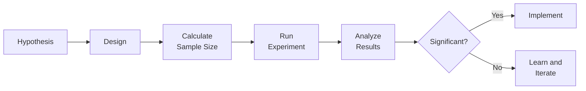

# Experimentation

> Opinions are cheap. Experiments provide evidence. Controlled experiments test hypotheses rigorously, revealing what actually works versus what we think works.

## Why Experimentation Matters

**Without experimentation:**
- Decisions based on opinions
- Can't distinguish correlation from causation
- Don't know if changes help or hurt
- Waste resources on ineffective features

**With experimentation:**
- Evidence-based decisions
- Causal understanding
- Know what actually works
- Efficient resource allocation

## Experiment Types

### Experiment Process



### 1. A/B Testing

**Compare two versions:**

**Process:**
- Create control (current) and variant (new)
- Randomly assign users
- Measure outcomes
- Compare statistically

**When to use:**
- Testing specific changes
- Optimizing existing features
- Clear success metrics

**Example:**
```
A/B Test: Search button placement

Hypothesis: Moving search button to top increases usage

Control: Search button in sidebar (current)
Variant: Search button at top (new)

Metrics:
- Primary: Search usage rate
- Secondary: Time to first search
- Guardrail: Overall satisfaction

Sample size: 10,000 users per group
Duration: 2 weeks

Results:
Control: 45% search usage
Variant: 62% search usage
p-value: 0.001 (significant)

Decision: Implement variant
Impact: 38% increase in search usage
```

### 2. Multivariate Testing

**Compare multiple variants:**

**Process:**
- Create multiple variants
- Test simultaneously
- Identify best performer

**When to use:**
- Multiple design options
- Optimizing across variations
- Exploring solution space

**Example:**
```
Multivariate Test: Onboarding flow

Variant A: 3-step onboarding (current)
Variant B: 5-step onboarding (more guidance)
Variant C: 1-step onboarding (minimal)
Variant D: Interactive tutorial

Metrics:
- Primary: Onboarding completion rate
- Secondary: Time to first project
- Guardrail: 7-day retention

Results:
A: 65% completion, 8 min to first project, 70% retention
B: 80% completion, 12 min to first project, 75% retention
C: 85% completion, 5 min to first project, 60% retention
D: 75% completion, 10 min to first project, 80% retention

Winner: Variant D (best balance of completion and retention)
```

### 3. Feature Flags

**Controlled feature rollout:**

**Process:**
- Build feature behind flag
- Enable for percentage of users
- Gradually increase exposure
- Monitor and adjust

**When to use:**
- Risky changes
- Gradual rollout
- Quick rollback capability

**Example:**
```
Feature Flag: New pricing model

Week 1: 5% of users (monitor for issues)
Week 2: 20% of users (early results)
Week 3: 50% of users (broader test)
Week 4: 100% of users (full rollout)

Monitoring:
- Conversion rate
- Revenue per user
- Support tickets
- User feedback

Rollback criteria:
- Conversion drops > 10%
- Support tickets increase > 50%
- Negative feedback > 20%
```

## Experiment Design

### 1. Hypothesis

**Clear, testable hypothesis:**

**Structure:**
```
We believe that [change]
will result in [outcome]
for [user segment]
because [rationale]
```

**Example:**
```
We believe that adding autocomplete to search
will result in 20% more successful searches
for all users
because users struggle with exact wording
and autocomplete helps them find what they need
```

### 2. Metrics

**Define success metrics:**

**Primary metric:**
- Main outcome you're testing
- Must be measurable
- Statistically powered

**Secondary metrics:**
- Supporting outcomes
- Additional insights

**Guardrail metrics:**
- Metrics that shouldn't get worse
- Safety checks

**Example:**
```
Primary: Search success rate
Secondary: Time to successful search, search usage
Guardrail: Page load time, overall satisfaction
```

### 3. Sample Size

**Calculate required sample:**

**Factors:**
- Expected effect size
- Statistical power (typically 80%)
- Significance level (typically 5%)
- Baseline conversion rate

**Example:**
```
Baseline conversion: 10%
Minimum detectable effect: 2% (absolute)
Power: 80%
Significance: 5%

Required sample: 3,800 per group
Duration: 2 weeks at current traffic
```

### 4. Randomization

**Ensure fair comparison:**

**Principles:**
- Random user assignment
- Balanced groups
- No selection bias
- Consistent experience

**Example:**
```
Randomization:
- User ID hashed
- Hash determines group
- 50% control, 50% variant
- Consistent throughout experiment
```

## Running Experiments

### 1. Launch

**Start experiment:**
- Verify instrumentation
- Check randomization
- Monitor for issues
- Confirm sample sizes

### 2. Monitor

**During experiment:**
- Check for technical issues
- Monitor guardrail metrics
- Watch for anomalies
- Don't peek at results (biases decisions)

### 3. Analyze

**After experiment:**
- Check statistical significance
- Calculate effect size
- Analyze segments
- Consider practical significance

### 4. Decide

**Based on results:**
- Implement if successful
- Iterate if promising but not significant
- Abandon if unsuccessful
- Learn regardless of outcome

## Statistical Concepts

### 1. P-value

**Probability result is random:**
- p < 0.05: Statistically significant (5% chance random)
- p < 0.01: Highly significant (1% chance random)
- p > 0.05: Not significant (could be random)

### 2. Confidence Interval

**Range of likely true effect:**
```
Result: 2% improvement
95% CI: [0.5%, 3.5%]

Interpretation: We're 95% confident true improvement
is between 0.5% and 3.5%
```

### 3. Statistical Power

**Probability of detecting real effect:**
- 80% power: 80% chance of detecting real effect
- Higher power requires larger sample
- Typical target: 80% power

### 4. Minimum Detectable Effect

**Smallest effect you can reliably detect:**
- Smaller MDE requires larger sample
- Balance sensitivity with feasibility
- Typical: 1-5% relative change

## Common Experimentation Mistakes

### 1. Peeking

**Mistake:** Checking results early and stopping
**Fix:** Pre-define duration, don't peek

### 2. Multiple Testing

**Mistake:** Running many tests, some will be significant by chance
**Fix:** Adjust significance threshold (Bonferroni correction)

### 3. Small Sample

**Mistake:** Not enough users for reliable results
**Fix:** Calculate sample size beforehand

### 4. Ignoring Segments

**Mistake:** Overall result hides segment differences
**Fix:** Analyze by segments

### 5. Correlation Confusion

**Mistake:** Observational data treated as experiment
**Fix:** Use proper randomization

## Experimentation Culture

### 1. Test Everything

**Build experimentation mindset:**
- Test assumptions
- Validate hypotheses
- Learn from failures
- Celebrate learning

### 2. Share Learnings

**Disseminate insights:**
- Experiment reviews
- Learnings database
- Best practices
- Failure postmortems

### 3. Prioritize Experiments

**Focus on high-impact tests:**
- Potential impact
- Confidence in hypothesis
- Resource requirements
- Strategic alignment

## Senior-Level Experimentation

1. **Strategic experimentation**
   - Not just tactical tests
   - Strategic hypothesis testing
   - Major initiative validation

2. **Experimentation platform**
   - Build testing infrastructure
   - Enable rapid experimentation
   - Standardize processes

3. **Advanced methods**
   - Causal inference
   - Quasi-experiments
   - Bayesian methods

4. **Experimentation culture**
   - Build test-and-learn culture
   - Train organization
   - Celebrate learning

## Metrics

- Experiment velocity (experiments per quarter)
- Experiment quality (% with proper design)
- Win rate (% of experiments successful)
- Learning rate (insights per experiment)
- Impact (total value from experiments)

## Resources

- Trustworthy Online Controlled Experiments by Ron Kohavi et al.
- [[body-of-knowledge/DMBOK/11_Data_Analytics]] - Data analytics
- Running Lean by Ash Maurya

## Checklist

Before experiment:
- [ ] Hypothesis clearly defined
- [ ] Success metrics identified
- [ ] Sample size calculated
- [ ] Duration determined
- [ ] Instrumentation verified
- [ ] Randomization checked

After experiment:
- [ ] Statistical significance calculated
- [ ] Effect size measured
- [ ] Segments analyzed
- [ ] Learnings documented
- [ ] Decision made
- [ ] Results communicated

