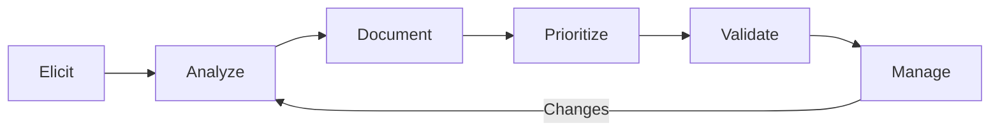

# Requirements

> Requirements bridge the gap between problems and solutions. Clear requirements ensure everyone understands what to build, why it matters, and how success will be measured.

## Why Requirements Matter

Products without clear requirements:
- Teams build wrong solutions
- Scope creep and rework
- Misaligned expectations
- Wasted resources

Products with clear requirements:
- Teams build right solutions
- Focused execution
- Aligned expectations
- Efficient delivery

## Subtopics

| # | Topic | Summary |
|---|-------|---------|
| 01 | [[01_Requirements_Elicitation]] | Discovering what stakeholders need |
| 02 | [[02_Requirements_Analysis]] | Understanding and refining requirements |
| 03 | [[03_User_Stories]] | Writing requirements as user stories |
| 04 | [[04_Acceptance_Criteria]] | Defining success conditions |
| 05 | [[05_Requirements_Prioritization]] | Deciding what to build first |
| 06 | [[06_Requirements_Management]] | Managing requirements through delivery |

## Requirements Lifecycle



## Requirements Principles

1. **Problem-focused:** Start with problem, not solution
2. **User-centered:** Written from user perspective
3. **Testable:** Clear how to verify
4. **Unambiguous:** One interpretation only
5. **Complete:** All necessary information included

## Requirements Types

### Business Requirements
- High-level business goals
- Strategic objectives
- Success metrics

**Example:**
```
Reduce customer service call handling time by 30%
within 6 months to improve efficiency and reduce costs
```

### User Requirements
- What users need to accomplish
- User goals and tasks
- User experience expectations

**Example:**
```
Customer service reps need to find customer information
quickly (under 30 seconds) to handle calls efficiently
```

### Functional Requirements
- What the system must do
- Features and capabilities
- System behaviors

**Example:**
```
System shall display customer profile with contact info,
order history, and support tickets when rep searches by
customer name or ID
```

### Non-Functional Requirements
- How the system performs
- Quality attributes
- Constraints

**Example:**
```
Search results must return within 2 seconds for 95% of
queries, system must support 500 concurrent users
```

## Requirements Hierarchy

```
Business Requirements (Why)
    ↓
User Requirements (What users need)
    ↓
Functional Requirements (What system does)
    ↓
Technical Requirements (How system works)
```

## Requirements Process

### 1. Elicit
- Discover needs
- Gather information
- Understand context

### 2. Analyze
- Refine requirements
- Resolve conflicts
- Ensure quality

### 3. Specify
- Document clearly
- Use appropriate format
- Include acceptance criteria

### 4. Validate
- Review with stakeholders
- Confirm understanding
- Verify completeness

### 5. Manage
- Track changes
- Maintain traceability
- Ensure alignment

## Common Requirements Mistakes

### 1. Solution Before Problem
**Mistake:** Jumping to solutions without understanding problem
**Fix:** Start with problem definition

### 2. Vague Requirements
**Mistake:** "System should be fast" (how fast?)
**Fix:** Specific, measurable criteria

### 3. Gold Plating
**Mistake:** Adding features nobody asked for
**Fix:** Focus on stated needs

### 4. Ignoring Constraints
**Mistake:** Requirements without technical/business constraints
**Fix:** Include constraints explicitly

### 5. No Acceptance Criteria
**Mistake:** Requirements without success definition
**Fix:** Define how to verify

## Senior-Level Requirements

1. **Strategic requirements**
   - Not just feature requirements
   - Business outcome requirements
   - Strategic alignment

2. **Requirements leadership**
   - Establish requirements processes
   - Train teams in best practices
   - Build requirements culture

3. **Complex requirements**
   - Handle ambiguity
   - Navigate conflicts
   - Balance competing needs

4. **Requirements quality**
   - Ensure clarity and completeness
   - Validate with stakeholders
   - Maintain traceability

## Connections

- [[body-of-knowledge/BABOK/04_Elicitation]] - Requirements elicitation
- [[body-of-knowledge/BABOK/05_Requirements_Analysis_and_Design]] - Requirements analysis
- [[career-path/02_Senior_Software_Engineer/01_Technical_Strategy_and_Vision/02_Requirements_Engineering]] - Requirements engineering

## Evidence for Promotion

To demonstrate senior-level requirements:
- Elicited requirements from complex stakeholder groups
- Wrote clear, actionable requirements
- Managed requirements through delivery
- Showed measurable outcomes from requirements
- Built requirements processes and culture

