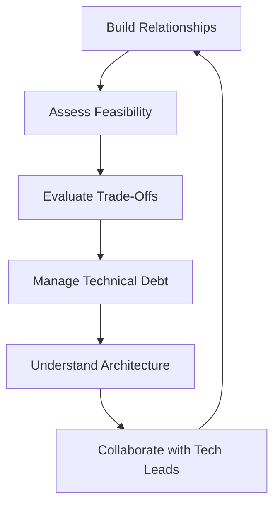

# Technical Partnership

> Product managers don't need to code, but they need to partner effectively with engineering. Technical partnership bridges business needs and technical reality, enabling better decisions and faster delivery.

## Why Technical Partnership Matters

Products without technical partnership:
- Unrealistic expectations
- Misaligned priorities
- Technical debt accumulation
- Slow delivery

Products with technical partnership:
- Realistic planning
- Aligned priorities
- Sustainable development
- Faster delivery

## Subtopics

| # | Topic | Summary |
|---|-------|---------|
| 01 | [[01_Working_with_Engineering]] | Building effective engineering relationships |
| 02 | [[02_Technical_Feasibility]] | Assessing what's possible |
| 03 | [[03_Technical_Trade_Offs]] | Balancing technical decisions |
| 04 | [[04_Technical_Debt]] | Understanding and managing technical debt |
| 05 | [[05_Architecture_Understanding]] | Grasping system architecture |
| 06 | [[06_Collaboration_with_Tech_Leads]] | Partnering with technical leaders |

## Technical Partnership Process



## Technical Partnership Principles

1. **Respect expertise:** Engineering knows technical reality
2. **Learn enough:** Understand concepts, not implementation details
3. **Communicate clearly:** Translate business needs to technical context
4. **Collaborate:** Joint problem-solving, not dictation
5. **Trust:** Give engineering autonomy on how, focus on what and why

## Technical Partnership Benefits

### Better Decisions

**Product manager perspective:**
- Business value
- User needs
- Market timing
- Strategic alignment

**Engineering perspective:**
- Technical feasibility
- Implementation complexity
- System constraints
- Long-term maintainability

**Combined perspective:**
- Realistic and valuable solutions
- Sustainable delivery
- Aligned priorities

### Faster Delivery

**Without partnership:**
```
PM defines requirements → Engineering discovers infeasible →
Back to PM → Redefine → Engineering estimates →
Too expensive → Back to PM → Simplify → Finally build
```

**With partnership:**
```
PM and Engineering collaborate from start →
Feasible, valuable requirements →
Accurate estimates → Build efficiently
```

### Sustainable Development

**Technical partnership enables:**
- Appropriate technical debt management
- Realistic timelines
- Quality focus
- Long-term thinking

## Technical Partnership Skills

### 1. Technical Literacy

**Understand concepts:**
- Architecture patterns (monolith, microservices)
- Development practices (agile, CI/CD)
- Quality attributes (scalability, reliability)
- Technical debt types

**Not required:**
- Coding skills
- Implementation details
- Technology selection
- Architecture design

### 2. Feasibility Assessment

**Ask the right questions:**
- Is this technically possible?
- How complex is implementation?
- What are the risks?
- What are the alternatives?

**Listen to engineering:**
- Technical constraints
- Implementation challenges
- Resource requirements
- Timeline realities

### 3. Trade-off Analysis

**Balance dimensions:**
- Speed vs. quality
- Features vs. simplicity
- Short-term vs. long-term
- Custom vs. standard

**Make informed decisions:**
- Understand technical implications
- Consider business impact
- Evaluate alternatives
- Accept trade-offs

### 4. Communication

**Translate business to technical:**
```
Business: "We need to handle more customers"
Technical: "Current system supports 10K concurrent users,
           need to scale to 50K, requires load balancing
           and database optimization"
```

**Translate technical to business:**
```
Technical: "Need to refactor authentication service"
Business: "Current login system has security risks and
          is slow to update, refactor will improve security
          and enable faster feature development"
```

## Technical Partnership Process

### 1. Early Involvement

**Include engineering early:**
- Problem definition
- Solution exploration
- Feasibility assessment
- Estimation

**Benefits:**
- Better solutions
- Realistic expectations
- Faster decisions
- Shared ownership

### 2. Collaborative Planning

**Plan together:**
- Define what to build (product)
- Determine how to build (engineering)
- Estimate effort (engineering)
- Prioritize together (product + engineering)

### 3. Continuous Communication

**Regular touchpoints:**
- Daily standups (status)
- Sprint planning (commitments)
- Sprint reviews (progress)
- Retrospectives (improvement)
- Ad-hoc discussions (issues)

### 4. Joint Problem-Solving

**When issues arise:**
- Understand problem together
- Explore solutions collaboratively
- Evaluate trade-offs jointly
- Decide together

## Common Technical Partnership Mistakes

### 1. Dictating Solutions

**Mistake:**
```
PM: "Build a mobile app using React Native"
Engineering: "But that's not the best approach for..."
PM: "Just do it"
```

**Fix:**
```
PM: "We need mobile access for field users"
Engineering: "Let's explore options..."
Together: "React Native makes sense for our needs"
```

### 2. Ignoring Technical Constraints

**Mistake:**
```
PM: "Add real-time search"
Engineering: "Current architecture doesn't support that"
PM: "Just make it work"
```

**Fix:**
```
PM: "Users need faster search"
Engineering: "Real-time search requires architecture changes"
Together: "Let's plan architecture evolution and phased approach"
```

### 3. Not Understanding Technical Debt

**Mistake:**
```
PM: "Just ship it fast, we'll fix later"
(Later never comes, system becomes unmaintainable)
```

**Fix:**
```
PM: "What's the technical debt impact?"
Engineering: "This approach adds 2 months of debt"
Together: "Let's balance speed and sustainability"
```

### 4. Unrealistic Timelines

**Mistake:**
```
PM: "This should take 1 week"
Engineering: "Actually, it's 4 weeks because..."
PM: "That's too long, do it in 2"
```

**Fix:**
```
Engineering: "This is 4 weeks because of X, Y, Z"
PM: "What if we simplify requirements?"
Together: "Simplified version is 2 weeks, full version is 4 weeks"
```

### 5. Not Building Relationships

**Mistake:**
- Only interact in formal meetings
- Don't understand engineering context
- No trust or rapport

**Fix:**
- Regular informal conversations
- Understand engineering challenges
- Build trust and respect

## Technical Partnership Levels

### Level 1: Basic Awareness

**Characteristics:**
- Understand basic technical concepts
- Respect engineering expertise
- Communicate requirements clearly

**Activities:**
- Attend technical discussions
- Ask clarifying questions
- Learn technical vocabulary

### Level 2: Effective Collaboration

**Characteristics:**
- Collaborate on solution design
- Understand feasibility and trade-offs
- Make joint decisions

**Activities:**
- Participate in architecture discussions
- Evaluate technical alternatives
- Balance business and technical needs

### Level 3: Strategic Partnership

**Characteristics:**
- Contribute to technical strategy
- Understand long-term implications
- Enable technical innovation

**Activities:**
- Align product and technical roadmaps
- Invest in technical capabilities
- Foster innovation culture

## Senior-Level Technical Partnership

1. **Strategic partnership**
   - Not just tactical collaboration
   - Align product and technical strategy
   - Enable technical innovation

2. **Technical leadership**
   - Contribute to technical decisions
   - Advocate for technical excellence
   - Balance short and long term

3. **Organizational influence**
   - Build technical partnership culture
   - Train product managers
   - Establish best practices

4. **Advanced collaboration**
   - Complex technical problems
   - Cross-team coordination
   - Technical transformation

## Connections

- [[body-of-knowledge/SWEBOK/10_Software_Engineering_Management]] - Software engineering management
- [[career-path/02_Senior_Software_Engineer]] - Senior software engineer capabilities
- [[career-path/02_Senior_Software_Engineer/09_Delivery_and_Operational_Excellence]] - Delivery excellence

## Evidence for Promotion

To demonstrate senior-level technical partnership:
- Built strong engineering relationships
- Made informed technical trade-offs
- Balanced business and technical needs
- Enabled faster, sustainable delivery
- Contributed to technical strategy

## Resources

- Inspired by Marty Cagan
- The Manager's Path by Camille Fournier
- [[career-path/02_Senior_Software_Engineer]] - Understanding engineering
