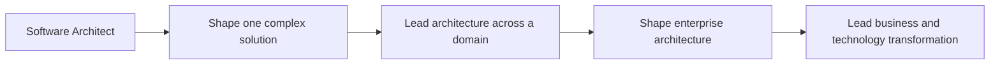

# Solutions and Enterprise Architect

> **Positioning:** A broader architecture path that connects software and technology decisions to customer needs, business capabilities, enterprise strategy, and organizational change.

## What This Path Is

A **Solutions Architect** typically shapes a solution for a customer, business problem, or major initiative. An **Enterprise Architect** works at a wider organizational scope, connecting business, information, application, and technology concerns to strategy and transformation.

Titles and boundaries vary. The common feature is that the architect must operate beyond one codebase: understanding stakeholders, constraints, business capabilities, integration, data, security, procurement, operating models, and long-term change.

## Primary Outcomes

- A feasible and valuable solution aligned with stakeholder needs
- Coherent relationships among business, data, application, and technology architecture
- Clear options, trade-offs, assumptions, and constraints
- Technology decisions that support organizational strategy
- Safe transition from current state to future state
- Alignment among customers, vendors, engineers, operations, and executives

## Capability Areas

| Capability | Architect behavior | Existing vault anchor |
|---|---|---|
| Business analysis | Understands needs, capabilities, and desired change | [[BABOK/04_Strategy_Analysis]] |
| Solution architecture | Translates needs into a feasible system and delivery approach | [[System Engineer BOK/07_System_Definition_and_Architecture]] |
| Enterprise architecture | Connects business, information, applications, and technology | [[System Engineer BOK/11_Enterprise_Systems_Engineering]] |
| Data architecture | Aligns data ownership, flow, governance, and value | [[DMBoK v2 - Overview]] |
| Security and risk | Integrates security, privacy, resilience, and compliance | [[CyBOK v1 - Overview]] |
| Roadmaps | Defines transition steps, dependencies, and investment choices | [[PMBOK v8 - Overview]] |
| Communication | Presents architecture in stakeholder-relevant views | [[02_Software_Architecture/07_Design_and_Documentation]] |

## Solutions Architect versus Enterprise Architect

| Dimension | Solutions Architect | Enterprise Architect |
|---|---|---|
| Main scope | One solution, customer, product, or initiative | Organization or enterprise landscape |
| Main question | How should this solution work? | How should the enterprise evolve? |
| Time horizon | Initiative and solution lifecycle | Multi-year strategy and transformation |
| Main stakeholders | Customer, product, engineering, delivery, operations | Executives, business units, portfolio, architecture, governance |
| Typical artifacts | Solution architecture, options, interfaces, transition plan | Capability map, target architecture, principles, transformation roadmap |

## Typical Progression

## Signals for Moving Forward

- You can connect technical design to business capability and organizational change.
- You are comfortable discussing constraints such as procurement, regulation, budget, operating model, and vendor capability.
- You can present several viable options rather than defending one preferred technology.
- You can design a transition path, not only a target state.
- You can work with people who do not share your technical vocabulary.

## Evidence to Build

- Solution architecture document
- Architecture views for different stakeholders
- Business capability map
- Current-state and target-state architecture
- Technology or application portfolio assessment
- Architecture principles
- Transition roadmap
- Vendor or platform evaluation
- Architecture governance proposal

## Nearby Paths

- [[06_Software_Architect|Software Architect]]: software system structure
- [[03_Staff_Engineer|Staff Engineer]]: cross-team technical influence
- [[04_Principal_and_Distinguished_Engineer|Principal or Distinguished Engineer]]: organization-wide technical direction
- [[14_Product_Manager|Product Manager]]: product outcomes and customer value
- [[13_Project_and_Program_Manager|Project or Program Manager]]: coordinated change delivery

## Suggested Future Note Route

1. [[SEBoK v2 - Overview]]
2. [[System Engineer BOK/07_System_Definition_and_Architecture]]
3. [[System Engineer BOK/11_Enterprise_Systems_Engineering]]
4. [[BABOK/04_Strategy_Analysis]]
5. [[BABOK/05_Requirements_Analysis_and_Design]]
6. [[DMBOK/02_Data_Architecture]]
7. [[CyBOK v1 - Overview]]
8. [[02_Software_Architecture/08_ADLs_and_Architecture_Frameworks]]

## Sources

- [The Open Group: TOGAF Standard](https://www.opengroup.org/togaf)
- [[SEBoK v2 - Overview]]
- [[DMBOK v2 - Overview]]
- [[BABOK v3 - Overview]]

## Related

- [[00_Career_Path_Overview]]
- [[06_Software_Architect]]
- [[03_Staff_Engineer]]
- [[14_Product_Manager]]
