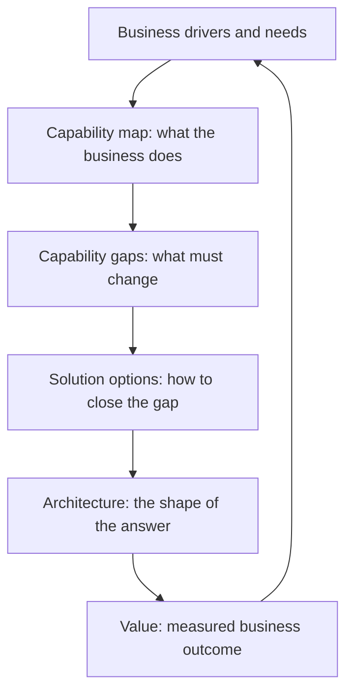

# Business Analysis and Capability Mapping

> **Core capability:** The solutions and enterprise architect understands business needs, capabilities, and desired change — connecting what the organization does (and wants to do) to the technology that enables it.

## Why This Matters

Architecture that starts from technology produces solutions looking for problems. The effective architect starts from the business: what capabilities does the organization have, what needs to change, what value does the change create, and which stakeholders define success. This is the discipline where architecture earns its seat at the strategy table — by speaking business as fluently as it speaks systems.

Business analysis at architect level is not requirements gathering — it is capability thinking: seeing the organization as a set of capabilities to be evolved, mapping how value flows through them, and identifying where technology investment moves the needle. The BABOK discipline provides the methods; the architect provides the connection to solution and enterprise design.

## Topics in This Capability Area

| Topic | Core Skill | When It Matters |
|-------|------------|-----------------|
| [[01_Business_Needs_Analysis]] | Eliciting and framing business needs and drivers | Initiative start; strategy alignment |
| [[02_Capability_Mapping]] | Building and using business capability maps | Enterprise planning; investment cases |
| [[03_Value_Stream_Analysis]] | Understanding how value flows through the business | Process improvement; transformation |
| [[04_Requirements_Architecture_Alignment]] | Bridging requirements analysis to architectural design | Solution inception; traceability |
| [[05_Stakeholder_Management_for_Architects]] | Working with sponsors, business owners, and executives | Every engagement |
| [[06_Business_Case_and_Options_Analysis]] | Framing options, benefits, and feasibility for decisions | Investment approval; option selection |
| [[07_Business_Architecture_Domain]] | The business architecture discipline: capabilities, value streams, organization | Enterprise architecture practice |

## From Business Need to Architecture

Capabilities are the bridge between business strategy and architecture.

## Practical Applications

### Business Analysis Checklist

- [ ] Business drivers and success measures are documented for the initiative
- [ ] A capability map exists covering the affected business area
- [ ] Value streams show where architecture enables or blocks value
- [ ] Solution options are framed with business benefits, not just technical trade-offs
- [ ] Stakeholders are mapped with their interests and decision roles

## Common Pitfalls

| Pitfall | Why It Is a Problem | Better Approach |
|---------|---------------------|-----------------|
| **Technology-first framing** | Solution chosen before the need is understood | Start from capabilities and value; let needs drive design |
| **Capability maps as wallpaper** | Built once, never used in decisions | Use the map in every investment and architecture discussion |
| **Requirements as the whole story** | Business context lost in functional detail | Understand drivers and value, not just features |

## Success Indicators

- Business stakeholders recognize their needs in the architecture framing
- Capability gaps are visible and addressed in roadmaps
- Investment cases cite value streams and capabilities, not technology features
- The architect is invited to business discussions, not only technical ones

## Related Capabilities

- [[02_Solution_Architecture_and_Design/00_overview|Solution Architecture and Design]]: needs become solutions here
- [[03_Enterprise_Architecture_Practice/00_overview|Enterprise Architecture Practice]]: capabilities at enterprise scope
- [[career-path/14_Product_Manager/00_overview|Product Manager]]: the product-value perspective
- [[career-path/06_Software_Architect/01_Architecture_Fundamentals/00_overview|Architecture Fundamentals (Architect)]]: the technical architecture foundation

## Summary

Business analysis and capability mapping is the architect's business fluency: understanding drivers, mapping capabilities, tracing value flows, and framing options in business terms. Architecture that starts from capabilities produces solutions the business actually needs — and an architect the business actually invites to the table.