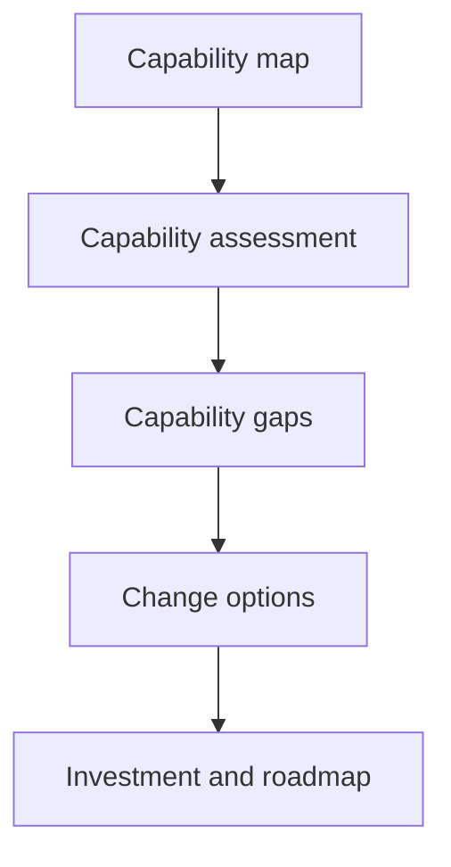

# Capability Mapping

> **Core skill:** Building and maintaining a business capability map — a structured model of what the organization does — and using it to expose gaps, prioritize investment, and anchor architecture decisions in business terms.

## Why This Matters

A capability map answers the question every executive and every architect eventually needs: what does this organization do, and how well does it do it? Unlike an organization chart, which shows who reports where, or a process model, which shows how work flows, the capability map shows what the business is able to do — independent of structure, technology, or current performance. That independence is what makes it a durable planning instrument: reorganizations come and go, but the capability to price a product or onboard a customer persists.

For the architect, the map is the bridge between strategy and design. Strategy states intent — enter a market, serve a segment, reduce risk. Capabilities state what the organization must be able to do to realize that intent. Solution architecture states how specific capabilities will be enabled or improved. Without the middle layer, technology investment is justified by features rather than by the business abilities it changes, and there is no consistent basis for prioritizing one initiative over another.

The map is also the architect's communication device with the business. Executives challenge a system diagram; they engage with a map of capabilities they own. A well-built map turns architecture conversations into business conversations, because it speaks in the language of what the organization does.

## What a Capability Is

| Concept | Definition | Example | Owned By |
|---------|------------|---------|----------|
| **Capability** | What the business is able to do, stated as a stable ability | Customer onboarding | Business capability owner |
| **Process** | How work is performed to exercise a capability | Verify identity, open account | Process owner |
| **Value stream** | The end-to-end flow of value to a stakeholder | Prospect to active customer | Value stream owner |
| **Function** | An organizational grouping of people and work | Retail operations division | Executive |
| **System** | Technology that enables capabilities and processes | Onboarding platform | Application owner |

The discipline of capability naming matters: a capability is a noun phrase describing an ability ("Fraud Detection", "Order Fulfillment"), not a verb phrase describing an activity ("Detect fraud", "Fulfill orders"). Verb phrasing collapses the map back into processes and destroys the stability that makes capability maps useful.

## Building the Capability Map

| Level | Content | Typical Count | Use |
|-------|---------|---------------|-----|
| **Level 1** | Enterprise-level capability groups | 8 to 20 | Executive communication, strategy mapping |
| **Level 2** | Capabilities under each group | 5 to 12 per group | Investment planning, gap analysis |
| **Level 3** | Sub-capabilities, only where decisions require | Selective | Solution scoping, detailed assessments |

Good maps are deliberately shallow. A map with hundreds of level-3 entries is a process inventory in disguise; it will never be maintained and will never be read by anyone who funds change. The test of the right depth is whether each entry is something someone would plausibly invest in or make a decision about.

## Assessing and Using the Map

| Assessment Dimension | Question | Signal It Produces |
|----------------------|----------|--------------------|
| **Strategic importance** | Does this capability differentiate us or keep us compliant? | Where to invest versus where to be adequate |
| **Maturity** | How developed and reliable is this capability today? | Gap size against strategic need |
| **Performance** | What do cost, speed, quality, and risk metrics show? | Operational pain visible in numbers |
| **Technology dependence** | How much does this capability rely on fragile systems? | Architectural risk hotspots |
| **Coverage gaps** | Does the capability exist at all? | New-build versus improvement decisions |

Heat-mapping the assessment across the map produces the architect's most persuasive artifact: a single page showing which capabilities matter most, which are weakest, and therefore where investment belongs.

## From Map to Action



The map earns its keep only when it is cited in decisions: initiative prioritization debates, business cases, application portfolio reviews, and roadmap sequencing all improve when they can point at capability impact. A map that lives only in the architecture repository has failed regardless of how well it was built.

## Practical Applications

### Capability Mapping Checklist

- [ ] The map covers a defined scope — enterprise, business unit, or domain — stated on the artifact
- [ ] Capabilities are named as stable noun-phrase abilities, not processes or systems
- [ ] Depth stops where decisions stop; level 3 exists only where it is used
- [ ] Each capability has a named business owner, not only a technical contact
- [ ] Assessments use consistent dimensions across the map
- [ ] The map is versioned and dated; changes are treated as decisions
- [ ] At least one live decision — investment, prioritization, or architecture — cites the map

### Capability Definition Template

```markdown
Capability: <noun-phrase ability>
Owner: <business owner>
Description: <what the business is able to do, one or two sentences>
Level: <1 — group | 2 — capability | 3 — sub-capability>
Enabling processes: <reference to process models>
Enabling systems: <applications that support it>
Assessment: <maturity, performance, strategic importance>
Gaps: <known weaknesses against strategic need>
```

## Common Pitfalls

| Pitfall | Why It Is a Problem | Better Approach |
|---------|---------------------|-----------------|
| **Capability map as wallpaper** | Built once, presented once, never used again | Tie the map to recurring decisions: investment, portfolio, roadmap |
| **Processes in disguise** | Verb-structured entries recreate a process inventory | Keep entries as noun-phrase abilities; model processes separately |
| **Mapping everything** | Exhaustive depth takes months and is never maintained | Stop at decision-relevant depth; expand only on demand |
| **No business owners** | Technically-owned capabilities have no one to invest or prioritize | Assign each capability a business owner at the outset |
| **Org-chart mirror** | Capabilities change when the organization chart changes | Keep the map independent of reporting lines and structure |

## Success Indicators

- Executives reference the map when discussing strategy, investment, or priorities
- Business cases state capability impact: which capabilities change, and how
- The map outlives reorganizations without being rebuilt from scratch
- Architecture reviews anchor scope to affected capabilities and their owners
- Capability owners can describe their assessment without consulting the architect

## Related Topics

- [[01_Business_Needs_Analysis]]: needs expressed in capability terms from the start
- [[03_Value_Stream_Analysis]]: how capabilities combine to deliver stakeholder value
- [[07_Business_Architecture_Domain]]: capability mapping within the wider business architecture discipline
- [[06_Transformation_Roadmaps_and_Portfolio/00_overview|Transformation Roadmaps and Portfolio]]: capability gaps drive roadmap sequencing
- [[03_Enterprise_Architecture_Practice/00_overview|Enterprise Architecture Practice]]: the map as an enterprise-level planning instrument

## Summary

Capability mapping models what the organization is able to do as a stable, structure-independent asset. Built to decision-relevant depth, owned by the business, and assessed on consistent dimensions, the map connects strategy to architecture: strategy defines which capabilities matter, assessment reveals which are weak, gaps justify change options, and the roadmap sequences the response. Its value is not the artifact but the decisions it cites — capability maps fail as wallpaper and succeed as the shared language where business and technology investment choices meet.
