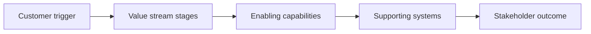

# Value Stream Analysis

> **Core skill:** Mapping how value flows through the organization to a stakeholder — the stages it passes through, the capabilities that enable each stage, and where value is created, delayed, or lost.

## Why This Matters

Capability maps show what the business can do; value streams show why it matters. A value stream is the end-to-end sequence of activity that takes a trigger — a customer application, an order, a claim — and converts it into value for a specific stakeholder. Analyzing it reveals what no org chart or system diagram can: where time disappears, where handoffs break, and where technology enables or obstructs the flow.

For the architect, value stream analysis converts vague pain into located pain. "Onboarding is too slow" becomes "six of the twelve days are spent waiting between three handoffs, two of which cross system boundaries." That precision changes everything downstream: it tells the business case where to aim, tells capability assessment which capabilities underperform, and tells solution design which integration points matter to the flow.

Value stream analysis also keeps architecture honest about the customer. Systems are justified by the stages they serve, not by their internal elegance. When the architect can show that a proposed change shortens cycle time at a bottleneck stage, the conversation moves from technical preference to business evidence.

## What a Value Stream Is

| Concept | Focus | Example | Question It Answers |
|---------|-------|---------|---------------------|
| **Value stream** | End-to-end value to a stakeholder | Prospect to active customer | How does value reach the customer? |
| **Process** | How one unit of work is performed | Identity verification procedure | How is this step done? |
| **Capability** | What the business is able to do | Customer onboarding | What ability does this require? |
| **Customer journey** | The stakeholder's experience over time | Applying, waiting, receiving | How does the customer experience it? |
| **System flow** | Data and control movement between systems | Application to core banking | How do systems interact? |

Value streams cross organizational boundaries, which is exactly why they surface problems that unit-level optimization hides. A value stream has one primary trigger, one primary stakeholder, and a measurable output worth flowing.

## Mapping the Value Stream

| Mapping Element | Description | Architect Use |
|-----------------|-------------|---------------|
| **Trigger** | The initiating event | Defines scope and start point |
| **Stages** | Major steps the value item passes through | Anchors analysis and communication |
| **Value items** | What is being transformed along the way | Clarifies handoff content |
| **Enabling capabilities** | Which capabilities each stage needs | Links flow to capability map |
| **Enabling systems** | Applications supporting each stage | Links flow to application estate |
| **Pain points** | Delays, rework, manual steps, failures | Prioritizes improvement candidates |
| **Metrics** | Lead time, process time, first-time-right, cost | Quantifies baseline and target |

A stage that adds no value — pure inspection, waiting, or re-keying — is a candidate for elimination before any technology is discussed. The architect who proposes automation for a step that should not exist has solved the wrong problem at textbook expense.

## From Value Stream to Architecture



The analysis produces a three-layer trace: each stage depends on capabilities, each capability is supported by systems, and each system either advances or delays the flow. Improvement options can then be tested against a concrete question: does this change shorten the lead time, reduce the failure rate, or lower the cost of a specific stage?

| Analysis Lens | Metric | Typical Finding |
|---------------|--------|-----------------|
| **Time** | Lead time versus process time | Most elapsed time is waiting between stages |
| **Quality** | First-time-right rate; rework loops | Failures cluster at specific handoffs |
| **Cost** | Unit cost per completed flow | Manual touchpoints dominate cost |
| **Experience** | Drop-off and complaint points | Pain concentrates at system or channel gaps |

## Practical Applications

### Value Stream Analysis Checklist

- [ ] The stream has one named trigger and one primary stakeholder
- [ ] Stages are defined at decision-relevant granularity, not as a task inventory
- [ ] Each stage is mapped to enabling capabilities and systems
- [ ] Pain points are evidenced — observed, measured, or reported with frequency
- [ ] Baseline metrics are captured before improvement is proposed
- [ ] Improvement candidates are ranked by flow impact, not by system ownership
- [ ] The map is reviewed with stage owners across organizational boundaries

### Value Stream Map Template

```markdown
Value stream: <name>
Trigger: <initiating event>
Primary stakeholder: <who receives the value>
Output: <completed value item and its acceptance criteria>

| Stage | Process time | Wait time | Capabilities | Systems | Pain points |
|-------|--------------|-----------|--------------|---------|-------------|
| ...   | ...          | ...       | ...          | ...     | ...         |

Baseline metrics: <lead time, first-time-right, cost per flow>
Improvement candidates: <ranked list with expected flow impact>
```

## Common Pitfalls

| Pitfall | Why It Is a Problem | Better Approach |
|---------|---------------------|-----------------|
| **Org-chart slicing** | Mapping stops at departmental boundaries and misses the worst delays | Follow the value item end to end, across every boundary |
| **Task-level detail** | Hundreds of micro-steps bury the flow insight | Map stages at the level where decisions and handoffs occur |
| **Metrics-free mapping** | Without baseline numbers, improvement claims cannot be proven | Capture lead time, process time, and quality before proposing change |
| **Local optimization** | One stage is sped up while the bottleneck moves downstream | Optimize the whole flow against end-to-end metrics |
| **Automation of waste** | A valueless step is digitized instead of removed | Eliminate or simplify the stage before enabling it |

## Success Indicators

- Stage owners across departments agree on the flow and its pain points
- Improvement proposals cite specific stages and measured flow impact
- Capability assessments and roadmaps are informed by value stream bottlenecks
- Lead time and first-time-right metrics are tracked after change, not only before
- Business stakeholders use the value stream language in prioritization debates

## Related Topics

- [[01_Business_Needs_Analysis]]: needs often originate as pain located in a value stream
- [[02_Capability_Mapping]]: capabilities are assessed where they enable critical streams
- [[07_Business_Architecture_Domain]]: value streams as a core business architecture technique
- [[06_Transformation_Roadmaps_and_Portfolio/00_overview|Transformation Roadmaps and Portfolio]]: stream bottlenecks sequence transformation
- [[career-path/14_Product_Manager/00_overview|Product Manager]]: the customer-value lens on the same flow

## Summary

Value stream analysis maps how value actually flows to a stakeholder — trigger, stages, capabilities, systems — and measures where time, quality, and cost are lost. It locates pain that capability maps only imply, links flow bottlenecks to the capabilities and systems that enable them, and forces improvement proposals to prove flow impact with baseline metrics. For the architect, the value stream is the evidence layer between business need and solution design: it shows which changes matter to the customer's experience of value, and it prevents technology investment from optimizing steps that should not exist at all.
