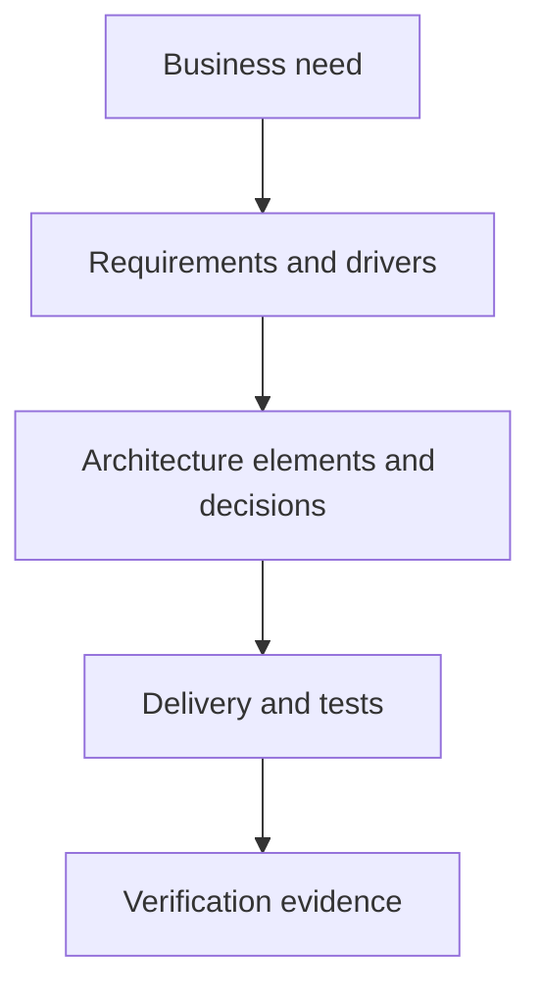

# Requirements Architecture Alignment

> **Core skill:** Bridging requirements analysis and architectural design — turning elicited requirements into architectural drivers, and keeping needs, requirements, design elements, and verification traceable to one another.

## Why This Matters

Requirements analysis and architecture design are usually performed by different people with different vocabularies, and the seam between them is where projects quietly break. Requirements arrive as a prioritized list of features and rules; architecture needs quality attributes, constraints, interfaces, and decisions. When no one bridges that gap, two failures follow: requirements that have no architectural home are deferred or dropped, and architectural decisions are made with no traceable justification and cannot be defended when challenged.

The solutions architect owns the bridge. Converting requirements into architectural drivers means asking, for each requirement, what it demands of the system: which components it touches, which quality attribute it stresses, which constraint it implies, and which part of the design answers it. The architect does not rewrite requirements — the architect reveals their architectural consequences while there is still time to negotiate them.

Traceability is the mechanism that keeps the bridge standing. A chain from business need to requirement to architectural element to test means every design element can answer "why do you exist?" and every requirement can answer "where are you built?" When scope changes, the chain shows the blast radius. When reviews happen, the chain is the evidence. Without it, alignment decays silently until acceptance testing reveals that the design and the requirements were never speaking.

## What Each Side Produces

| Artifact | Requirements Analysis Produces | Architecture Needs to Add |
|----------|-------------------------------|---------------------------|
| **Needs** | Validated business need and success measures | Capability and system impact of the need |
| **Functional requirements** | Features, rules, data expectations | Component responsibility and interaction implications |
| **Quality attributes** | Desired levels, often vaguely stated | Measurable scenarios and design tactics |
| **Constraints** | Budget, schedule, policy, regulation | Design consequences and affected decisions |
| **Priorities** | Business ranking of value | Technical dependencies and delivery sequencing |

The translation is bidirectional: architects also feed requirements back, surfacing quality scenarios, technical constraints, and interface obligations that stakeholders must acknowledge before design proceeds.

## From Requirement to Architectural Driver

| Architectural Driver Type | Source in Requirements | How It Shapes Design |
|---------------------------|------------------------|----------------------|
| **Quality attribute scenario** | Performance, availability, security expectations | Selects tactics, patterns, and technology classes |
| **Hard constraint** | Regulation, licensing, data residency, mandate | Eliminates options; defines non-negotiables |
| **Integration obligation** | Required interfaces with existing systems | Drives interface design and interaction patterns |
| **Data obligation** | Ownership, retention, reporting demands | Drives data architecture decisions |
| **Scale and volatility** | Volume forecasts, growth, change frequency | Drives elasticity, modularity, and platform choices |

A requirement that cannot be traced to any driver is either an implementation detail — route it to the delivery team — or an orphan that will be discovered late. Both findings are valuable; the point is to find them before build, not after.

## The Traceability Chain



| Link | Forward Question | Backward Question |
|------|------------------|-------------------|
| **Need to requirement** | Which requirements express this need? | Which need justifies this requirement? |
| **Requirement to design** | Which elements realize this requirement? | Which requirement does this element serve? |
| **Design to delivery** | Which work items implement this element? | Which design decision does this change touch? |
| **Delivery to verification** | Which test proves this requirement is met? | Which requirement does this evidence cover? |

Traceability fails when it becomes paperwork. The practical test is whether the chain can answer a real question quickly: a scope change arrives — within an hour, the team can name the affected requirements, designs, and tests.

## Managing Requirements Change

| Change Type | Architecture Question | Typical Response |
|-------------|----------------------|------------------|
| **New requirement** | Which driver does it serve, and what does it stress? | Assess architectural impact before acceptance |
| **Changed quality target** | Which tactics and elements are affected? | Re-evaluate the quality scenario; adjust design |
| **Deprioritized requirement** | Which design elements lose their justification? | Simplify; avoid building for requirements that no longer exist |
| **Constraint change** | Which options reopen or close? | Revisit eliminated options against the new constraint |

## Practical Applications

### Requirements Alignment Checklist

- [ ] Every requirement maps to at least one architectural driver or is explicitly delegated to delivery
- [ ] Quality attributes are expressed as measurable scenarios, not adjectives
- [ ] The traceability chain runs from need to verification and can be queried quickly
- [ ] Constraints are recorded with their design consequences, not just their text
- [ ] Changes to requirements trigger an architectural impact assessment before commitment
- [ ] Design decisions cite the requirements and drivers they serve

### Requirements to Architecture Trace Template

```markdown
| Requirement ID | Source need | Driver type | Architectural elements | Decision ref | Verification |
|----------------|-------------|-------------|------------------------|--------------|--------------|
| REQ-001        | NEED-01     | Quality     | Component, interface   | ADR-004      | TEST-012     |
```

## Common Pitfalls

| Pitfall | Why It Is a Problem | Better Approach |
|---------|---------------------|-----------------|
| **Feature list as complete input** | Quality attributes and constraints are never surfaced in time | Convert requirements to drivers before designing |
| **Architecture by assertion** | Design decisions with no requirement lineage cannot be defended | Require each significant decision to cite its drivers |
| **Vague quality attributes** | Adjectives cannot be designed for or verified | Specify measurable scenarios with stimulus and response |
| **Traceability as paperwork** | Heavy, unused matrices decay; the chain must work, not impress | Keep it queryable and small; test it with real change requests |
| **Deferred requirement conflict** | Contradictions surface during build, when change is expensive | Reconcile conflicts during alignment, before build commitment |

## Success Indicators

- Change requests can be impact-assessed through the chain within hours
- Design reviews point at requirements and drivers, not at opinions
- Quality attributes are tested as scenarios, and the tests trace back to them
- Few requirements are discovered missing during build or acceptance
- Delivery teams can explain why each major element exists in requirement terms

## Related Topics

- [[01_Business_Needs_Analysis]]: the validated need that anchors the traceability chain
- [[06_Business_Case_and_Options_Analysis]]: options judged against requirement drivers
- [[career-path/06_Software_Architect/01_Architecture_Fundamentals/00_overview|Architecture Fundamentals (Architect)]]: architectural drivers and quality attributes in depth
- [[career-path/14_Product_Manager/00_overview|Product Manager]]: requirements priorities as product value decisions
- [[career-path/12_Technical_Program_Manager/00_overview|Technical Program Manager]]: cross-team dependency tracking through the chain

## Summary

Requirements architecture alignment is the bridge discipline: converting requirements into architectural drivers, translating quality attributes into measurable scenarios, and maintaining a traceability chain from need through design to verification. The architect's contribution is not rewriting requirements but exposing their architectural consequences early, while negotiation is still cheap. A working chain makes impact analysis routine, gives design decisions defensible lineage, and prevents the late discovery that the system built and the requirements spoken were never aligned.
