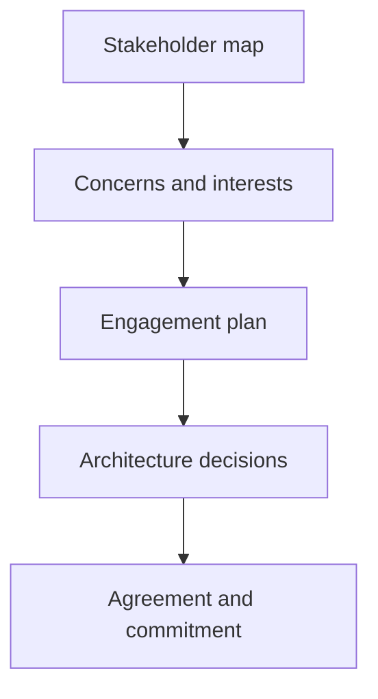

# Stakeholder Management for Architects

> **Core skill:** Working deliberately with sponsors, business owners, delivery teams, and executives — mapping their interests, influence, and decision roles so the architecture serves real needs and survives real politics.

## Why This Matters

Architecture is a social artifact as much as a technical one. A design that is technically sound but owned by no one, funded by no one, and trusted by no one will not be built. Stakeholder management for architects is the discipline of knowing who matters, what each party needs from the architecture, and what the architecture needs from each party — then designing the engagement so both are satisfied.

Architects operate without line authority over most of the people whose cooperation they need. The delivery team is not their team; the vendor is not their employee; the business sponsor is not their subordinate. Influence is built from credibility, evidence, and relationships — and it is spent when decisions are contested. An architect who has not invested in stakeholder relationships discovers the deficit precisely when the difficult trade-off needs to be defended.

This discipline is also the architect's early-warning system. Stakeholders reveal intent through their concerns: a security officer's persistent questions about the perimeter, a finance owner's fixation on run costs, a regional head's anxiety about local workarounds. Managed well, these signals shape the architecture before they become objections. Managed poorly, they become review failures at the worst possible moment.

## Stakeholder Mapping

| Dimension | Question | Use |
|-----------|----------|-----|
| **Influence** | How much can this stakeholder affect the outcome? | Prioritize engagement effort |
| **Interest** | How much does the outcome matter to them? | Tailor frequency and depth of involvement |
| **Decision role** | Do they decide, approve, consult, or inform? | Clarify who must agree to what |
| **Concerns** | What do they fear or value? | Anticipate objections; design evidence |
| **Stance** | Supporter, neutral, skeptic, or blocker? | Plan conversion or containment strategies |

The classic influence-interest grid remains useful as a conversation starter, but architects need the harder detail: a named decision role for each stakeholder and a specific concern list per person. "Engage regularly" is not a plan; "the CFO must approve run-cost assumptions before option selection" is.

## The Architect's Stakeholder Set

| Stakeholder | Cares About | How to Engage | Common Friction |
|-------------|-------------|---------------|-----------------|
| **Executive sponsor** | Value, risk, cost, schedule | Outcome language; options with trade-offs | Architects who present technology, not decisions |
| **Business capability owner** | The process being changed and their people | Value stream evidence; involvement in design | Change imposed without consultation |
| **Delivery lead and team** | Clarity, feasibility, scope stability | Early feasibility input; decisions answered fast | Architecture seen as constraint without context |
| **Vendor or partner** | Contract scope, interfaces, margins | Requirement-led conversations; clear acceptance | Design drift toward vendor convenience |
| **Security and risk** | Exposure, compliance, control evidence | Include early; treat as co-designers | Late review treated as a gate to sneak past |
| **Operations** | Runnability, support load, transition quality | Operations reviews before build completes | Design accepted without operability assessment |

Each stakeholder relationship has a currency: executives and business owners trade in outcomes; delivery trades in clarity; security trades in evidence; operations trades in stability. The architect who speaks the wrong currency is heard but not trusted.

## Engagement Planning

| Engagement Rail | Cadence | Purpose |
|-----------------|---------|---------|
| **Sponsor updates** | Monthly or at gates | Confirm value case, surface risks, take decisions |
| **Capability owner sessions** | Fortnightly during design | Validate impact and detail of change |
| **Delivery coordination** | Weekly during build | Answer decisions; keep design intent intact |
| **Risk and security reviews** | At design gates | Evidence-based assurance, not late inspection |
| **Operations readiness** | At design and pre-transition | Operability as a design property |



The engagement plan is a living artifact: stakeholders move between quadrants, stances shift after decisions, and new parties appear at gates. Review the map whenever a major decision is taken.

## Managing Conflict and Trade-Offs

| Conflict Pattern | Facilitation Response |
|------------------|-----------------------|
| Two functions want contradictory optimizations | Frame as a trade-off with explicit criteria and a decision owner |
| Sponsor and delivery disagree on scope | Return to the need statement and gates; agree what is deferred |
| Security and delivery clash on controls | Joint working session on risk acceptance and compensating controls |
| Vendor resists interface requirements | Anchor in contractual requirements; escalate through the sponsor |
| Unresolved cross-team dependencies | Escalate with options, not complaints; name the decision needed |

The architect's stance in conflict is process-neutral and outcome-anchored: keep the criteria visible, keep the decision owner named, and never let the debate become architect versus anyone.

## Practical Applications

### Stakeholder Management Checklist

- [ ] Stakeholders are mapped with influence, interest, stance, and decision role
- [ ] Each stakeholder's concerns are documented specifically, not generically
- [ ] An engagement cadence exists and is honored, not improvised
- [ ] Decision rights for architecture questions are explicit and accepted
- [ ] Objections are anticipated with prepared evidence
- [ ] Sponsor is used for escalation with options, not for refereeing disputes
- [ ] The map is reviewed when major decisions or scope changes occur

### Stakeholder Engagement Template

```markdown
Stakeholder: <name, role>
Influence and interest: <high or low each>
Stance: <supporter | neutral | skeptic | blocker>
Concerns: <specific list>
Decision role: <decides | approves | consulted | informed>
Engagement plan: <cadence, format, language>
Current issue: <open concern and planned response>
```

## Common Pitfalls

| Pitfall | Why It Is a Problem | Better Approach |
|---------|---------------------|-----------------|
| **Engaging only the sponsor** | The change fails at the layer that must absorb it | Map and engage capability owners and operations too |
| **Architect as adversary** | Being seen as the blocker destroys influence for real trade-offs | Present options with criteria; let decision owners decide |
| **Generic concern lists** | "Wants alignment" is not a concern; no evidence can address it | Document specific fears and values per stakeholder |
| **Escalation as complaint** | Sponsors lose patience with problems brought without options | Escalate with framed options and a named decision |
| **Set-and-forget map** | Stances and players change; a stale map misdirects effort | Refresh the map at gates and after contested decisions |

## Success Indicators

- Contested decisions are resolved by the named decision owner with architect evidence
- Delivery and security teams are engaged before reviews, not during them
- Stakeholders describe the architecture accurately in their own language
- Escalations arrive with options and recommendations, not just risks
- New stakeholders are added to the map within days of appearing

## Related Topics

- [[01_Business_Needs_Analysis]]: sponsor and owner alignment anchored in the validated need
- [[06_Business_Case_and_Options_Analysis]]: stakeholders as decision-makers on options
- [[07_Architecture_Communication/00_overview|Architecture Communication]]: the communication craft this discipline depends on
- [[career-path/13_Project_and_Program_Manager/00_overview|Project and Program Manager]]: the delivery-side stakeholder discipline
- [[career-path/03_Staff_Engineer/02_Cross_Team_Technical_Leadership/00_overview|Cross-Team Technical Leadership (Staff)]]: influence without authority in a wider setting

## Summary

Stakeholder management for architects is influence without authority made deliberate: map who matters, understand what each party fears and values, name who decides what, and design engagement that gives every party what it needs from the architecture while getting what the architecture needs from them. It is the discipline that converts a technically sound design into a funded, built, and trusted one — and the early-warning system that turns objections into design inputs before they become review failures.
