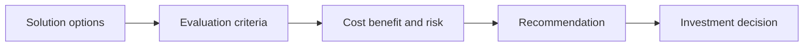

# Business Case and Options Analysis

> **Core skill:** Framing solution options with honest costs, benefits, risks, and feasibility — then building the business case that gives decision-makers a defensible basis for investing.

## Why This Matters

Every architecture recommendation is, in the end, an investment recommendation. The business case and options analysis is where the architect's technical thinking is converted into the currency executives actually spend: value, cost, risk, and time. An architect who cannot construct that conversion — who can only argue that one design is more elegant than another — is negotiating in a currency the decision table does not accept.

Options analysis is the discipline that protects the decision. A single recommendation, however good, was never tested against alternatives, and the organization cannot know what it gave up. Two or three genuine options, each internally coherent, each with its real costs and risks exposed, let the business choose with open eyes. The option that loses may still shape the winner — a deferred phase, a contingency design — which is why even rejected options earn their analysis cost.

The business case also disciplines the architect's own enthusiasm. Sizing implementation cost, run cost, transition effort, and adoption risk forces confrontation with realities that pure design work avoids: the legacy system that must be retired, the training that must happen, the operating model that must change. Vision survives contact with a well-built business case only if it deserves to.

## Framing the Options

| Option Archetype | Description | Typical Use |
|------------------|-------------|-------------|
| **Do nothing or minimal** | Continue current state with only mandatory change | Baseline; sometimes the honest answer |
| **Incremental improvement** | Fix and extend the existing estate | Lower risk; slower to strategic value |
| **Re-platform or replace** | Move capability to a new solution or platform | When current platform blocks the strategy |
| **Buy or configure** | Adopt vendor product, configured to need | Speed; depends on fit and lock-in tolerance |
| **Build** | Custom development of differentiating capability | Control; requires sustained capability |
| **Partner or outsource** | Deliver through a service provider | Scale and speed; governance demand |

Real options differ on more than technology: they differ on cost structure, risk profile, time to value, dependence on vendors, and organizational appetite. An options set where one option is plainly superior usually means the weaker options were strawmen — and decision-makers eventually notice.

## Comparing Options

| Evaluation Criterion | Question | Evidence to Bring |
|----------------------|----------|-------------------|
| **Strategic fit** | Does the option advance the capabilities that matter? | Capability map and strategy mapping |
| **Benefits** | What outcomes improve, by how much, by when? | Value stream metrics; benefit estimates as ranges |
| **Implementation cost** | What does it take to deliver, including transition? | Estimates with stated confidence and assumptions |
| **Run cost** | What does it cost to operate year over year? | Operating model and licensing analysis |
| **Risk** | What could fail, and what is the exposure? | Risk register; sensitivity analysis |
| **Time to value** | When does the first measurable benefit arrive? | Delivery sequencing and dependency analysis |
| **Feasibility** | Can the organization actually deliver and absorb it? | Skills, capacity, vendor, regulatory checks |
| **Exit and lock-in** | What does it cost to change direction later? | Contract terms; portability assessment |

Scoring models can help structure comparison but must never replace judgment — a weighted score that hides assumptions behind arithmetic is worse than a table of explicit trade-offs. Show the criteria, the evidence, and the uncertainties; let the decision owner weigh them.

## The Business Case



| Business Case Section | Content |
|-----------------------|---------|
| **Executive summary** | The need, the recommendation, the ask |
| **Strategic context** | Drivers and capability impact |
| **Options considered** | The option set with comparative analysis |
| **Costs** | Implementation, transition, and run cost with assumptions |
| **Benefits** | Quantified where possible; qualified where not; ranges and confidence |
| **Risk and sensitivity** | Key risks, mitigations, and what changes the conclusion |
| **Delivery approach** | Phasing, dependencies, and critical assumptions |
| **Recommendation** | Chosen option, rationale, and conditions of approval |

The honest business case states what would falsify its own recommendation. If the volumes assumption fails, if the vendor does not hold price, if the integration proves harder than modeled — the sensitivity section says so in advance, which is precisely what makes the rest credible.

## Practical Applications

### Business Case Checklist

- [ ] At least two viable options are analyzed, plus the do-nothing baseline
- [ ] Each option is coherent — buildable, fundable, and describable end to end
- [ ] Costs cover implementation, transition, operations, and decommissioning
- [ ] Benefits are traced to the need and expressed as ranges with confidence
- [ ] Risks and sensitivities are explicit, including what would change the recommendation
- [ ] Feasibility rests on evidence — skills, vendor, regulatory, capacity — not optimism
- [ ] The recommendation names the conditions under which it remains valid

### Option Comparison Template

```markdown
| Criterion              | Option A | Option B | Option C |
|------------------------|----------|----------|----------|
| Strategic fit          |          |          |          |
| Benefits range         |          |          |          |
| Implementation cost    |          |          |          |
| Run cost               |          |          |          |
| Key risks              |          |          |          |
| Time to first value    |          |          |          |
| Exit and lock-in       |          |          |          |

Recommendation: <option, rationale>
Conditions of approval: <conditions>
What would change the recommendation: <sensitivities>
```

## Common Pitfalls

| Pitfall | Why It Is a Problem | Better Approach |
|---------|---------------------|-----------------|
| **Single-option case** | No comparison means no evidence the choice is the best available | Develop and analyze genuine alternatives |
| **Strawman alternatives** | Fake options insult decision-makers and corrupt the process | Make every option one a reasonable party would defend |
| **Optimistic benefits** | Unrealized benefits destroy credibility and future funding | Use ranges with confidence; tie benefits to measurements |
| **Run costs forgotten** | Cheap to build, expensive to own; TCO surprises arrive later | Include operations, licensing, and support from day one |
| **Hidden assumptions** | A recommendation without stated assumptions cannot be re-examined | Publish assumptions and sensitivities with the case |

## Success Indicators

- Decision-makers engage with the trade-offs rather than asking for one more analysis
- Approved cases carry explicit conditions and assumptions into delivery
- Post-investment reviews can compare actuals against the case because baselines exist
- Rejected options are reused in later decisions instead of being rebuilt
- The architect is asked to shape funding conversations, not only respond to them

## Related Topics

- [[01_Business_Needs_Analysis]]: the need and measures every case must serve
- [[02_Capability_Mapping]]: capability impact as the strategic-fit evidence
- [[04_Requirements_Architecture_Alignment]]: requirements that bound what options must deliver
- [[06_Transformation_Roadmaps_and_Portfolio/00_overview|Transformation Roadmaps and Portfolio]]: how funded initiatives enter the portfolio
- [[career-path/13_Project_and_Program_Manager/00_overview|Project and Program Manager]]: the delivery-side discipline that turns cases into plans

## Summary

Business case and options analysis converts architecture into an investment decision the business can make with evidence. The architect frames several genuine, internally coherent options — do nothing included — and compares them on strategic fit, benefits, costs, risk, time to value, feasibility, and exit. The business case then states the recommendation with its costs, benefits as ranges, sensitivities, and conditions of approval, and it publishes the assumptions that would falsify it. Done honestly, it earns credibility for the funding it requests and for the next request after that.
