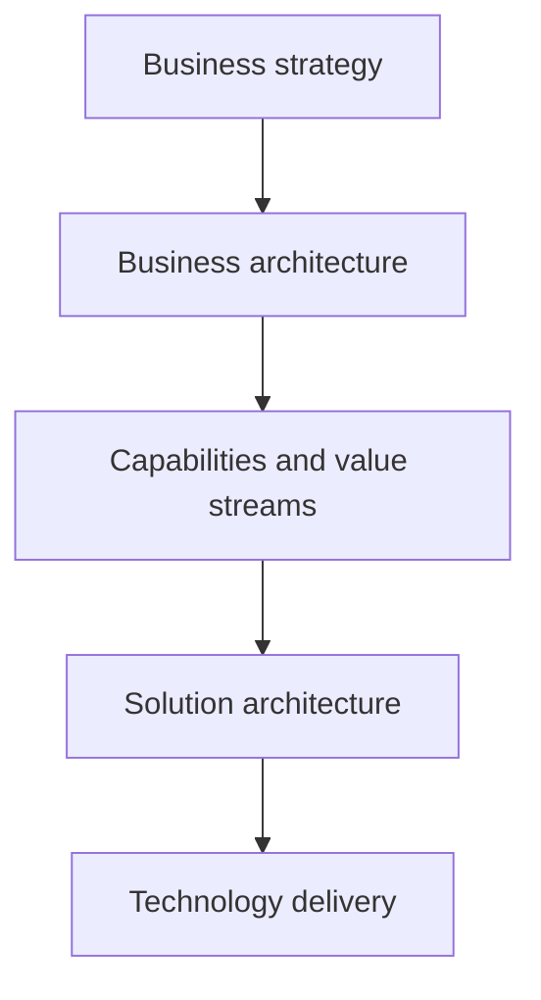

# Business Architecture Domain

> **Core skill:** Operating in the business architecture domain — capabilities, value streams, organization, and business information — as the discipline that connects strategy to execution and supplies the enterprise architect's business foundation.

## Why This Matters

Enterprise architecture is usually described as four domains: business, data, application, and technology. The business domain is first because everything else exists to serve it — and the domain most often skipped because it feels like someone else's job. Business architects, business analysts, and strategy teams all touch it; without a coherent discipline, the result is a pile of process models, org charts, and strategy slides that never compose into an architecture. The domain exists to make that composition systematic.

For the solutions architect, business architecture literacy is the difference between designing for a stated requirement and designing for the business that will live with the result. Capabilities frame what the solution must enable; value streams frame what the solution must accelerate; the business information view frames what the solution must own or exchange; the organizational view frames who must adopt it. Each frame catches a class of design error that no requirements document reliably captures.

At enterprise scope, the domain becomes the profession's connective tissue. Strategy documents say where the organization is going; capability and value stream models say what must change to get there; roadmaps sequence the change; solution architecture delivers it in increments. The business architecture domain is the layer where intent becomes structured, and the architect who can work in it fluently is employable at the widest range of altitudes.

## The Content of Business Architecture

| Business Architecture Element | Structure | Answers |
|-------------------------------|-----------|---------|
| **Capabilities** | Hierarchical map of abilities | What can the organization do? |
| **Value streams** | Stage models of end-to-end value delivery | How does value reach stakeholders? |
| **Organization** | Units, roles, and their relationships | Who performs and decides? |
| **Business information** | Conceptual entities and ownership | What does the business know about? |
| **Business processes** | Detailed workflows for key operations | How is work performed step by step? |
| **Strategy and policy** | Goals, objectives, constraints, mandates | What direction and rules apply? |

The elements interlock deliberately: a value stream stage is enabled by capabilities; a capability is performed by organizational units; its work consumes and produces business information; processes detail how. A business architecture that maintains these links stays navigable; one that stores elements in isolation is a filing cabinet.

## Business Architecture Techniques

| Technique | Purpose | Primary Output |
|-----------|---------|----------------|
| **Capability mapping** | Stable view of what the business does | Capability map with assessments |
| **Value stream mapping** | Locating value creation and friction | Streams with stages and metrics |
| **Business model canvas** | Articulating how value is created and captured | One-page model for alignment |
| **Conceptual information modeling** | Naming what the business knows | Entity and relationship model |
| **Organizational mapping** | Understanding who does and decides what | Structure and governance views |
| **Process modeling** | Specifying how key work happens | Detailed process models |

Technique selection follows the decision at hand. Enterprise planning leans on capabilities and streams; a regulatory initiative leans on process and information; an operating-model change leans on organization and capabilities. The senior skill is choosing the smallest set of techniques that answers the current decision.

## Relationship to the Other Domains

| Domain | Owns | Business Architecture Interface |
|--------|------|--------------------------------|
| **Business** | Capabilities, streams, organization, business information | Defines what all other domains must support |
| **Data** | Logical and physical data, governance, flow | Receives business information model and ownership rules |
| **Application** | Application services, components, integration | Receives capability and process requirements |
| **Technology** | Infrastructure, platforms, standards | Receives service levels and constraints |

## From Strategy to Delivery



The chain must survive contact with reality at every link: strategy that cannot name the capabilities it needs is a slogan; capabilities with no owner are aspirations; solutions that do not cite capability impact are features in search of funding. The business architecture domain is what keeps the chain connected — and keeps every downstream decision answerable to the strategy it serves.

## The Practice Around the Domain

| Practice Concern | Question | Mature Behavior |
|------------------|----------|-----------------|
| **Engagement model** | How do business architects work with strategy, delivery, and EA? | Named touchpoints and handoffs, not ad hoc requests |
| **Repository discipline** | Where do models live, and who maintains them? | Versioned, owned, findable artifacts |
| **Reuse** | Are models reused across initiatives? | Common capability and stream models as reference |
| **Governance** | Who approves changes to the business architecture? | Explicit change process with owners |
| **Value evidence** | How does the practice prove its worth? | Decisions and initiatives cite its models |

## Practical Applications

### Business Architecture Checklist

- [ ] Capabilities, value streams, and business information models exist and link to each other
- [ ] Each element has a business owner, not only an architecture custodian
- [ ] Models are maintained against real decisions — planning, investment, design
- [ ] The business information model is agreed with the data architecture function
- [ ] Strategy documents reference capabilities; capability models reference strategy goals
- [ ] Initiatives cite business architecture impact in their charters and cases
- [ ] The practice has an engagement model with delivery, not just an artifact library

### Domain Snapshot Template

```markdown
Scope: <enterprise | business unit | domain>
Capabilities: <map reference and owner list>
Value streams: <stream list with primary stakeholders>
Organization: <structure view reference>
Business information: <concept model reference and owners>
Strategy linkage: <goals and objectives served>
Open issues: <gaps, conflicts, decisions needed>
```

## Common Pitfalls

| Pitfall | Why It Is a Problem | Better Approach |
|---------|---------------------|-----------------|
| **Domain as documentation** | Models pile up but never enter a decision | Maintain only what decisions consume; cite models in cases and charters |
| **Isolated elements** | Capability, process, and information models that do not interlock cannot compose | Maintain the links between elements as first-class content |
| **Strategy detachment** | A business architecture not linked to current goals ages into irrelevance | Anchor every element to the strategy it serves; refresh on strategy change |
| **Ownership vacuum** | Architect-custodied models with no business owner have no authority | Business ownership for every capability, stream, and concept |
| **Technique sprawl** | Modeling everything in every notation burns goodwill and time | Choose the smallest technique set for the decision at hand |

## Success Indicators

- Strategy reviews request capability and stream views as standard input
- Solutions can cite capability impact and stream effect in their charters
- Data concepts trace to business information ownership without reinterpretation
- Business owners use the models in their own planning conversations
- The domain's models survive leadership change because owners, not individuals, hold them

## Related Topics

- [[02_Capability_Mapping]]: the core modeling technique of the domain
- [[03_Value_Stream_Analysis]]: the flow view the domain is built around
- [[01_Business_Needs_Analysis]]: needs framed against the domain's structures
- [[03_Enterprise_Architecture_Practice/00_overview|Enterprise Architecture Practice]]: how the domain operates inside EA
- [[04_Enterprise_Data_Architecture/00_overview|Enterprise Data Architecture]]: the receiving domain for business information

## Summary

The business architecture domain — capabilities, value streams, organization, business information, processes, and strategy — is the structured layer between strategic intent and technical execution. Its techniques compose into a navigable whole only when the links between elements are maintained and owned, and it proves its value only by being cited in real decisions. For the solutions architect it provides the frames that catch design errors no requirements document captures; for the enterprise architect it is the foundation on which every other domain rests. Business architecture done well is invisible — it is simply the way the organization understands itself before it changes.
