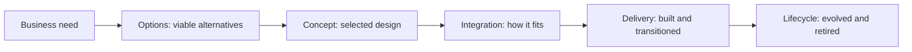

# Solution Architecture and Design

> **Core capability:** The solutions architect translates business needs into a feasible solution — options, concept, integration approach, and assurance — that delivery teams can build and operations can run.

## Why This Matters

A solution architecture is the bridge between a business need and a working system. It defines the solution's shape: what components exist, how they integrate, what constraints apply (procurement, budget, regulation, legacy), and how the solution will be delivered and sustained. Unlike pure software architecture, the solutions architect works in a world of vendors, mixed estates, commercial constraints, and non-technical stakeholders.

The defining discipline is options thinking: presenting viable alternatives with honest trade-offs rather than defending a preferred technology. The solutions architect who arrives with one option has already failed the business — the option might be right, but it was never tested.

## Topics in This Capability Area

| Topic | Core Skill | When It Matters |
|-------|------------|-----------------|
| [[01_Solution_Architecture_Process]] | Running the solution design process end to end | Initiative start |
| [[02_Solution_Options_and_Concept_Design]] | Framing options and selecting the concept design | Before commitment |
| [[03_Solution_Integration_Design]] | Designing how components and systems integrate | Cross-system solutions |
| [[04_Solution_Feasibility_and_Constraints]] | Testing feasibility: technical, commercial, organizational | Option selection |
| [[05_Solution_Delivery_Partnership]] | Partnering with delivery teams, PMs, and vendors | Throughout delivery |
| [[06_Solution_Assurance_and_Review]] | Reviewing solutions for compliance and quality | Design authority; milestones |
| [[07_Solution_Lifecycle_and_Evolution]] | Managing the solution across its life and retirement | Beyond go-live |

## The Solution Design Flow

Each stage gates the next — options before concept, concept before commitment.

## Practical Applications

### Solution Architecture Checklist

- [ ] Business need and success criteria are agreed before design starts
- [ ] At least two viable options are developed and compared
- [ ] Integration points, constraints, and dependencies are documented
- [ ] The solution fits the enterprise standards or has a justified exception
- [ ] Delivery and operations teams validate feasibility before commitment
- [ ] The solution's lifecycle and evolution path are considered

## Common Pitfalls

| Pitfall | Why It Is a Problem | Better Approach |
|---------|---------------------|-----------------|
| **Single-option advocacy** | No genuine trade-off analysis; business locked in | Present options with honest trade-offs |
| **Ignoring the estate** | Solution works alone; fails in the enterprise context | Design against the real integration landscape |
| **Design-for-go-live-only** | Operations burden discovered after launch | Lifecycle thinking from the start |

## Success Indicators

- Options are presented and decisions made on business criteria
- Delivery teams find the solution architecture useful — not shelfware
- Integration surprises are rare; the design accounted for the estate
- Solutions transition to operations without architecture rework

## Related Capabilities

- [[01_Business_Analysis_and_Capability_Mapping/00_overview|Business Analysis and Capability Mapping]]: needs that drive the solution
- [[03_Enterprise_Architecture_Practice/00_overview|Enterprise Architecture Practice]]: standards the solution must respect
- [[career-path/06_Software_Architect/00_overview|Software Architect]]: the technical architecture depth
- [[career-path/13_Project_and_Program_Manager/00_overview|Project and Program Manager]]: the delivery partner

## Summary

Solution architecture translates needs into feasible solutions: options before commitment, concept design with honest trade-offs, integration against the real estate, and lifecycle thinking beyond go-live. The solutions architect's credibility is built on the options they present — and the ones the business is glad they saw.