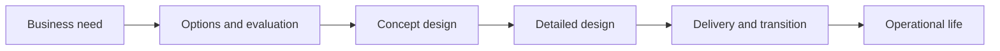

# Solution Architecture Process

> **Core skill:** Running the solution architecture process end to end — from business need and requirements through options, concept, design, delivery support, and handover — with clear inputs, outputs, and gate decisions.

## Why This Matters

Solution architecture is not a document; it is a process with a beginning, middle, and end. It begins when a business need is framed, moves through options and concept when commitments are still cheap to change, settles into detailed design when the direction is approved, and continues through delivery and transition until the solution runs. Architects who treat it as an event — a document produced once, then abandoned — leave the two most valuable phases, delivery support and handover, to improvisation.

The process exists to control a specific risk: the cost of changing your mind rises steeply as delivery proceeds. Every gate the process installs — options before concept, concept before commitment, design before build — is placed where options are still viable and decisions are still cheap. Skipping gates does not accelerate delivery; it moves the correction cost from the whiteboard to production.

It also defines the architect's interfaces. Each stage consumes defined inputs and produces defined outputs for specific consumers: the business case consumes options; the delivery team consumes the design; operations consumes the handover. An architect whose outputs have no clearly identified consumer is producing shelfware, and the process tells you which artifact is missing when a downstream party is improvising.

## Process Stages

| Stage | Purpose | Key Outputs | Gate Decision |
|-------|---------|-------------|---------------|
| **Need and requirements** | Understand the business need and architectural drivers | Need statement, driver list, quality scenarios | Proceed to options |
| **Options and concept** | Develop alternatives; shape the selected direction | Option analysis, concept design, decisions | Concept approved |
| **Detailed design** | Specify components, interfaces, and data | Solution design, interface specs, decision records | Design baselined |
| **Delivery support** | Keep design intent alive during build | Answered decisions, change assessments | Build progressing to plan |
| **Transition and handover** | Move to operations with the solution understood | Handover pack, runbook inputs, accepted risks | Operational acceptance |

The gates can be formal or lightweight, but each must have a named decision owner and recorded outcome. A gate that does not decide is a meeting.

## Inputs and Outputs by Stage

| Stage | Consumes | Produces | Primary Consumer |
|-------|----------|----------|------------------|
| **Need** | Business drivers, capability context, constraints | Framed need, architectural drivers | Sponsor and business case |
| **Options** | Drivers, evaluation criteria, constraint set | Option analysis, recommendation | Decision owner |
| **Concept** | Approved option, architecture principles | Concept design, key decisions | Delivery planning |
| **Detailed design** | Concept, requirements, interfaces | Design specifications, decision records | Delivery teams |
| **Delivery support** | Design intent, change requests | Impact assessments, decision responses | Delivery and PM |
| **Transition** | Built solution, operational requirements | Handover pack, operational obligations | Operations |

## The Design Flow



## The Architect in Different Delivery Contexts

| Context | Architect Role | Emphasis |
|---------|----------------|----------|
| **Stage-gate delivery** | Design authority at each gate; detailed upfront design | Completeness and sign-off discipline |
| **Agile or iterative** | Continuous architect within or alongside teams | Design runway, emergent decisions, just-enough documentation |
| **COTS or platform implementation** | Fit analysis and configuration governance | Requirement fit, vendor management, limit of customization |
| **Customer or bid context** | Shaping the offered solution within commercial terms | Feasibility, costing, delimited scope |
| **Hybrid estates** | Constant integration negotiation across ages of system | Interface contracts, transition sequencing |

The process is stable across contexts; the ceremony flexes. In agile delivery the gates become decisions at sprint boundaries; in stage-gate they become formal reviews. What never flexes is the existence of the decision: options were considered, concept was approved, design was baselined, handover was accepted.

## Roles Around the Solution Architect

| Role | Focus | Boundary With Solution Architect |
|------|-------|----------------------------------|
| **Enterprise architect** | Portfolio, standards, target landscape | Sets constraints; reviews conformance |
| **Technical architect** | Deep technical design within a domain | Elaborates within solution architecture |
| **Business analyst** | Requirements elicitation and detail | Supplies requirements; consumes architectural drivers |
| **Delivery or project manager** | Plan, cost, schedule, risk | Consumes design; supplies delivery reality |
| **Solution owner or product lead** | Ongoing value and operation | Accepts handover; owns evolution |

## Practical Applications

### Solution Architecture Process Checklist

- [ ] The triggering need is framed and validated before design work begins
- [ ] Each stage names its inputs, outputs, and decision owner
- [ ] Options are analyzed before a concept is committed
- [ ] Design decisions are recorded with their drivers and consequences
- [ ] Delivery receives design support as changes arise, not only at baseline
- [ ] Operational handover is planned from the start, not improvised at go-live
- [ ] The process is adapted to the delivery context without dropping its core gates

### Architecture Engagement Plan Template

```markdown
Initiative: <name>
Current stage: <need | options | concept | design | delivery | transition>
Stakeholders: <sponsor, business owner, delivery lead, operations>
Inputs expected: <docs and decisions needed to proceed>
Outputs due: <artifacts for this stage>
Gate: <decision, owner, date>
Risks and blockers: <open items>
```

## Common Pitfalls

| Pitfall | Why It Is a Problem | Better Approach |
|---------|---------------------|-----------------|
| **Architecture as one-time document** | Without delivery support and handover the design decays or is ignored | Run the full process to operational acceptance |
| **Design before need is framed** | Detailed answers to an unvalidated question; rework follows | Confirm the need and drivers before design begins |
| **Gate without a decision** | Review meetings that decide nothing simulate control | Every gate names its decision owner and records the outcome |
| **Design in ivory tower** | Delivery discovers infeasibility late and works around the design | Involve delivery and operations from concept onward |
| **Process ceremony over substance** | Heavy templates slow the initiative without improving decisions | Scale ceremony to context; keep the core decisions intact |

## Success Indicators

- Each stage's outputs are consumed by their named audience
- Delivery raises architectural questions early, expecting fast answers
- Gate decisions are recorded and produce visible consequences
- Few design changes re-open decisions that were previously settled
- Handover to operations happens without architecture rework

## Related Topics

- [[02_Solution_Options_and_Concept_Design]]: the options and concept stages in depth
- [[04_Solution_Feasibility_and_Constraints]]: feasibility testing woven through the process
- [[06_Solution_Assurance_and_Review]]: the review and governance mechanics of gates
- [[career-path/06_Software_Architect/01_Architecture_Fundamentals/00_overview|Architecture Fundamentals (Architect)]]: the technical foundation this process applies
- [[career-path/13_Project_and_Program_Manager/00_overview|Project and Program Manager]]: the delivery discipline the architect partners with

## Summary

The solution architecture process turns a business need into an operating solution through controlled stages: need and drivers, options, concept, detailed design, delivery support, and transition, each with defined inputs, outputs, and a gate decision with a named owner. Its gates exist where the cost of changing your mind is still low, and its outputs exist for named consumers — business case, delivery, operations. The process flexes with delivery context but never drops its core decisions, because every dropped gate converts a cheap correction today into an expensive one after go-live.
