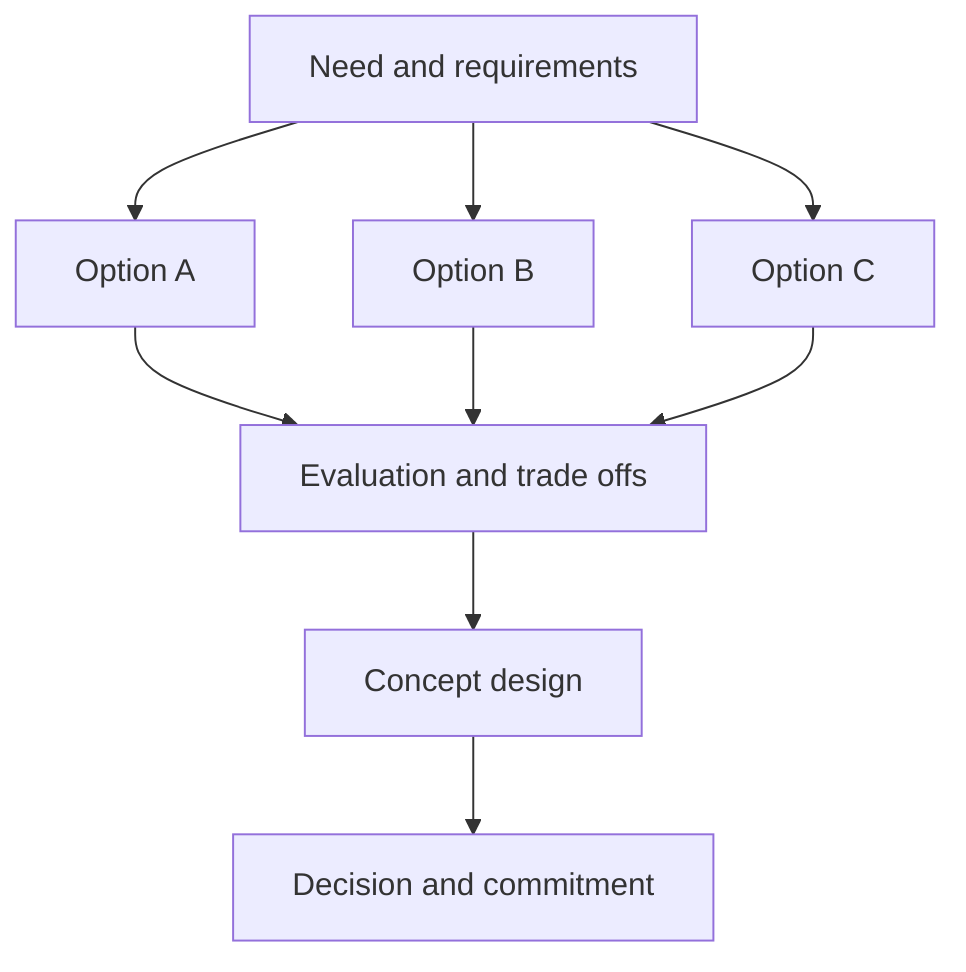

# Solution Options and Concept Design

> **Core skill:** Developing at least two viable solution options with honest trade-offs, then shaping the selected direction into a concept design that stakeholders can evaluate and delivery can build against.

## Why This Matters

The most damaging sentence in solution delivery is "we considered alternatives, but this was clearly the right choice." If the alternatives were never written down, the claim is unfalsifiable — and if it is wrong, no one discovers it until the cost of reversal is enormous. Options thinking is the architect's core professional discipline: not defending a preferred technology, but constructing several coherent ways to meet the need and exposing what each one sacrifices.

A genuine option is coherent end to end — buildable, fundable, and describable in terms of who does what. Strawman options — the deliberately bad alternative kept for decoration — corrupt the decision process and insult everyone who reads them. Two or three real options, each one a choice a reasonable team could defend, test the recommendation properly.

The concept design is where the chosen direction becomes concrete enough to evaluate. It is not a detailed design and should not pretend to be: it shows the shape of the solution — major components, how they interact, where it lives, how it integrates at a high level, and the assumptions and constraints it rests on. Its purpose is to make the direction tangible while it is still cheap to change, so that the commitment decision that follows is informed rather than speculative.

## Developing the Options

| Option Dimension | Variants to Consider | Why It Changes the Answer |
|------------------|----------------------|---------------------------|
| **Capability source** | Buy product, build custom, reuse existing, partner | Determines cost structure, control, and lock-in |
| **Delivery pattern** | Big-bang, phased, parallel run, pilot first | Determines risk profile and time to first value |
| **Deployment model** | Cloud, on-premise, hybrid, managed service | Determines operations, compliance, and elasticity |
| **Platform class** | Established platform, emerging platform, current stack | Determines skills, support, and lifecycle cost |
| **Scope boundary** | Minimum viable, target, visionary | Determines what the first funding actually buys |
| **Integration approach** | Direct, mediated, event-driven, batched | Determines coupling and evolution options |

Options should differ on dimensions that matter to this decision. Varying only price between options produces a procurement comparison, not an architecture decision.

## Evaluating Options

| Criterion | Evidence Required | Common Failure |
|-----------|-------------------|----------------|
| **Value** | Outcome improvement against the need and its measures | Value claimed but never quantified |
| **Cost** | Implementation, transition, and run cost ranges | Run costs omitted or underestimated |
| **Risk** | Key failure modes and their exposure | Risks averaged away by scoring models |
| **Time** | Time to first value and to full capability | Schedule optimism masking sequencing risk |
| **Fit** | Conformance with enterprise standards and strategy | Strategic fit asserted rather than evidenced |
| **Sustainability** | Lifecycle, skills, support, and exit | Lock-in discovered after commitment |

Weighted scoring can organize the comparison but must not conceal the assumptions. The decisive questions — what would make us reverse, what are we accepting as a downside — belong in plain language beside any score.

## The Concept Design

| Concept Element | Content | Audience Question |
|-----------------|---------|-------------------|
| **Shape** | Major components and their responsibilities | What are the moving parts? |
| **Interaction** | How components exchange information at high level | How does it work together? |
| **Placement** | Where components run and who operates them | Where does it live? |
| **Integration** | Key connections into the existing estate | How does it fit? |
| **Data view** | What data is owned, exchanged, and where it flows | What does it know and share? |
| **Assumptions and constraints** | Conditions the concept relies on | What must hold true? |
| **Open questions** | What detailed design must resolve, and by when | What is still undecided? |

A concept that hides its open questions is not a concept; it is a promise that detailed design will be effortless, which it will not be.

## From Options to Commitment



## Practical Applications

### Options and Concept Checklist

- [ ] At least two genuine options exist, each coherent end to end
- [ ] The do-nothing or minimal baseline is included where relevant
- [ ] Options differ on dimensions meaningful to this decision
- [ ] Evaluation criteria, evidence, and uncertainties are stated openly
- [ ] The concept design covers shape, interaction, placement, integration, and data
- [ ] Assumptions, constraints, and open questions are explicit
- [ ] The decision and its rationale are recorded for later reference

### Option Summary Template

```markdown
Option: <name>
Description: <end-to-end shape in a short paragraph>
Value: <outcome improvement against the need>
Cost: <implementation and run ranges>
Risks: <key risks and exposure>
Time to value: <first and full>
Constraints and dependencies: <what it assumes>
Why it could win: <the strongest case for this option>
Why it could fail: <the honest disqualifiers>
```

## Common Pitfalls

| Pitfall | Why It Is a Problem | Better Approach |
|---------|---------------------|-----------------|
| **Single-option advocacy** | No test against alternatives; the decision is a preference | Develop real options before recommending any |
| **Strawman options** | Fake alternatives destroy trust and corrupt the decision | Every option should be defensible by its advocate |
| **Scoring-model theater** | Numbers create false precision and hide judgment calls | Show criteria and evidence; let the decision owner weigh trade-offs |
| **Concept as brochure** | Pretty diagrams without assumptions or open questions | State assumptions, constraints, and unresolved questions plainly |
| **Unrecorded decision** | The rationale evaporates; the same debate reopens later | Record the decision, the options, and the reasons |

## Success Indicators

- Decision-makers discuss trade-offs rather than demand a single answer
- Rejected options are quoted when later decisions touch their trade-offs
- Delivery can begin detailed design without re-litigating the concept
- Concept documents are short enough to be read and specific enough to constrain
- Reversals, when needed, cite the earlier decision record knowingly

## Related Topics

- [[01_Solution_Architecture_Process]]: where options and concept sit in the process
- [[04_Solution_Feasibility_and_Constraints]]: the feasibility tests options must pass
- [[06_Transformation_Roadmaps_and_Portfolio/00_overview|Transformation Roadmaps and Portfolio]]: how selected concepts enter the investment pipeline
- [[career-path/06_Software_Architect/04_Architecture_Evaluation_and_Trade_Offs/00_overview|Architecture Evaluation and Trade Offs (Architect)]]: the evaluation craft this builds on
- [[career-path/14_Product_Manager/00_overview|Product Manager]]: product value as an option criterion

## Summary

Solution options and concept design turn a validated need into a committed direction. The architect develops several genuine, coherent options, compares them on value, cost, risk, time, fit, and sustainability with evidence rather than arithmetic theater, and shapes the chosen direction into a concept design that states its shape, interactions, placement, integration, data, assumptions, and open questions. The commitment that follows is then informed: the business knows what it chose, what it declined, and what must prove true for the choice to hold.
