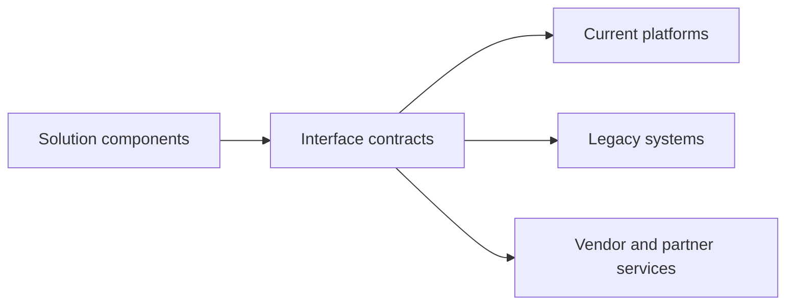

# Solution Integration Design

> **Core skill:** Designing how the solution's components and the surrounding enterprise systems integrate — interfaces, protocols, data flows, events, and the operational realities of a mixed estate.

## Why This Matters

No solution is an island. Whatever gets built must talk to what already exists: the finance system that has run for twenty years, the vendor platform under contract, the data warehouse that feeds reporting, the identity provider everyone authenticates against. Integration design decides whether that conversation is a managed architecture or a growing tangle of point-to-point connections that eventually makes every change a crisis.

Integration is where estimates most reliably fail. A solution whose internal components are simple can still drown in interface politics: the legacy system with no API, the third party that batches files nightly, the shared database that three systems write to without coordination. The architect's job is to design integrations against the real estate — the systems as they are, with their actual constraints — not against an idealized landscape where everything exposes a clean interface.

The design choices compound. Each interface selected becomes a dependency for the solution's lifetime: its ownership, its change cadence, its failure modes. An architect who documents interfaces but never designs their contracts, ownership, and failure behavior has described the tangle rather than prevented it.

## Integration Styles

| Style | Description | Strengths | Weaknesses |
|-------|-------------|-----------|------------|
| **Point-to-point** | Direct connection between two systems | Simple; fast for a pair | Multiplies connections; fragile landscape |
| **Hub or broker** | Central mediator routes interactions | Decouples parties; central control | Hub becomes bottleneck and single point |
| **API layer** | Managed, governed service interfaces | Reusability; contract discipline | Governance overhead; needs ownership |
| **Event streaming** | Publish and subscribe of events | Loose coupling; extensibility | Eventual consistency; operational complexity |
| **File and batch** | Scheduled file exchange | Tolerates legacy; simple to audit | Latency; error handling in files |
| **Shared database** | Multiple systems read and write one store | Convenient in the short term | Coupling; schema changes ripple everywhere |

The practical estate usually contains all six. The architect's discipline is to choose deliberately for each new interface and to contain, document, and where possible retire the accidental ones.

## Interface Design

| Interface Element | Content | Why It Matters |
|-------------------|---------|----------------|
| **Contract** | Operations, message schemas, versions | Enables independent evolution of both sides |
| **Protocol and style** | REST, messaging, streaming, file, RPC | Determines performance and resilience profile |
| **Data mapping** | Source-to-target field semantics | Prevents silent semantic corruption |
| **Ownership** | Who owns, changes, and supports it | Interfaces without owners decay |
| **Security** | Authentication, authorization, encryption | Integration is a security surface |
| **Failure behavior** | Timeouts, retries, dead letters, idempotency | Determines blast radius of failures |
| **Monitoring** | Health, throughput, error visibility | You cannot operate what you cannot see |

Contract-first design — defining the interface before implementation — lets teams proceed in parallel and makes the contract the negotiable artifact rather than the code.

## Integration Patterns

| Pattern | Problem It Solves | Caution |
|---------|-------------------|---------|
| **Anti-corruption layer** | Isolates new components from a legacy model | Worth its cost wherever a model would otherwise leak |
| **Strangler** | Incremental replacement of legacy behavior | Requires disciplined routing and retirement |
| **Event-driven decoupling** | Producers and consumers evolve independently | Consumers must handle eventual consistency |
| **Saga** | Distributed transactions across services | Compensations add complexity; design failure paths |
| **Idempotent receivers** | Safe retries under at-least-once delivery | Must be designed, not assumed |
| **Backend for frontend** | Channel-specific aggregation | Avoid accumulating business logic there |

## Integration in the Real Estate



| Estate Condition | Design Response |
|------------------|-----------------|
| **Legacy without APIs** | Wrap with a service facade; schedule its real modernization |
| **Vendor platform limits** | Agree interface obligations contractually; design around gaps |
| **Shared data stores** | Establish a single writer; mediate reads through services |
| **High-volume event needs** | Stream with schema governance and consumer contracts |
| **Cross-organizational exchange** | Formal contracts, versioning, and test environments on both sides |

## Practical Applications

### Integration Design Checklist

- [ ] Every interface has a named owner on both sides
- [ ] Contracts are defined before implementations and versioned
- [ ] Data mappings specify semantics, not just field names
- [ ] Failure behavior is designed: timeouts, retries, idempotency, dead letters
- [ ] Security controls apply to every crossing, including internal ones
- [ ] Monitoring and alerting exist for interface health and lag
- [ ] Legacy couplings are contained, documented, and on a retirement path

### Interface Specification Template

```markdown
Interface: <name>
Purpose: <business exchange it supports>
Providers and consumers: <owners on each side>
Style and protocol: <REST | messaging | stream | file | RPC>
Contract: <operations, schemas, versions>
Data mapping: <key semantic mappings and transformation rules>
Failure behavior: <retry, idempotency, dead letter handling>
Security: <authentication, authorization, encryption>
Monitoring: <health signals, ownership of alerts>
```

## Common Pitfalls

| Pitfall | Why It Is a Problem | Better Approach |
|---------|---------------------|-----------------|
| **Spaghetti by increments** | Each delivery adds direct links until the landscape is unroutable | Mediate through owned, contract-based interfaces |
| **Shared database coupling** | Schema changes ripple through every reader and writer | Single writer with service-mediated access |
| **Sync-only thinking** | Blocking chains turn one slow system into an outage for all | Use asynchronous patterns where the business can tolerate them |
| **No idempotency** | Retries duplicate orders, payments, or records | Design every receiver to be safely repeatable |
| **Interfaces without owners** | Unsupported integrations become archaeology | Name the owner on both sides at design time |

## Success Indicators

- Interfaces have owners, contracts, and monitoring before go-live
- Change in one system rarely breaks another silently
- Legacy couplings carry documented retirement plans
- Incident reviews cite interface behavior as designed, not discovered
- Delivery teams integrate new components without renegotiating the estate

## Related Topics

- [[01_Solution_Architecture_Process]]: integration design within the overall process
- [[04_Solution_Feasibility_and_Constraints]]: estate constraints as feasibility evidence
- [[07_Solution_Lifecycle_and_Evolution]]: interfaces as long-lived assets to evolve and retire
- [[04_Enterprise_Data_Architecture/00_overview|Enterprise Data Architecture]]: data ownership and flow across the estate
- [[05_Security_Risk_and_Compliance/00_overview|Security Risk and Compliance]]: integration as a security and compliance surface

## Summary

Solution integration design manages how the solution converses with everything around it. The architect selects integration styles deliberately, defines interfaces as owned contracts with explicit data mappings, failure behavior, security, and monitoring, and applies patterns such as anti-corruption layers, stranglers, sagas, and idempotent receivers against the real estate rather than an imagined one. Because every interface becomes a dependency for the solution's lifetime, the discipline is to design integrations that can evolve independently — and to keep the inevitable legacy couplings contained, documented, and on a path to retirement.
