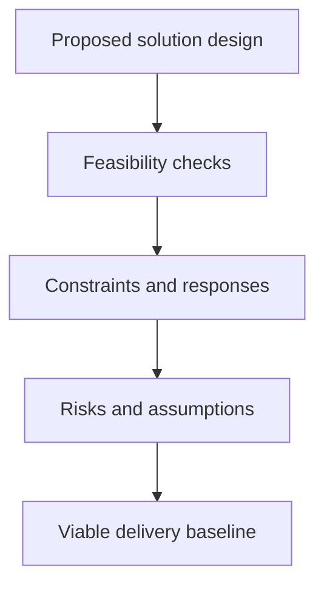

# Solution Feasibility and Constraints

> **Core skill:** Testing whether a solution direction is actually achievable — technically, commercially, organizationally, and regulatorily — and designing within explicit constraints instead of discovering them during delivery.

## Why This Matters

Every solution looks feasible on the whiteboard. Feasibility work is the architect's disciplined effort to find the reasons it might not be — before funding, before contracts, before the delivery schedule has made the discovery expensive. The failures that sink solutions are rarely internal to the design; they live in the seams: the integration that proves harder than assumed, the vendor whose license model forbids the intended use, the operations team that cannot support the chosen platform, the regulator who requires data to stay in-country.

The architect's instinct should be constructive suspicion. A novel design is not automatically risky, and a conservative one is not automatically safe — the relevant question is where the unknowns are concentrated and how much the plan depends on them. Identifying points of novelty, ranking them by exposure, and testing the most dangerous ones early is what converts feasibility from a feeling into evidence.

Constraints get the same treatment. A constraint the architect designs against is a requirement; one discovered at delivery is an obstacle. Budget ceilings, license terms, mandated vendors, security classifications, data residency, existing contracts, scarce skills — each has a design response, and the response belongs in the concept while options are still open. Constraints that are documented but unaddressed are postponed failures.

## Feasibility Dimensions

| Dimension | Core Question | Typical Evidence |
|-----------|---------------|------------------|
| **Technical** | Can it be built with available technology and skills? | Prototypes, spikes, reference implementations |
| **Integration** | Can it connect to the real estate as designed? | Interface analysis with the actual systems |
| **Commercial** | Can it be procured within budget and terms? | Vendor discussions, license analysis |
| **Organizational** | Can the organization adopt and absorb it? | Operating model, training, change readiness |
| **Regulatory** | Does it satisfy enforceable obligations? | Compliance review, data residency, audit |
| **Operational** | Can it be run, supported, and monitored? | Support model, monitoring design, runbooks |

## Points of Novelty

| Novelty Level | Description | Required Response |
|---------------|-------------|-------------------|
| **Proven elsewhere** | Others run it in production at comparable scale | Reference check; adopt with standard caution |
| **Proven at different scale** | Works, but not at our volumes or in our context | Structured proof at scale before commitment |
| **New combination** | Known parts assembled in a new way | Spike the seams: integration and failure behavior |
| **New technology** | Immature product or first-of-kind use | Staged pilot with explicit exit criteria |

The architect's novelty register — a list of everything the solution does that the organization has not done before — is one of the most useful artifacts in feasibility work. It focuses proof effort where risk actually concentrates and gives reviewers something truthful to approve.

## Constraints and Design Responses

| Constraint Type | Examples | Design Response |
|-----------------|----------|-----------------|
| **Financial** | Budget ceiling; capital versus operating treatment | Phasing; defer options; run-cost engineering |
| **Regulatory** | Data residency; reporting; consent | Locality design; data controls; audit trails |
| **Commercial** | Mandated vendors; existing contracts; license terms | Fit analysis; boundary design; term negotiation |
| **Technical estate** | Legacy interfaces; platform standards | Facades; conformance with justified exceptions |
| **Skills and capacity** | Scarce expertise; competing demands | Sequencing; enablement; delivery partnership |
| **Time** | Deadline events; market windows | Scope shaping; minimum viable definition |

Constraints ranked honestly separate the negotiable from the immovable. Only with that ranking can the architect and sponsor trade correctly — giving ground on the soft constraints and spending decision capital on the hard ones.

## Proving Feasibility



| Proof Technique | Use For | Design Discipline |
|-----------------|---------|-------------------|
| **Technical spike** | Uncertain mechanics or integration | Timeboxed; question stated before code |
| **Proof of concept** | Product fit or interaction model | Define falsifiable success criteria first |
| **Pilot** | Adoption, operations, scale effects | Real users, real constraints, decided exit path |
| **Reference visit** | Someone has done this already | Ask about failures, not showcases |
| **Prototype** | Stakeholder validation of direction | Cheap, disposable, aimed at a decision |

Proof work without a falsifiable question is theater. State what result would stop the initiative, then run the proof.

## Practical Applications

### Feasibility and Constraints Checklist

- [ ] Each feasibility dimension has an owner and evidence, not just an opinion
- [ ] A novelty register lists everything the organization has not done before
- [ ] The riskiest novel elements are proof-tested before commitment
- [ ] Constraints are listed, classified as hard or negotiable, and mapped to design responses
- [ ] Vendor and licensing terms are checked against intended usage
- [ ] Operational support feasibility is confirmed with the operations function
- [ ] Assumptions underlying feasibility are recorded with their sensitivity

### Feasibility Assessment Template

```markdown
Solution direction: <option being assessed>
Technical feasibility: <finding and evidence>
Integration feasibility: <finding and evidence>
Commercial feasibility: <finding and evidence>
Organizational feasibility: <finding and evidence>
Regulatory feasibility: <finding and evidence>
Novel points and proofs: <register with test status>
Hard constraints: <list with design responses>
Assumptions: <list with sensitivity>
Residual risks: <list with exposure>
```

## Common Pitfalls

| Pitfall | Why It Is a Problem | Better Approach |
|---------|---------------------|-----------------|
| **Feasibility by optimism** | Enthusiasm substitutes for evidence; surprises arrive in delivery | Evidence per dimension; test the riskiest novelty first |
| **Proof of concept as demo** | A curated demo proves what was already assumed | Define falsifiable criteria and try to fail them |
| **Late constraints** | Constraints found at build force redesign at full cost | Surface and design against them during concept |
| **Ignoring operational readiness** | A buildable solution that cannot be run is not feasible | Confirm support, monitoring, and skills before commitment |
| **Vendor claims as evidence** | Sales narratives are not proofs of fit | Contractual commitments, references, and hands-on trials |

## Success Indicators

- Commitments are made knowing the named residual risks and the reasoning for accepting them
- Proof work stops initiatives early when the evidence says stop — cheaply
- Constraint responses are visible in the concept design, not discovered in delivery
- Delivery surprises relate to genuinely new information, not untested assumptions
- Operations and compliance confirm feasibility before, not after, sign-off

## Related Topics

- [[02_Solution_Options_and_Concept_Design]]: feasibility as evidence for option choice
- [[03_Solution_Integration_Design]]: the estate realities feasibility must confront
- [[06_Solution_Assurance_and_Review]]: how feasibility evidence feeds assurance
- [[05_Security_Risk_and_Compliance/00_overview|Security Risk and Compliance]]: regulatory and risk constraints in depth
- [[career-path/13_Project_and_Program_Manager/00_overview|Project and Program Manager]]: turning feasibility findings into delivery plans

## Summary

Solution feasibility and constraints discipline the gap between a design that looks achievable and one that is. The architect tests every dimension — technical, integration, commercial, organizational, regulatory, operational — keeps a register of what is genuinely novel, and proves the riskiest novelty with falsifiable, timeboxed experiments before commitment. Constraints are surfaced in concept, classified as hard or negotiable, and answered with explicit design responses. The result is a delivery baseline whose risks are named, owned, and knowingly accepted rather than hidden in optimism.
