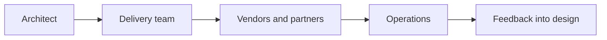

# Solution Delivery Partnership

> **Core skill:** Partnering with delivery teams, project and program managers, vendors, and operations — staying accountable for the architecture while enabling others to build, run, and evolve it.

## Why This Matters

The solution architect's design is only worth what delivery makes of it. Between the concept design and the running system lies a long negotiation: what the plan can absorb, what the vendor will actually deliver, what the team discovers when the code meets the legacy estate. Architects who retreat after sign-off see their design interpreted, eroded, or resented; architects who dominate delivery become bottlenecks that teams route around. The productive position is partnership: the architect owns design intent and its evolution, the delivery organization owns execution, and the two stay in continuous contact.

The partnership has structure. Delivery needs decisions answered within hours or days, not weeks; a queue of pending architecture questions is a delivery risk in itself. Vendors need unambiguous requirements and contractual obligations, because goodwill alone does not survive commercial pressure. Operations needs to be involved before the design is frozen, because operability is a design property, not an afterthought. Project and program managers need the architecture's dependency map to sequence work realistically.

Working this way also protects the architecture's honesty. When delivery discovers that an assumption was wrong, the partnership surfaces it early and the design evolves with evidence. When there is no partnership, the same discovery happens late, disguised as "delivery issues," and the architecture is blamed for a design that was never given a chance to adapt.

## The Delivery Ecosystem

| Partner | Needs From the Architect | Offers the Architect |
|---------|--------------------------|----------------------|
| **Delivery team** | Clear decisions, design intent, fast answers | Feasibility reality, implementation feedback |
| **Project manager** | Dependencies, risks, sequencing implications | Architectural constraints on the plan |
| **Program manager** | Cross-initiative architecture alignment | Landscape context across projects |
| **Vendor or integrator** | Precise requirements, acceptance criteria | Product capability, delivery capacity |
| **Operations and support** | Operability by design, handover quality | Run realities, incident evidence |
| **Security and compliance** | Design-time integration, evidence | Controls, findings, risk guidance |

## Working With Delivery Teams

| Practice | Description | Failure It Prevents |
|----------|-------------|--------------------|
| **Decision service** | Named channel with response expectations | Teams blocked on unanswered questions |
| **Design intent sharing** | Walkthroughs of the why, not just the what | Literal compliance that misses the point |
| **Decision records** | Every significant deviation recorded | Silent architecture erosion |
| **Embedded time** | Architect attends ceremonies and refinements | Late discoveries of infeasibility |
| **Architecture enablers** | Work items that build the runway for upcoming design | Refactoring that never gets prioritized |

Agile delivery changes the cadence, not the need: decisions move from gate documents to just-in-time answers, and the architect becomes a participant in the team's flow rather than an external authority. The architecture runway — keeping design ahead of the next few iterations, not the whole project — is the central craft.

## Working With Project and Program Management

| Joint Concern | Architect Contribution | Manager Contribution |
|---------------|------------------------|----------------------|
| **Planning** | Interfaces, dependencies, sequencing constraints | Schedule, capacity, commitments |
| **Risk** | Architectural risk exposure and novelty register | Risk process, ownership, mitigation tracking |
| **Scope** | Impact assessment of changes on design and estate | Change control and decision routing |
| **Vendors** | Requirements, fit, design authority | Contracts, performance management |
| **Reporting** | Architecture status, conformance, exceptions | Consolidated delivery truth |

The architect does not manage the project and the manager does not design the solution; the friction comes from confusing these boundaries, not from the collaboration itself.

## Working With Vendors



| Vendor Interaction | Architect Discipline |
|--------------------|----------------------|
| **Requirements and scope** | Precise, testable statements; no implied flexibility |
| **Solution proposals** | Evaluate against architecture drivers, not demos |
| **Design authority** | Retained by the organization; vendor designs conform |
| **Change and variation** | Architecture impact assessed before commercial response |
| **Acceptance** | Conformance to agreed interfaces and qualities, evidenced |
| **Exit and portability** | Data and interface exit terms reviewed at contract time |

## Practical Applications

### Delivery Partnership Checklist

- [ ] A decision channel exists with agreed response expectations
- [ ] Design walkthroughs happen at delivery start, not only at review gates
- [ ] Deviations from design are assessed and recorded, never silent
- [ ] Delivery participates in feasibility and concept, not only build
- [ ] Vendor obligations include interfaces, qualities, and exit terms
- [ ] Operations is engaged before design freeze
- [ ] Architecture enabler work is planned and resourced alongside features

### Delivery Engagement Plan Template

```markdown
Initiative: <name>
Delivery model: <agile | stage-gate | hybrid | vendor-led>
Architect touchpoints: <cadences and formats>
Decision service: <channel, owner, response expectation>
Open architectural decisions: <list with dates needed>
Deviation log: <location and review cadence>
Operations engagement: <contact and plan>
Vendor obligations: <architecture-relevant terms>
```

## Common Pitfalls

| Pitfall | Why It Is a Problem | Better Approach |
|---------|---------------------|-----------------|
| **Ivory-tower handoff** | Design thrown over the wall loses feasibility and goodwill | Partner through delivery; iterate with evidence |
| **Architect as bottleneck** | All questions queue behind one person; delivery stalls | Delegate decision classes; publish standards; answer fast |
| **Silent deviation** | Erosion discovered at review, after cost is sunk | Require deviation assessment and records as they occur |
| **Vendor-captured design** | Convenience of the vendor replaces the needs of the business | Retain design authority; anchor in requirements |
| **Operations by surprise** | The running solution arrives with no support model | Engage operations from design onward |

## Success Indicators

- Delivery teams describe architecture decisions as helpful, not obstructive
- Deviations are logged, justified, and visible to governance
- Vendors build to agreed interfaces with few renegotiations
- Operations accepts the solution without extraordinary stabilization effort
- The architect hears about emerging delivery risks before they become issues

## Related Topics

- [[01_Solution_Architecture_Process]]: delivery support as a defined process stage
- [[04_Solution_Feasibility_and_Constraints]]: feasibility findings shared into planning
- [[07_Solution_Lifecycle_and_Evolution]]: the transition to operations this partnership produces
- [[career-path/13_Project_and_Program_Manager/00_overview|Project and Program Manager]]: the closest delivery partner
- [[career-path/03_Staff_Engineer/02_Cross_Team_Technical_Leadership/00_overview|Cross-Team Technical Leadership (Staff)]]: influence without authority across teams

## Summary

Solution delivery partnership keeps the architect accountable for design intent while enabling delivery, vendors, and operations to execute. It runs on structure: a decision service with response expectations, walkthroughs that share the why, recorded deviations, feasibility participation, contractual vendor obligations including exit, and operations engagement before design freeze. The partnership turns the architecture into a living agreement that evolves with evidence — and prevents both failure modes of the disengaged architect: a design that delivery ignores and a process that delivery routes around.
