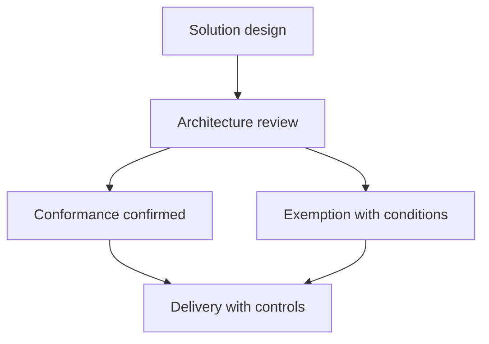

# Solution Assurance and Review

> **Core skill:** Assuring that solutions conform to architecture standards, principles, and risk requirements — through design reviews, governance checkpoints, and exemptions that are explicit rather than accidental.

## Why This Matters

Assurance is how an organization finds out, before the money is spent, whether a solution respects the architecture it depends on. Without it, every initiative is an experiment conducted in production against shared standards that may or may not hold; with it done badly, architecture becomes a police function that delivery learns to evade. The architect's task is to make assurance useful: reviews that improve designs, checkpoints placed at moments when change is still cheap, and exemption processes honest enough that they are used instead of circumvented.

The review is not an audience for a completed design; it is an evidence-based examination of one. Reviewers ask what the design assumes, which standards it invokes or departs from, what the risks are, and what evidence supports the claims. The most valuable reviews catch the question nobody asked — the missing data ownership, the unaddressed residency requirement, the integration with the system that was forgotten. An assurance process that only checks boxes produces box-tickers; one that improves designs earns its access to the next design.

Exemptions are where assurance most often fails. Every architecture standard eventually meets a case it did not anticipate. If the only options are rigid refusal or quiet violation, the organization gets quiet violation. A functioning exemption process — time-bound, evidence-backed, risk-accepted by a named owner — keeps the standard meaningful while letting the business move. Unrecorded exceptions are not flexibility; they are unmanaged risk.

## What Assurance Covers

| Assurance Dimension | Question | Evidence |
|---------------------|----------|----------|
| **Standard conformance** | Does the solution follow standards, or justify departure? | Design mapping against standards |
| **Quality attributes** | Are required qualities designed, not hoped for? | Quality scenarios with design responses |
| **Risk and security** | Are key risks controlled and accepted by owners? | Risk assessments, control mappings |
| **Data and integration principles** | Are ownership and interface principles respected? | Data and interface views |
| **Operational readiness** | Can operations run and support it? | Operability review, support model |
| **Value alignment** | Does the design still serve the approved need and case? | Traceability to need and benefit case |

## Review Checkpoints

| Checkpoint | Timing | Purpose | Typical Participants |
|------------|--------|---------|----------------------|
| **Concept review** | After concept design, before commitment | Validate direction and drivers | Architecture, business owner, delivery |
| **Design review** | Before build commitment | Examine conformance, risk, and quality design | Architecture, security, operations |
| **Change review** | On significant deviations during delivery | Assess impact; approve or redirect | Architect, delivery lead, owner as needed |
| **Readiness review** | Before transition to operations | Confirm support, monitoring, and handover | Operations, architecture, delivery |
| **Post-implementation review** | After go-live | Learn: did the architecture hold; what surprised | All parties; feeds standards |

## Running a Design Review

| Review Element | Practice |
|----------------|----------|
| **Pre-read** | Design circulated in advance with drivers and decisions |
| **Questions** | Reviewers bring questions; the designer answers with evidence |
| **Scope** | Focus on architecture concerns, not implementation detail |
| **Decisions** | Every review ends with approve, condition, exempt, or redirect |
| **Records** | Outcomes, conditions, and owners recorded and visible |
| **Follow-up** | Conditions tracked to closure like any deliverable |

The strongest review cultures ask one adversarial question well: what would make this design fail? A review that cannot produce that question for any design is not reviewing, it is approving.

## Exemptions and Conformance Outcomes



| Outcome | Meaning | Control |
|---------|---------|---------|
| **Conform** | Meets standards and principles as designed | Standard delivery governance |
| **Conform with conditions** | Acceptable with tracked conditions | Conditions monitored to closure |
| **Time-bound exemption** | Departure accepted temporarily | Expiry date forces revisit |
| **Redirect** | Design must change before proceeding | Rework and re-review |
| **Refuse** | Unacceptable risk or conflict | Escalation path for disagreement |

Every outcome must name its decision owner. A review that ends without a recorded decision leaves delivery to guess — and delivery will guess toward whatever is easiest.

## Practical Applications

### Assurance and Review Checklist

- [ ] Checkpoints are scheduled in the delivery plan, not improvised
- [ ] Reviews receive pre-reads with drivers, decisions, and open issues
- [ ] Review outcomes are recorded as decisions with owners and conditions
- [ ] Exemptions are time-bound, evidence-backed, and risk-accepted by a named owner
- [ ] Conditions and exemptions are tracked to closure like other work
- [ ] Security and operations participate in reviews relevant to their concerns
- [ ] Post-implementation learning feeds back into standards and checkpoints

### Review Record Template

```markdown
Solution: <name>
Review type: <concept | design | change | readiness>
Date and participants: <list>
Drivers and need reference: <links>
Design summary: <short description>
Findings: <list with severity>
Decision: <conform | conditions | exemption | redirect | refuse>
Conditions and owners: <list with dates>
Exemption expiry: <date if applicable>
Escalations: <open disagreements>
```

## Common Pitfalls

| Pitfall | Why It Is a Problem | Better Approach |
|---------|---------------------|-----------------|
| **Review theater** | Meetings held, nothing examined, nothing decided | Evidence-based review with recorded outcomes |
| **Reviewer as designer** | Reviewers redesign in the meeting; ownership blurs | Review against drivers and standards; prescribe outcomes, not designs |
| **Gate without teeth** | Findings ignored because delivery continues anyway | Conditions tracked to closure; deviations have consequences |
| **Unrecorded exemptions** | Departures from standards become invisible permanent state | Formal time-bound exemptions with named risk owners |
| **Assurance at the end only** | Late inspection finds what early involvement would have prevented | Checkpoints across the lifecycle, starting at concept |

## Success Indicators

- Reviews improve designs: findings that prevent issues, not just document them
- Decisions and conditions from reviews are visible and tracked to closure
- Exemption registers are current, small, and trending toward closure
- Standards evolve from post-implementation learning rather than staying frozen
- Delivery requests reviews early, treating them as help rather than inspection

## Related Topics

- [[01_Solution_Architecture_Process]]: gates within the architecture process
- [[05_Solution_Delivery_Partnership]]: reviews as part of the delivery relationship
- [[07_Solution_Lifecycle_and_Evolution]]: learning that feeds standards and future designs
- [[03_Enterprise_Architecture_Practice/00_overview|Enterprise Architecture Practice]]: governance at enterprise scope
- [[05_Security_Risk_and_Compliance/00_overview|Security Risk and Compliance]]: the risk and compliance dimension of assurance

## Summary

Solution assurance and review keep architecture meaningful across many initiatives: checkpoints at concept, design, change, readiness, and post-implementation; reviews run on evidence and end in recorded decisions; and a formal exemption process that is used and honored rather than circumvented. The point is not conformance for its own sake but the prevention of shared mistakes, the surfacing of risks while they are still cheap to control, and the evolution of standards based on what delivery actually learns. Assurance that delivery requests voluntarily is assurance that works.
