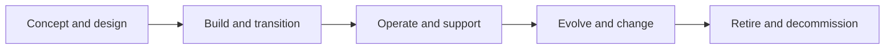

# Solution Lifecycle and Evolution

> **Core skill:** Managing the solution across its whole life — from delivery and transition into operation through change, evolution, and retirement — so the architecture stays viable and the estate stays clean.

## Why This Matters

A solution architecture that stops at go-live is half a design. The system that the business runs for the next decade will pass through upgrades, integrations, data migrations, incident postmortems, and eventually retirement — and every one of those events is an architecture event. Architects who design for launch day leave their successors a system whose evolution was never considered: interfaces with no versioning path, data with no residency in the future target, components with no exit route.

Designing for the lifecycle means answering questions at design time that pay off years later. How will this component be upgraded without outage? Which parts are expected to change first, and are they isolated? What happens to the data when this solution is eventually replaced? What signals will tell us the solution needs to evolve — or die? These questions cost little to answer early and are brutally expensive to retrofit.

The lifecycle view also protects the estate. Every solution eventually stops being the answer; the organization that cannot decommission accumulates cost, risk, and confusion. Retirement is a design responsibility: systems designed with exit paths — clear ownership of data, decoupled interfaces, documented migration assumptions — can be shut down with dignity. Systems designed without them outlive their value by a decade because no one can safely turn them off.

## Lifecycle Stages

| Stage | Dominant Question | Architect Involvement |
|-------|-------------------|-----------------------|
| **Concept and design** | What are we building, and how will it live? | Owns design, lifecycle planning |
| **Build and transition** | Does it work and can operations run it? | Design support, readiness assurance |
| **Operate and support** | Is it healthy, and are assumptions holding? | Architecture health reviews |
| **Evolve and extend** | What changes, and what do they stress? | Impact assessment, runway design |
| **Retire and migrate** | What replaces it, and what must move? | Transition architecture, decommissioning |

The architect's involvement is not uniform: it is deep at both ends of the lifecycle — design and retirement — and periodic in the middle, when health signals or change requests demand it.

## Transition to Operations

| Transition Element | Content | Failure Without It |
|--------------------|---------|--------------------|
| **Operational acceptance** | Explicit criteria the solution must meet | Go-live by fatigue rather than fitness |
| **Support model** | Who runs it, responds, and escalates | Incidents routed to whoever answers |
| **Monitoring and observability** | Health, performance, and business signals | Failures invisible until customers report |
| **Runbooks and knowledge** | Known procedures, failure modes, recovery | Hero-driven operations |
| **Service levels** | Agreed targets and reporting | Expectations diverging silently |
| **Residual risk acceptance** | Named owner for accepted gaps | Risks quietly inherited by operations |

Transition is a design outcome, not a ceremonial transfer. If operations cannot state what it supports and how, the solution is not transitioned — it is merely running.

## Change and Evolution

| Change Type | Architecture Question | Typical Response |
|-------------|----------------------|------------------|
| **Feature extension** | Does it threaten a designed quality? | Assess; design if it bends a principle |
| **Scale growth** | Where does capacity first fail? | Re-test elasticity assumptions; evolve |
| **Integration change** | Which interfaces and contracts shift? | Version contracts; coordinate consumers |
| **Platform or upgrade mandate** | What breaks with the new version? | Compatibility assessment before compliance deadline |
| **Regulatory change** | Which data and controls must adapt? | Design response traced to the obligation |
| **Technical debt accumulation** | When does debt become a delivery blocker? | Debt as backlog with business impact stated |

Also design the runway: the patterns, interfaces, and abstractions that make the next set of known changes cheap. Architecture runway is not speculative generality; it is deliberate preparation for changes that the roadmap already names.

## Health and Retirement



| Health Signal | Indicates | Architecture Action |
|---------------|-----------|---------------------|
| **Change failure rate rising** | Structure resists modification | Refactoring or re-architecture assessment |
| **Incident clusters** | Design weaknesses under real load | Targeted design review |
| **Cost per transaction drifting** | Accumulated inefficiency | Value review against alternatives |
| **Key-person dependence** | Knowledge concentrated, not designed in | Documentation and design simplification |
| **Business capability changing** | The original need no longer holds | Evolution or retirement decision |

Decommissioning deserves the same planning as launch: a decommissioning checklist covering data disposition, interface retirement, consumer migration, license termination, and archive obligations. Zombie systems — running, costing, occasionally surprising everyone — are what happens when retirement is nobody's job.

## Practical Applications

### Lifecycle Management Checklist

- [ ] The design states which elements are expected to change first and how they are isolated
- [ ] Operational acceptance criteria are defined before go-live
- [ ] Monitoring covers system health and the business signals that matter
- [ ] Architecture health is reviewed periodically with operations evidence
- [ ] Change requests receive an architectural impact assessment
- [ ] Every solution has a named owner beyond the delivery project
- [ ] Retirement is planned at design time: data, interfaces, and consumers

### Lifecycle Plan Template

```markdown
Solution: <name>
Expected service life: <years and drivers>
Change-sensitive areas: <components and rationale>
Operational acceptance: <criteria and evidence>
Health signals: <metrics and review cadence>
Evolution path: <anticipated changes and runway>
Exit path: <data disposition, interface retirement, consumer migration>
Owner: <accountable role after go-live>
```

## Common Pitfalls

| Pitfall | Why It Is a Problem | Better Approach |
|---------|---------------------|-----------------|
| **Design for go-live only** | Operations burdens and evolution costs surface after launch | Design for the operating life, not the release date |
| **Ownerless after go-live** | Nobody owns health, debt, or evolution decisions | Named solution owner with an architecture mandate |
| **Debt without visibility** | Accumulated shortcuts become invisible until they block change | Track debt with business impact, not as an engineering secret |
| **Immortal systems** | Nothing ever retires; cost and risk compound quietly | Plan and execute decommissioning as a first-class activity |
| **Assumption drift unmonitored** | Original design assumptions fail silently | Monitor the signals that would reveal their failure |

## Success Indicators

- Solutions transition to operations against agreed criteria, not exhaustion
- Health reviews detect degradation before it becomes incidents or blockage
- Change requests come with architecture impact understood in advance
- Decommissioning happens when a solution's value ends, not when it finally breaks
- Design assumptions are visibly monitored and revisited

## Related Topics

- [[03_Solution_Integration_Design]]: interfaces as lifecycle assets to version and retire
- [[05_Solution_Delivery_Partnership]]: operations engagement that begins during design
- [[06_Solution_Assurance_and_Review]]: reviews as lifecycle checkpoints
- [[06_Transformation_Roadmaps_and_Portfolio/00_overview|Transformation Roadmaps and Portfolio]]: evolution and retirement within the portfolio
- [[career-path/06_Software_Architect/04_Architecture_Evaluation_and_Trade_Offs/00_overview|Architecture Evaluation and Trade Offs (Architect)]]: trade-offs that determine evolvability

## Summary

Solution lifecycle and evolution extend the architect's responsibility across the solution's entire life: designing for transition and operations, monitoring the health signals that reveal assumption drift, managing change with impact assessments and deliberate runway, and planning retirement — data, interfaces, consumers — from the beginning. The solution that is designed only for its launch will burden the organization for years; the one designed for its whole life serves cheaply, evolves deliberately, and can end cleanly when its value does.
