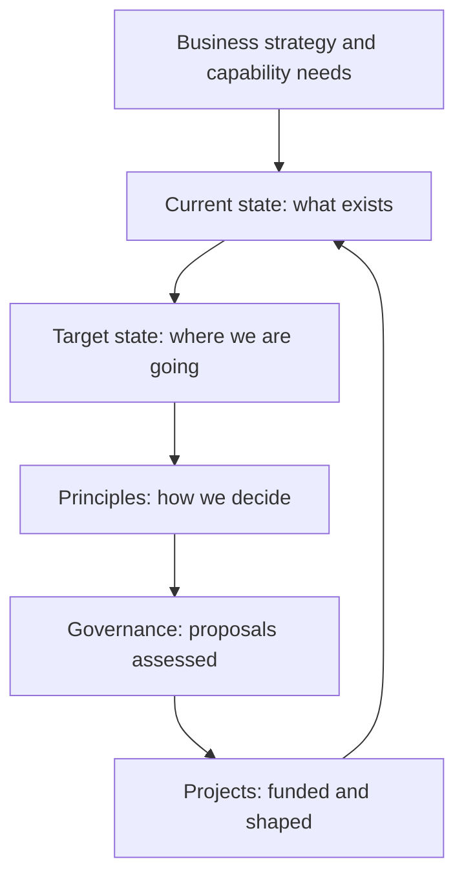

# Enterprise Architecture Practice

> **Core capability:** The enterprise architect connects business, information, application, and technology domains — maintaining the current-state picture, defining the target, and governing the evolution of the enterprise landscape.

## Why This Matters

Enterprises accumulate technology the way cities accumulate buildings: organically, with no master plan, each addition rational in isolation and incoherent in aggregate. The enterprise architect is the city planner — maintaining the map, defining the target, and making the connections between business intent and technology reality visible to decision makers.

Enterprise architecture fails when it becomes documentation theater: impressive artifacts, no influence. It succeeds when the capability map, current-state assessment, target architecture, and governance actually shape investment decisions — when proposals cite the target state and duplications get caught before they are funded.

## Topics in This Capability Area

| Topic | Core Skill | When It Matters |
|-------|------------|-----------------|
| [[01_Enterprise_Architecture_Frameworks]] | Choosing and tailoring EA frameworks pragmatically | Practice establishment |
| [[02_Architecture_Domains_and_Layers]] | Understanding the business/data/application/technology layers | Every architecture discussion |
| [[03_Current_State_Architecture]] | Capturing and maintaining the current-state landscape | Assessment; planning |
| [[04_Target_State_Architecture]] | Defining the target and the path toward it | Strategy; investment alignment |
| [[05_Architecture_Principles_for_the_Enterprise]] | Writing principles that guide enterprise decisions | Governance; consistency |
| [[06_Enterprise_Architecture_Governance]] | Running architecture governance that enables, not blocks | Investment decisions; exceptions |
| [[07_Building_the_EA_Practice]] | Establishing and maturing the architecture function | New EA roles; practice growth |

## The EA Operating Loop

The loop never ends: every funded project changes the current state.

## Practical Applications

### EA Practice Checklist

- [ ] A framework is adopted pragmatically — tailored, not followed blindly
- [ ] The architecture landscape covers business, data, application, technology layers
- [ ] Current-state and target-state artifacts exist and are current
- [ ] Architecture principles are written, socialized, and used in governance
- [ ] Governance reviews shape projects without becoming a bottleneck

## Common Pitfalls

| Pitfall | Why It Is a Problem | Better Approach |
|---------|---------------------|-----------------|
| **Framework worship** | TOGAF-for-its-own-sake; huge artifacts, no influence | Tailor the framework to the organization's needs |
| **Documentation theater** | Beautiful current-state maps, ignored in decisions | Artifacts exist to shape decisions; measure their use |
| **Ivory tower architecture** | EA disconnected from delivery reality | Embed with projects; make governance enabling |

## Success Indicators

- Investment proposals reference the target architecture
- Duplicate systems are caught before funding, not after
- Current-state artifacts stay current because teams contribute
- Governance reviews are sought, not avoided

## Related Capabilities

- [[02_Solution_Architecture_and_Design/00_overview|Solution Architecture and Design]]: solutions realize the enterprise target
- [[06_Transformation_Roadmaps_and_Portfolio/00_overview|Transformation Roadmaps and Portfolio]]: the transition from current to target
- [[career-path/06_Software_Architect/04_Architecture_Evaluation_and_Trade_Offs/00_overview|Architecture Evaluation and Trade Offs (Architect)]]: evaluation methods EA governance relies on
- [[career-path/04_Principal_and_Distinguished_Engineer/03_Decision_Governance_and_Principles/00_overview|Decision Governance and Principles (Principal)]]: the engineering-side governance counterpart

## Summary

Enterprise architecture practice maintains the enterprise's technology picture — current state, target state, principles, and governance — and makes it useful for decisions. The test of the practice is influence: proposals that cite the target, duplications caught before funding, and governance that enables delivery rather than blocking it.