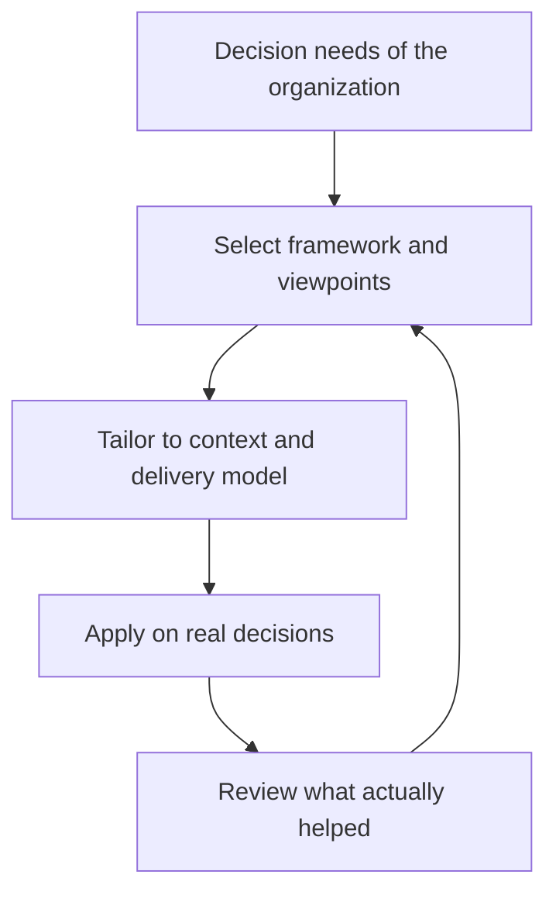

# Enterprise Architecture Frameworks

> **Core skill:** Selecting and tailoring an EA framework — TOGAF, Zachman, FEAF, or a lightweight in-house variant — so it supports the decisions the organization actually makes instead of producing artifacts nobody reads.

## Why This Matters

A framework is a catalog of viewpoints plus a process for producing them. It is not the architecture, and it does not think. Organizations that adopt a framework wholesale end up with ceremony — phase gates, deliverable templates, review boards — while the decisions that mattered, such as what to consolidate or how systems should connect, remain ad hoc. Organizations that reject frameworks entirely reinvent their vocabulary every year and cannot compose a landscape from team-level decisions.

The senior architect treats frameworks as reference material. Borrow the metamodel where completeness matters, borrow the process where the practice lacks rhythm, borrow artifact templates where teams produce inconsistent output — and leave the rest behind. A well-tailored framework is invisible in daily work; only its effects show: shared language, consistent artifacts, traceable decisions.

Framework choice also sends a signal. Executives, auditors, and procurement functions recognize TOGAF or FEAF as evidence that the practice has a spine. But certification is not competence: knowing the ADM phases says nothing about judgment on a real landscape. The framework is scaffolding for judgment, never a substitute for it.

## The Framework Landscape

| Framework | Core Structure | Strength | Cost | Best Fit |
|-----------|----------------|----------|------|----------|
| **TOGAF** | ADM cycle plus content framework and metamodel | Broad coverage; widely recognized; mature governance hooks | Heavy vocabulary; easy to over-apply | Large enterprises building a formal practice |
| **Zachman** | Ontology of perspectives by interrogatives | Forces completeness of viewpoints | No process guidance; very abstract | Completeness checks; shared ontology |
| **FEAF** | Segmented architecture aligned to government functions | Alignment to public-sector planning and budget cycles | Bureaucratic; slow to adapt | Government and public agencies |
| **DoDAF** | Viewpoints for defense systems of systems | Rigor for very complex portfolios | Specialized vocabulary; overhead | Defense and systems-of-systems contexts |
| **Gartner-style EA** | Lightweight, business-outcome-first | Executive-friendly; fast to start | Fewer structural guarantees | Mid-size firms; business-led EA |
| **Lightweight in-house** | Capability map, current and target states, principles, review | Minimal cost; tailored to delivery model | Requires internal skill to sustain | Agile organizations; first EA hires |

Framework names and structures evolve. What stays constant is the trade-off: coverage versus speed, formality versus adoption. Choose the point on that curve the organization will actually sustain.

## What Frameworks Actually Provide

| Element | What It Gives You | When It Is Worth Adopting |
|---------|-------------------|---------------------------|
| Vocabulary | Shared terms for domains, artifacts, and roles | Always — cheap and compounding |
| Metamodel | Rules for what must be defined and how entities relate | When artifacts from different teams disagree structurally |
| Process | A repeatable cycle from vision to change | When the practice has no operating rhythm |
| Artifact templates | Minimum content and shape per deliverable | When teams produce inconsistent or unusable output |
| Governance hooks | Defined points where reviews and gates attach | When decisions lack a place to be tested |
| Reference models | Starter taxonomies — capability, service, technical | When starting from a blank page |

## The TOGAF ADM at a Glance

TOGAF's Architecture Development Method is the most widely referenced EA cycle. Its phases are best read as a checklist of concerns, not a waterfall.

| Phase | Question | Typical Output |
|-------|----------|----------------|
| Preliminary | How is the practice set up and governed? | Principles, governance model, tailoring decisions |
| A — Vision | Why this change, and who cares? | Architecture vision, scope, stakeholder map |
| B — Business | Which capabilities and processes change? | Business architecture views |
| C — Information Systems | What data and applications are needed? | Data and application architectures |
| D — Technology | What platforms carry the change? | Technology architecture |
| E — Opportunities and Solutions | What work packages are feasible? | Options, work packages, dependencies |
| F — Migration Planning | In what order, at what cost? | Migration plan, roadmap, business case inputs |
| G — Implementation Governance | Is delivery still conforming to the architecture? | Compliance reviews, deviations log |
| H — Change Management | What shifted in strategy, technology, or priorities? | Change requests; cycle restart |
| Requirements Management | All phases feed and draw from it | Requirements repository and traceability |

## Choosing and Tailoring

| Organizational Context | Tailoring Choice |
|------------------------|------------------|
| Small organization, first EA hire | Start with a lightweight in-house variant: capability map, current and target sketches, five principles |
| Regulated enterprise with audit pressure | Adopt a recognized framework with a defined subset of deliverables that trace to audit questions |
| Agile delivery at scale | Keep the full ADM as a backlog of concerns; slice artifacts per value stream and time-box reviews |
| Federated business units | Define enterprise vocabulary, target, and standards centrally; let units own local views within them |
| Active vendor and partner ecosystem | Add integration and interoperability viewpoints early, before portfolio decisions harden |
| Systems-of-systems portfolio | Borrow DoDAF or systems-engineering viewpoints for the portions that warrant the rigor |

## The Framework Adoption Loop



The loop is the point: the framework is re-tailored against evidence of what helped decisions, not defended as doctrine.

## Practical Applications

### Framework Fitness Checklist

- [ ] The framework is chosen after naming the decisions it must support
- [ ] A written tailoring decision records what is adopted, adapted, and dropped
- [ ] Every artifact template has a named consumer and a review cadence
- [ ] The ADM or equivalent maps onto real planning cycles, not the reverse
- [ ] Framework vocabulary is used by non-architects in everyday decisions
- [ ] The practice revisits its tailoring annually and prunes what stopped earning its keep

### Framework Tailoring Brief

```markdown
# Framework Tailoring Brief

## Decisions This Framework Must Support
- [Investment, consolidation, integration, compliance decisions it must inform]

## Adopted
- [Views, artifacts, process steps, and governance hooks taken as-is]

## Adapted
- [What is changed from the source framework, and why]

## Dropped
- [What is explicitly not done, and what replaces it]

## Artifact Minimums
- [Per deliverable: minimum content, owner, consumer, cadence]

## Review Date
- [When this tailoring is revisited, and by whom]
```

## Common Pitfalls

| Pitfall | Why It Is a Problem | Better Approach |
|---------|---------------------|-----------------|
| **Framework worship** | The framework becomes the goal; artifacts multiply while influence shrinks | Anchor every artifact to a decision someone must make |
| **Certification as competence** | Certificates prove vocabulary, not judgment on real landscapes | Assess architects on decisions shaped, not courses completed |
| **Metamodel before decisions** | Building the taxonomy first delays all visible value by months | Start from the top decisions; let the metamodel fill in behind them |
| **ADM as waterfall** | A serial cycle conflicts with iterative delivery and becomes a bottleneck | Run phases concurrently at different depths; time-box every review |
| **Artifact catalog without consumers** | Deliverables are produced for the process; nobody reads them | Name the consumer and the decision each artifact informs before creating it |
| **No framework at all** | Every team invents vocabulary and structure; nothing composes | Adopt the cheapest shared spine: vocabulary, core artifacts, one review forum |

## Success Indicators

- Stakeholders use framework vocabulary in ordinary discussion, not only in reviews
- Artifacts get shorter over time because their consumers and purposes are clear
- Tailoring decisions are written down and revisited on a schedule
- The practice can explain why each adopted element exists and what would replace it
- Framework choice survives leadership changes because it is tuned to decisions, not to a sponsor

## Related Topics

- [[02_Architecture_Domains_and_Layers]]: the domains every framework organizes
- [[03_Current_State_Architecture]]: the first artifact most frameworks demand
- [[07_Building_the_EA_Practice]]: where framework choice lands operationally
- [[career-path/06_Software_Architect/00_overview|Software Architect]]: the solution-level counterpart to enterprise framing

## Summary

Enterprise architecture frameworks are reference material for structuring description, process, and governance — valuable exactly to the extent they are tailored. The senior architect selects a framework after naming the decisions it must support, adopts the pieces that earn their keep, drops the ceremony, and re-tailors annually against evidence. The test is never fidelity to the framework; it is whether shared vocabulary, consistent artifacts, and traceable decisions show up in the work.
