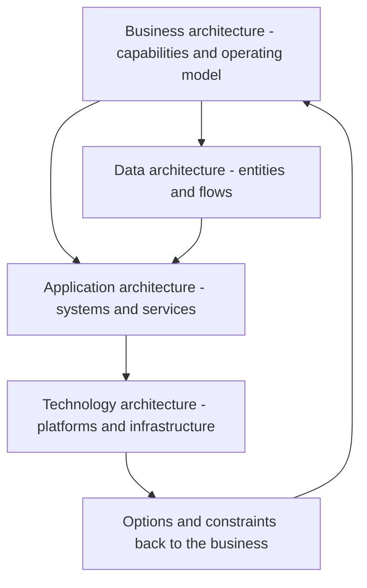

# Architecture Domains and Layers

> **Core skill:** Reasoning across the four architecture domains — business, data, application, technology — and keeping their dependencies visible so change in one layer is coherent in the others.

## Why This Matters

Enterprises are usually described in layers because change propagates through them. A new business capability requires data it does not yet have, an application to hold the logic, and technology to run it. When architects see only one layer, the incoherence shows up somewhere else: a business strategy lands on systems that cannot carry it, or a technology refresh happens with no business case attached.

The four domains — business, data, application, technology — are the standard scaffold because each answers a different question for a different audience. Business architecture answers what the organization does and how value flows. Data architecture answers what the organization knows and how it moves. Application architecture answers what systems do the work. Technology architecture answers what platforms everything runs on.

The senior architect's discipline is bidirectional reasoning. Downward, every business change is traced to its data, application, and technology implications before it is funded. Upward, every technology and platform shift is asked what new business options it creates or forecloses. Domains are not silos to be owned; they are lenses that must agree with each other.

## The Four Domains

| Domain | Core Question | Typical Artifacts | Typical Owners |
|--------|---------------|-------------------|----------------|
| **Business** | What does the enterprise do, and how does value flow? | Capability map, value streams, operating model, process models | Business architecture lead; strategy office |
| **Data** | What does the enterprise know, how is it defined, who owns it? | Conceptual data model, data domains, flows, governance map | Data architect; CDO office |
| **Application** | Which systems implement capability, and how do they interact? | Application portfolio, service map, integration views | Application architects; portfolio managers |
| **Technology** | What platforms, infrastructure, and standards carry the systems? | Technology standards, platform blueprint, lifecycle inventory | Technology architect; infrastructure and platform leads |

## How the Layers Depend

| Direction | Mechanism | Example |
|-----------|-----------|---------|
| Business to data | New capabilities need new or better-managed data | Real-time pricing needs product, inventory, and competitor data mastered first |
| Business to application | New value streams require system capabilities | Self-service onboarding demands identity, document, and workflow services |
| Data to application | Data obligations constrain application design | Data residency rules shape where components may run and store state |
| Application to technology | Application characteristics drive platform needs | Low-latency trading logic excludes cold-start serverless patterns |
| Technology to application | Platform capability enables or caps application options | Managed message backbone makes event-driven integration cheap |
| Technology to business | New platform options create strategic moves | Cloud elasticity makes usage-based business models viable |
| Application to business | System reality limits or unlocks offerings | Legacy billing caps how fast new pricing models can ship |

Reading the table top to bottom gives the classic downward trace; bottom to top gives the enablement view. Good architecture work moves fluently in both directions in the same conversation.

## Cross-Domain Consistency Checks

| Check | Question | Failure Symptom |
|-------|----------|-----------------|
| Coverage | Does every capability have supporting data, applications, and platforms? | Capabilities with no accountable systems; shadow process work |
| Coherence | Do the domains tell the same story at the same granularity? | Business capability map much finer than portfolio map |
| Ownership | Does each element have one accountable owner per domain? | Shared applications with no single owner; orphaned data domains |
| Currency | Were all four views refreshed within the same planning cycle? | Investment decisions citing year-old views for one layer |
| Traceability | Can any element be traced to the capability it serves? | Systems kept alive with no capability justification |

## Layers, Tiers, and Levels

Language discipline matters when presenting to different audiences.

| Term | Meaning | Example Usage |
|------|---------|---------------|
| **Domain** | A concern area with its own viewpoint | Business, data, application, technology |
| **Layer** | A logical grouping within a domain | Channel layer, integration layer, system-of-record layer |
| **Tier** | A physical or deployment split | Web tier, application tier, database tier |
| **Level** | Scope of description | Enterprise, segment, solution, component |

Confusing these terms produces reviews where participants argue past each other — one person discussing logical layers while another hears deployment tiers.

## The Domain Dependency Chain



## Practical Applications

### Domain Alignment Checklist

- [ ] Every capability in the business map is traced to data, applications, and platforms
- [ ] Each domain has one accountable owner and a current description
- [ ] Cross-domain changes are reviewed together, not domain by domain
- [ ] Layer, tier, and level language is used consistently in documents and reviews
- [ ] The four views are refreshed within a shared planning cadence
- [ ] At least one upward trace (technology to business) appears in every major architecture decision

### Domain Alignment Canvas

```markdown
# Domain Alignment Canvas

## Business Change
- [Capability or value stream in scope, and the intended outcome]

## Data Implications
- [Entities created, changed, or retired; ownership moves]

## Application Implications
- [Systems built, changed, integrated, or retired]

## Technology Implications
- [Platforms required or freed; standards affected]

## Consistency Risks
- [Where the four views disagree or are out of date]
```

## Common Pitfalls

| Pitfall | Why It Is a Problem | Better Approach |
|---------|---------------------|-----------------|
| **Technology-led architecture** | Starting from platforms inverts the dependency chain; solutions seek problems | Start from business capability change and trace downward |
| **Domain silos** | Each architect optimizes a layer; cross-layer incoherence persists | Review changes across all four domains in one forum |
| **The missing data domain** | Data implications surface late as migration surprises | Trace every business change through its data implications first |
| **Layer and tier confusion** | Arguments about physical deployment when the debate is logical | Fix vocabulary before the review; use one glossary |
| **Snapshot domains** | One domain view refreshed, others stale; decisions cite mixed vintages | Refresh all four on a shared cadence tied to planning |
| **One-layer fixes** | A platform migration presented as solving a capability gap | Require the capability trace before approving any layer change |

## Success Indicators

- Investment proposals show the full trace from capability to platform
- Domain owners can cite each other's views accurately in review
- Changes surface in all four domains in the same review cycle
- Vocabulary is stable enough that a new architect can read the landscape unaided
- Retrospectives find few late surprises of the "we forgot the data dimension" kind

## Related Topics

- [[01_Enterprise_Architecture_Frameworks]]: frameworks organize these domains
- [[03_Current_State_Architecture]]: describing what exists across the domains
- [[04_Enterprise_Data_Architecture/00_overview|Enterprise Data Architecture]]: the data domain in depth
- [[02_Solution_Architecture_and_Design/00_overview|Solution Architecture and Design]]: where domain constraints meet a concrete solution

## Summary

The four architecture domains — business, data, application, technology — exist because change propagates through them and each answers a different stakeholder question. The senior architect reasons in both directions: tracing business change down to platform implications, and asking what new options each platform shift creates for the business. Consistency checks, one accountable owner per element, and a shared refresh cadence keep the layers telling one story instead of four.
