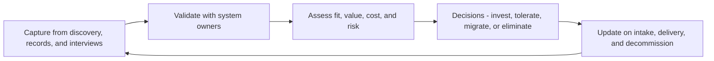

# Current State Architecture

> **Core skill:** Capturing and maintaining a trustworthy description of what exists — applications, integrations, data, and platforms — at a level of detail that serves decisions rather than decorating a shelf.

## Why This Matters

You cannot manage a landscape you cannot see. Current-state architecture is the evidence base for every enterprise decision: consolidation candidates, migration scope, integration risk, cost reduction, and compliance exposure all come from knowing what is actually running, who owns it, and how it connects. Without it, every decision becomes an anecdote contest between the loudest stakeholders.

The failure mode is not missing documentation — most enterprises have piles of it — but documentation that is stale, partial, or too detailed to use. A perfectly accurate register of 1,400 applications updated eighteen months ago is worse than a coarse map refreshed last month, because it invites false confidence. Currency beats precision.

The senior architect treats current state as a living instrument, not a project. It gets captured from what already exists — asset systems, discovery tooling, delivery records, and interviews — validated with owners, assessed against fitness dimensions, and updated by the events that change it: new intake, deliveries, and decommissions. The test of the artifact is simple: when a decision needs evidence, people reach for it without being told to.

## What Current State Covers

| View | Content | Primary Consumer |
|------|---------|------------------|
| Application portfolio | Systems, owners, lifecycle stage, criticality, cost | Portfolio and investment decisions |
| Integration map | System-to-system interfaces, patterns, criticality | Change impact and incident analysis |
| Data landscape | Stores, domains, flows, duplication | Data and consolidation decisions |
| Technology inventory | Platforms, versions, hosting, support status | Refresh and risk planning |
| Capability heat map | Which capabilities each system supports | Duplication and gap analysis |

## Levels of Detail

Current state is not one document; it is a pyramid of views at different zoom levels.

| Level | Scope | Typical Content | Refresh Trigger |
|-------|-------|-----------------|-----------------|
| **Landscape** | Whole enterprise | All systems and major flows, coarse attributes | Quarterly cadence plus major changes |
| **Domain** | One business or functional domain | Systems, integrations, and data in depth | On significant change in the domain |
| **Solution** | One system or service | Components, interfaces, deployment reality | On delivery or re-architecture |

Detail on demand: the landscape answers "what and where"; deeper levels are pulled only when a decision requires them. Attempting to keep every system at solution depth is why most current-state programs collapse under their own weight.

## Sources and Their Reliability

| Source | What It Gives | Reliability Notes |
|--------|---------------|-------------------|
| Asset and inventory systems | Ownership, contracts, cost data | Accurate for what is recorded; blind to shadow IT |
| Automated discovery tooling | Running hosts, traffic, dependencies | Ground truth for existence; weak on purpose and ownership |
| Delivery and procurement records | Recent projects and purchases | Trails reality by months; misses grassroots tools |
| Team interviews and surveys | Purpose, pain, roadmap, interfaces | High insight; must be triangulated, never trusted alone |
| Code and config scanning | Libraries, versions, endpoints | Precise for what is scanned; blind to off-repo runtime |

Credibility comes from triangulation: discovery tooling for existence, records for money, interviews for meaning. Any single source produces a map with a systematic blind spot.

## Assessment Dimensions

A register becomes decision-useful when each element is assessed, not just listed.

| Dimension | Question | Example Rating |
|-----------|----------|----------------|
| Business fit | How well does this serve current and future needs? | High, medium, low |
| Technical fit | Is it maintainable, supported, and aligned to standards? | Healthy, constrained, obsolete |
| Business value | What does it enable, and for whom? | Critical, important, marginal |
| Cost | What does it take to run and change? | License, run, change effort |
| Risk | What is the exposure if it fails or is breached? | Availability, security, compliance |
| Lifecycle stage | Where is it in adopt-tolerate-invest-migrate-eliminate? | Portfolio action class |

The classic TIME classification — tolerate, invest, migrate, eliminate — is built from the first, second, fourth, and fifth dimensions combined. The output is a portfolio where every system has a stated disposition, even if the disposition is "tolerate for now".

## Keeping It Current

| Mechanism | How It Works | Failure Mode It Prevents |
|-----------|--------------|--------------------------|
| Named system owners | Each register entry has an accountable editor | Orphaned entries nobody updates |
| Intake hooks | New proposals must state which entries they change | Invisible purchases and shadow tools |
| Delivery hooks | Projects close with a landscape update as a deliverable | Post-project drift |
| Decommission flow | Retirement updates the register within a set window | Ghost systems inflating cost and risk |
| Review cadence | Quarterly validation of critical entries | Slow rot of the most important rows |
| Use-based pressure | Decisions cite the register; gaps get fixed to unblock decisions | Updates driven by process instead of need |

## The Capture and Maintenance Cycle



## Practical Applications

### Current-State Readiness Checklist

- [ ] A landscape-level view exists and is younger than one quarter
- [ ] Every entry has an owner, a lifecycle stage, and a disposition
- [ ] Major integrations are drawn with pattern and criticality marked
- [ ] Intake, delivery, and decommission all trigger register updates
- [ ] Assessment dimensions are rated, not just recorded
- [ ] At least one real decision this quarter cited the current-state view as evidence

### Application Portfolio Register

```markdown
## Application Portfolio Register

| System | Owner | Capability Served | Lifecycle | Fit | Cost Band | Risk | Disposition |
|--------|-------|-------------------|-----------|-----|-----------|------|-------------|
| Order capture | Sales ops | Order to cash | Tolerate | Constrained | High | Medium | Migrate in 2 years |
| Billing engine | Finance IT | Revenue accounting | Invest | Healthy | Medium | High | Invest and extend |
| Legacy CRM | Marketing | Customer management | Eliminate | Obsolete | High | Medium | Eliminate on CRM rollout |
```

## Common Pitfalls

| Pitfall | Why It Is a Problem | Better Approach |
|---------|---------------------|-----------------|
| **Shelfware inventory** | A beautiful map produced once and never cited decays into fiction | Tie updates to intake, delivery, and decommission events |
| **Perfection paralysis** | Waiting for complete data means no view exists when decisions need one | Publish the coarse view now; deepen on demand |
| **List without assessment** | A pure inventory cannot prioritize anything | Rate fit, value, cost, risk, and disposition per entry |
| **No named owners** | Entries drift the moment the central team looks away | Each entry has an accountable editor who validates it |
| **Tooling-first capture** | Discovery software is bought before the questions it must answer are defined | Define decisions and views first; tooling third |
| **Covering everything equally** | Deep detail on trivia crowds out clarity on critical systems | Depth tiers by criticality and decision demand |

## Success Indicators

- A consolidation or migration decision cites the current-state view as its evidence
- Critical entries are validated within the quarter they change
- Owners update their own entries without being chased
- Reviews start from the view rather than from competing anecdotes
- Decommissioned systems disappear from cost and risk reporting on schedule

## Related Topics

- [[04_Target_State_Architecture]]: the destination the current state is measured against
- [[02_Architecture_Domains_and_Layers]]: the domains this picture spans
- [[06_Transformation_Roadmaps_and_Portfolio/00_overview|Transformation Roadmaps and Portfolio]]: where the current state becomes a transition plan
- [[career-path/06_Software_Architect/00_overview|Software Architect]]: solution-level views that feed the landscape

## Summary

Current-state architecture is the evidence base for enterprise decisions: a landscape view of applications, integrations, data, and platforms that is assessed, owned, and kept current. The senior architect optimizes for currency and decision usefulness over documentary completeness, captures from triangulated sources, gives every entry an owner and a disposition, and wires updates into the events that change the landscape — intake, delivery, and decommission.
