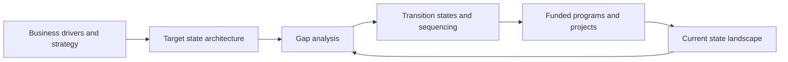

# Target State Architecture

> **Core skill:** Defining a target architecture that is strategically grounded but delivery-realistic — and the transition states between here and there, so the destination shapes work today without pretending the journey is one leap.

## Why This Matters

A target without a path is a poster; a path without a target is drift. Target state architecture is where enterprise strategy becomes concrete enough to steer investment: which capabilities the organization must have, what the application and data landscape should look like when it does, and which platforms carry it. Without a target, every proposal is judged only on its own merits, and the enterprise accumulates locally rational decisions that are globally incoherent.

The classic failure is the big-bang blueprint: an exhaustive future state that would require everything to change at once. It is intellectually satisfying and organizationally impossible, so it is either ignored or descoped into irrelevance. The senior alternative is a directional target — opinionated on structure, deliberately silent on details that will be decided closer to delivery — plus explicit transition architectures that sequence the crossing.

Good targets have an owner and a horizon. They state which decisions they are meant to constrain, which constraints (budget, regulation, contracts) shape them, and what would cause them to change. A target that cannot be revised when strategy shifts is not a target; it is a monument.

## From Strategy to Target

| Business Driver | Architecture Implication | Typical Moves |
|-----------------|--------------------------|---------------|
| Cost reduction | Consolidation and retirement | Merge duplicate systems; retire low-value applications; standardize platforms |
| Customer experience | Channel integration and shared data | Unified customer view; API-enabled channels; journey-aligned services |
| Speed of change | Decoupling and reuse | Loosely coupled services; shared platforms; self-service delivery paths |
| Regulatory pressure | Control and traceability | Data lineage; access controls; residency-aware deployment |
| Merger or acquisition | Integration and rationalization | Interim coexistence architecture; target portfolio of record |
| New revenue models | Extensibility and metering | Usage instrumentation; partner interfaces; productized data and services |

The table's value is the forcing function: no entry on the right is allowed to appear in a target without a driver on the left. Targets that contain moves nobody asked for are the first thing budget scrutiny will cut.

## Components of a Target State

| Component | What It States | Example Granularity |
|-----------|----------------|---------------------|
| Capability target | Which capabilities to lead, match, or stop | Capability map with disposition |
| Application target | The future portfolio's shape and boundaries | System-of-record decisions; consolidation map |
| Data target | Domains, ownership, and sharing model | Domain list; integration principles |
| Technology target | Platforms, standards, and hosting model | Platform blueprint; standards list |
| Operating model | How delivery, ownership, and funding work | Team topologies; funding flows |

A target that covers only applications and platforms is a technology plan, not an architecture. The operating model row is often the one that determines whether the rest can be delivered.

## Gap Analysis

| Dimension | Current State | Target State | Gap | Action | Dependency |
|-----------|---------------|--------------|-----|--------|------------|
| Customer data | Duplicated across five systems | Single owned domain with mastered identity | No accountable owner; no matching capability | Stand up domain ownership and identity resolution | CRM rollout decision |
| Order capture | Monolith with embedded pricing | Decoupled order and pricing services | Coupling blocks independent change | Extract pricing service behind an interface | Platform API gateway |
| Integration | Point-to-point links | Governed patterns with contracts | 40 undocumented interfaces | Prioritize by criticality; instrument and register | Interface inventory |
| Hosting | Two data centers, static capacity | Cloud-first with elasticity | Migration capability and cost model absent | Build landing zone; migrate by wave | Skills program |

The gap table is the bridge between the target document and the roadmap: each gap becomes a work item with a dependency, fed to portfolio planning rather than an appendix nobody reads.

## Transition Architectures

| Transition | Purpose | What Stays Constant | Exit Criteria |
|------------|---------|---------------------|---------------|
| Interim coexistence | Run old and new in parallel during migration | Contracts and data ownership rules | Data parity and cutover rehearsal passed |
| Bridging integration | Connect legacy to new via governed interfaces | One integration pattern set | Legacy link decommissioned |
| Strangler progression | Grow the new around the old, feature by feature | User-visible continuity | Remaining legacy features retired |
| Enabling platform | Build the foundation a later target depends on | Delivery commitments | Platform serves first two consumers |

Transitions are architecturally significant in their own right: they get described, reviewed, and owned like any other architecture, because most real failures happen mid-transition, not at the endpoints.

## From Current to Target



## Practical Applications

### Target State Quality Checklist

- [ ] Every element of the target traces to a business driver
- [ ] The target is opinionated on structure and silent where detail belongs at delivery time
- [ ] Gap analysis converts each difference into named actions with dependencies
- [ ] At least one transition state is described in architecture terms, not just project terms
- [ ] The target has a named owner and a stated horizon for revision
- [ ] Major investment proposals are assessed against the target before approval

### Target State Statement

```markdown
# Target State Statement — [Domain or Enterprise]

## Business Drivers Addressed
- [Drivers and the outcomes they demand; trace to strategy]

## Target Description
- Capability target: [lead, match, or stop per capability]
- Application target: [portfolio shape and boundaries]
- Data target: [domains, ownership, sharing model]
- Technology target: [platforms, standards, hosting]
- Operating model: [ownership, delivery, funding]

## Explicitly Out of Scope
- [What this target does not decide, and where it will be decided]

## Constraints and Assumptions
- [Budget, regulation, contracts, talent]

## Owner and Revision Horizon
- [Who owns it; what triggers a revision]
```

## Common Pitfalls

| Pitfall | Why It Is a Problem | Better Approach |
|---------|---------------------|-----------------|
| **Vendor blueprint as target** | A product roadmap replaces strategy; lock-in is designed in | State target properties first; evaluate products against them |
| **Ignoring the operating model** | The architecture cannot be delivered by an org that is not designed for it | Include ownership, delivery, and funding in the target |
| **Infinite horizon** | A target that is never reached cannot shape sequencing | Pair every target with transitions and exit criteria |
| **Too detailed too soon** | Specifying what will change anyway invites rework and rejection | Be directional where uncertainty is high; concrete where structure matters |
| **No executive ownership** | Targets without sponsors lose every budget contest | Secure a named executive owner before publishing |
| **Gold plating** | Elegance that costs more than the business case supports | Cost the target honestly; let drivers cap ambition |

## Success Indicators

- Proposals cite the target when arguing scope, and expect to be tested on it
- Transitions are described and governed, not improvised mid-program
- Gap analyses feed portfolio planning with work items, not complaints
- The target is revised deliberately when strategy shifts — visibly, with a record
- Delivery teams can explain how their current work moves the enterprise toward the target

## Related Topics

- [[03_Current_State_Architecture]]: the baseline every gap is measured from
- [[05_Architecture_Principles_for_the_Enterprise]]: the rules that keep movement toward the target coherent
- [[06_Transformation_Roadmaps_and_Portfolio/00_overview|Transformation Roadmaps and Portfolio]]: where target and gaps become a funded sequence
- [[career-path/04_Principal_and_Distinguished_Engineer/02_Enterprise_and_Systems_of_Systems_Thinking/00_overview|Enterprise and Systems of Systems Thinking (Principal)]]: the strategy framing behind enterprise targets

## Summary

Target state architecture converts strategy into a directional picture of capabilities, systems, data, and platforms — opinionated on structure, honest about constraints, owned by a named executive, and bounded by a revision horizon. The senior architect pairs every target with gap analysis and explicit transition states, so the destination shapes today's funded work without pretending the crossing happens in one leap.
