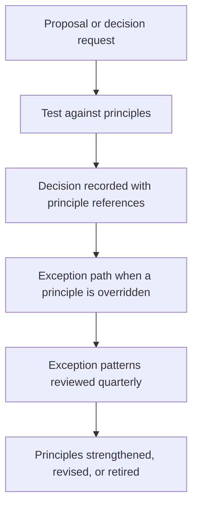

# Architecture Principles for the Enterprise

> **Core skill:** Writing a small set of principles that actually arbitrate decisions — each with a statement, rationale, and implications — and retiring them the moment they stop earning their keep.

## Why This Matters

Principles are decision precedent. When a review, a design discussion, or a budget conversation hits a recurring trade-off, principles are the enterprise's standing answer: reuse before buy, master data at its source, integrate through interfaces rather than databases. Without them, every decision relitigates from zero, outcomes depend on who is in the room, and the same argument consumes a different project team every quarter.

The failure modes sit at both extremes. No principles means an enterprise of local optima — thirty teams, thirty answers to the same question. Too many principles, or principles that read like aspirations, means nobody remembers them and nothing is ever refused. A principle that has never caused anyone to change a plan is not a principle; it is decoration.

The senior architect writes few principles, makes each one testable, attaches consequences, and enforces them in the places where decisions actually get made. Principles are also living: exceptions teach you where they were wrong, patterns of exception teach you when to revise them, and a principle that stopped matching strategy gets retired loudly rather than quietly ignored.

## Anatomy of a Principle

| Element | Purpose | Example |
|---------|---------|---------|
| **Name** | A memorable handle used in conversation | Data is mastered at its source |
| **Statement** | The rule, stated as a decision default | Authoritative data is created and owned in one system, and consumed everywhere else |
| **Rationale** | Why the enterprise chooses this | Duplication causes reconciliation cost and conflicting truth |
| **Implications** | What the principle forces on projects | Requires domains and owners; forbids local master stores; requires published interfaces |
| **Exceptions** | How deviation is requested and granted | Time-bound waiver with a remediation plan, logged and reviewed |

The implications line is what separates a working principle from a slogan. If you cannot list what the principle forbids, it will never constrain anything.

## Attributes of Good Principles

| Attribute | Test | Anti-Example |
|-----------|------|--------------|
| Few | Ten to twenty, memorized by the architecture community | Forty principles in a PDF, cited by none |
| Testable | A proposal can pass or fail against it | "We value agility" |
| Consequential | Overriding it requires a visible decision | "We consider security important" |
| Grounded | Traces to strategy, regulation, or hard experience | Copied from a framework appendix |
| Stable | Changes yearly at most, deliberately | Rewritten every reorg |
| Owned | An individual or forum is accountable for it | A committee's collective draft |

## Example Enterprise Principles

| Principle | Statement | Key Implication |
|-----------|-----------|-----------------|
| **Reuse before buy, buy before build** | Prefer existing capability, then market solutions, then construction | Build decisions need written justification of why reuse and buy failed |
| **Data is mastered at its source** | One authoritative system per data domain; others consume | No local shadow masters; reconciliation replaces duplication |
| **Integrate through interfaces** | Systems integrate via APIs, events, or files — never shared databases | Database-level coupling is rejected in review; interface contracts are mandatory |
| **Loose coupling by default** | Dependencies are explicit, versioned, and replaceable | Synchronous coupling needs a stated reason; contracts carry versions |
| **Security and privacy by design** | Controls are in the design, not bolted on after | Threat and data classification precede approval; retrofits need waivers |
| **Standards unless justified otherwise** | Deviations are explicit, owned, and time-bound | Every deviation has an owner and an expiry date |

These six are illustrative, not universal. The test is whether each one resolves a trade-off the enterprise actually faces, repeatedly.

## Using Principles in Review

| Situation | Principle Behavior | Example Handling |
|-----------|--------------------|------------------|
| Proposal complies | Cited as supporting evidence | Review records the reference; no further debate |
| Proposal conflicts | Conflict is surfaced and must be resolved | Either redesign, request a waiver, or escalate the principle itself |
| Two principles conflict | Weighted by strategic priority, decided visibly | Strategic driver of the year breaks the tie; the ruling becomes precedent |
| Principle feels outdated | Trigger a revision, not a silent bypass | Deviation log feeds the annual principles review |
| New recurring trade-off appears | Candidate for a new principle after the third occurrence | Do not write principles for one-off situations |

Reviews that cite principles stay short and impersonal: the argument is about the rule the enterprise already accepted, not about the architect's taste.

## Maintaining Principles

| Mechanism | Cadence | Output |
|-----------|---------|--------|
| Principles review | Annual, or after major strategy shift | Additions, revisions, retirements |
| Exception log review | Quarterly | Patterns that indicate a broken or missing principle |
| Compliance sampling | Per review cycle | Evidence principles are applied, not just printed |
| Teaching moments | Onboarding and architecture forums | New architects can apply principles unaided |

## The Principle Lifecycle



## Practical Applications

### Principles Program Checklist

- [ ] The set is small enough to recite from memory in a review
- [ ] Each principle has a statement, rationale, and explicit implications
- [ ] Review records cite principles by name in decisions
- [ ] Exceptions are logged, time-bound, and reviewed as patterns
- [ ] At least one retirement has happened — proof the set is curated, not accumulated
- [ ] Principles trace to current strategy, not to history

### Principle Definition Template

```markdown
# Principle: [Name]

## Statement
[The decision default, one sentence, testable]

## Rationale
[Why the enterprise chooses this; link to strategy or hard experience]

## Implications
- [What projects must now do]
- [What projects may no longer do]
- [What artifacts or roles this creates]

## Exceptions
[How to request deviation; who grants it; maximum duration]

## Owner and Review Date
[Accountable person or forum; when this principle is next reviewed]
```

## Common Pitfalls

| Pitfall | Why It Is a Problem | Better Approach |
|---------|---------------------|-----------------|
| **Platitude principles** | Untestable statements never constrain anything | Write rules a proposal can pass or fail |
| **Principle inflation** | Thirty principles are remembered by nobody, applied by no one | Cap the set; add one only when an old one retires |
| **Missing implications** | Without forbidden moves, projects cannot tell what changed | List what each principle forces and forbids |
| **Unexamined conflicts** | Two principles collide silently; each team picks its favorite | Record the tie-break in review outcomes as precedent |
| **Enforcement theater** | Principles cited in reviews but waived by default | Make waivers visible, owned, and time-bound |
| **Never retiring** | Dead principles dilute the living ones | Annual review with explicit retirements |

## Success Indicators

- Review minutes cite principles by name, and proposals pre-check themselves against them
- Waiver volume is low and dominated by genuine constraint cases, not convenience
- The set has changed in the last two years — at least one revision or retirement
- New architects apply principles correctly without coaching
- Teams reference principles in design docs before review even begins

## Related Topics

- [[06_Enterprise_Architecture_Governance]]: where principles are enforced and waivers granted
- [[04_Target_State_Architecture]]: principles keep movement toward the target coherent
- [[career-path/04_Principal_and_Distinguished_Engineer/03_Decision_Governance_and_Principles/00_overview|Decision Governance and Principles (Principal)]]: the engineering-side counterpart practice
- [[02_Solution_Architecture_and_Design/00_overview|Solution Architecture and Design]]: where principles meet concrete design trade-offs

## Summary

Enterprise architecture principles are a small, curated set of decision defaults — each with a statement, rationale, implications, and an exception path — that arbitrate recurring trade-offs so the enterprise stops relitigating them. The senior architect writes few, makes them testable and consequential, enforces them where decisions happen, reads the exception log as a signal, and retires principles that stopped earning their keep.
